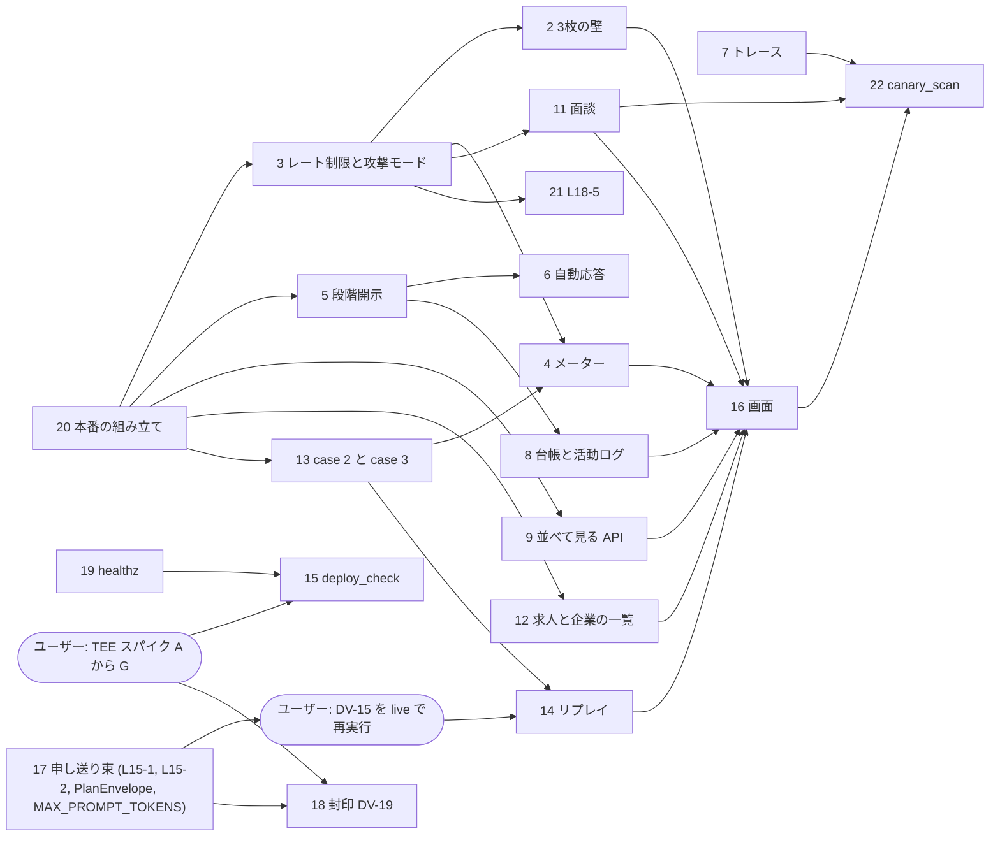

# 設計書に対する未実装のギャップ表

- 調査日: 2026-10-03(スナップショット。コードは変更していない・コミットもしていない)
- 対象: `/Users/toshixa/dev/tenshokuagent` ブランチ `feat/phase1-core`、HEAD `9c8223f`。作業ツリーは調査の前後とも clean(`git status --short` が 0 行)
- 設計書: `design/anon-negotiation-agent/design.md` v19(承認済み。指紋 `v19:298da78d4ee4`)
- コード規模(行数): `src/` 11,091(negotiation_core 1,408 / vault 4,043 / agents 1,204 / web 4,412)、`scripts/` 1,738、`tests/` 27,061(テスト 62 ファイル)
- テストの結果: 62 ファイルを 1 ファイルずつ実行して、**全部合格(2,309 件。失敗 0・スキップ 0。合計 約 305 秒)**。時間がかかるのは `test_concurrency.py`(65 秒)と `test_fixtures.py`(58 秒)だけで、残りは 15 秒以内

## 0. 調査の方法と、読み方

- 「ある」と書いたものは、ファイルを開いて関数名・クラス名まで確かめたもの。
- 「無い」と書いたものは、`src/`・`scripts/`・`fixtures/`・`config/`・`deploy/`・`tests/`・`static/` を `find`・`grep` で探して見つからなかったもの。探した語を各項目に添えた。
- 「規模」は行数の目安で、既存の近い部品(例: `web/llm_budget.py` 214 行 + `tests/test_llm_budget.py` 855 行)を物差しにした**推測**。実装者が見積もり直すこと。
- テストの実行: `PYTHONDONTWRITEBYTECODE=1 uv run --no-sync --offline pytest -p no:cacheprovider tests/<file> -q`。設計書の `uv run pytest <file> -q` に、ネットワークに出ない・リポジトリに書かないためのフラグを足しただけ。Firestore エミュレータは conftest が JDK 21 で起動する(gcloud は使わない)。
- 実行していないもの: DV-15 の `scripts/run_demo.py --case 1 --live`(本物の Gemini = GCP に接続するため)。`gcloud` は一度も叩いていない。秘密の場所(`~/.ssh`・`~/.config/gcloud`・`.env` など)は `ls` もしていない。
- この調査が作ったファイル(すべてスクラッチパッド `.../scratchpad/` の中。`design/` と repo には何も書いていない): この `inv-gap-inventory.md`、`inv-appendix.md`(付録 A の元)、`inv-run-tests.py`(逐次実行の駆動)、`inv-test-results.tsv`(結果)、`inv-run-tests.out`(駆動の標準出力)、`inv-test-logs/`(1 ファイル 1 ログ)。

## 1. 要約表(機能ごとに 1 行)

状態は「ある(設計書の範囲を満たす)／一部／無い」。規模は src(scripts・fixtures を含む)と tests の行数の目安。UI は別に数える。

| # | 機能(設計書の節) | 状態 | 規模の目安 | 先に要るもの |
|---|---|---|---|---|
| 1 | 丸め原則の検証テスト(§2.5・AC-05) | ほぼある(136+32 件合格) | 追加 0〜80 行 | なし |
| 2 | 3 枚の壁(§8.1) | 無い(部品のみ) | src 250 / tests 250 | 3 のレート制限と攻撃・デモ交渉の入口、画面 |
| 3 | 攻撃モード + 入口ごとのレート制限(§8.2) | 一部(agents 側・referee 側・金庫側はある。web の入口とレート制限と指示文が無い) | src 450〜600 / tests 600 | 13 の case 3、20 の本番の組み立て。R-7(GCP で確かめる) |
| 4 | 推定区間メーター(§8.3) | 無い(読み出し口だけある) | src 400 / tests 400 | 3、13 の case 3。画面は API の後 |
| 5 | 段階開示 ④(§6.2) | 一部(段 0 の作成・TTL・削除連鎖のみ) | src 450〜550 / tests 600 | 20、8(台帳) |
| 6 | 架空人物の自動応答(§4.4・§6.2) | 一部(途中確認の `FixtureAnswerer` はあるが本番に未接続。「会う」「承認」の自動押下は無い) | src 150 / tests 100 | 5、20 |
| 7 | トレース ⑤(§7・FR-41・AC-18) | 無い | src 200 / tests 200 | 依存追加の承認(Cloud Trace の exporter) |
| 8 | 活動ログ・開示台帳 ⑤(§7・FR-37/38) | 一部(events の読み出し口と台帳の削除だけ) | src 200 / tests 200 | 5 |
| 9 | 並べて見る画面の API ⑤(§7・FR-39) | 一部(`GET policy` だけ) | src 200 / tests 150 | 20 |
| 10 | 管理画面 ⑤(§7・FR-40) | API はある(`control`)。画面が無い | UI のみ(質問の取得口を足すなら +40) | 16 |
| 11 | 面談(§5。最小構成・軸を外す手順) | 一部(送信 API・変換規則・予算の計上口はある。面談エージェント・設問・画面が無い) | src 900〜1,100 / tests 600〜700 | 3 のレート制限、U-01(設問の文面は暫定で作る) |
| 12 | 求人・企業の一覧 API(§5 手順 8・§6.1) | 無い(データは fixtures にだけある) | src 120 / tests 100 | 20、U-08/U-09(求人カタログ) |
| 13 | デモ 3 ケース(§8.4) | 一部(ケース 1 のみ) | fixtures 200 / src 100 / tests 250 | 20(投入経路)。U-09(中身は暫定で作る) |
| 14 | リプレイ(§8.4・AC-21) | 無い | src 350 / tests 250 | 13、17(指示文を確定してから録画)。録画はユーザーの環境 |
| 15 | `scripts/deploy_check.sh`(§10・AC-22) | 無い | 600〜900(スクリプト + 試験) | 19、TEE スパイクの結果、R-4・R-8 |
| 16 | 画面 `static/`(§10・§5・§6・§7・§8) | 無い | HTML/JS/CSS 2,000〜3,000 + 配信 60 | 各 API が先。R-5。依存の明示(sse-starlette) |
| 17 | ③ への申し送り(L15-1・L15-2・L16-1/X-74/X-79/P-14・MAX_PROMPT_TOKENS) | 無い(実行で確認済み) | src 150〜250 / tests 250〜350(書き換え含む) | 完了後に DV-15 の再実行(ユーザー環境) |
| 18 | 封印の `store.py` への組み込み(DV-19) | 無い(部品 `Sealer` だけある) | src 150〜250 / tests 250 | TEE の採否(スパイク)。17 の L15-1 と同じ `store.py` |
| 19 | `/healthz`(AC-22) | 無い(web・agents・vault のどれにも) | src 30 / tests 20 | なし |
| 20 | 本番の組み立て(`FictionalAnswerer` の配線・テンプレートの投入経路・fixtures の読み込み) | 無い | src 150〜250 / tests 100 | 設計判断(§5 の穴 1・2) |
| 21 | L18-5 nonce 転送の IP ごとの制限 | 無い | src 40 / tests 60 | 3 と同じクライアントキー関数 |
| 22 | 検証スクリプト `canary_scan.py`・`check_no_web_storage.sh`(AC-02・17・18) | 無い | scripts 330 / tests 100 | 11(面談)、7(トレース)、16(画面) |

新規の合計の目安(推測): src・scripts・fixtures 約 5,200〜6,100 行、tests 約 4,800〜5,500 行、UI 約 2,000〜3,000 行。現状の src は 11,091 行・tests は 27,061 行。

config のセクション(`config/params.toml`): `axes.*`(7 軸)、`attribute_bands.*`(3 種)、`agents`、`agents.cost_targets`、`vault.limits`、`vault.deadlines`、`vault.judgment`、`vault.retention`、`web.referee`、`web.sweeper`、`web.llm_budget`、`web.session`、`web.principals`、`web.principal_sweeper`、`web.retention`、`web.vault_client`、`web.limits`、`vault.tee`。無いもの: レート制限・攻撃モード・面談・段階開示・トレースの設定、`agents` の `max_prompt_tokens`。

## 2. 機能ごとの詳細(節 / AC・DV / あるもの / 無いもの / 規模 / 依存)

### 2.1 丸め原則の検証テスト(§11 ③)

| 項目 | 内容 |
|---|---|
| 設計書の節 | §2.5(丸め)、§11 ③、§12.1 AC-05 |
| AC・DV | AC-05(`tests/test_leakage_bound.py`) |
| すでにあるもの | `src/negotiation_core/rounding.py` の `round_numeric_value`・`round_anchor`。`tests/test_leakage_bound.py`(136 件合格: 全マスの丸め先・同じマスの生の値は 18,000 通りへの応答まで区別不能・隣接点は区別可能・観測と矛盾しない範囲が真のマスを含む)と `tests/test_rounding_properties.py`(32 件合格: グリッド上の判定が丸めで変わらない・冪等) |
| 無いもの | 金庫の API 越しに、複数の交渉・複数の求人から適応的に攻める攻撃者の試験(探した語: `adaptive`・`適応`・`leakage` を `tests/` で。あるのは `evaluate()` の純関数に対する「全 18,000 通りを聞く最強の攻撃者」の論証型のみ)。実システムでの確認は AC-12(`test_meter.py`)が兼ねる設計 |
| 規模 | 追加 0〜80 行(論証型で足りるとみるなら 0) |
| 依存 | なし。金庫越しの攻撃者を足すなら 4(メーター)の後 |

### 2.2 3 枚の壁(§8.1・FR-42〜44)

| 項目 | 内容 |
|---|---|
| 設計書の節 | §8.1、§4.3(受信口)、§4.2(前文)、§8.2(壁 1 の入口の上限) |
| AC・DV | AC-11(ケース 3 で 3 枚が画面で確認できる)、AC-13(生メッセージ 32 KB の拒否・候補者側の受信口に届くのは `TurnInput` だけ)、AC-04・DV-04(受信口の拒否。ある) |
| すでにあるもの | 壁 1 の受け側: `src/agents/app.py` の `create_app`(`/a2a/candidate` は DataPart 1 つ・`TurnInput` のみ・`BodySizeLimitMiddleware` で 32 KB・拒否は LLM を動かす前。`agents/validation.py` の `validate_request`)。`tests/test_validation.py`・`tests/test_agent_endpoints.py`(壁 1 の経路)が合格。 日次の物理数を数える口: `src/web/llm_budget.py` の `LlmBudget.reserve(None)`(面談・壁 1 用。呼ぶ側が無い。`tests/test_llm_budget.py` に計上のテストがある)。 壁 2 の材料: 固定前文 `src/agents/instructions/__init__.py` の `load_instruction(role)`(入力で変わらない)と、`src/web/turn_input.py` の `build_turn_input` |
| 無いもの | 探した語: `raw.?message`・`send_raw` を `src/`・`scripts/` で(0 件)。`wall`・`壁` はコメントだけ。 (1) 壁 1: 利用者が書いた生の A2A メッセージ JSON(TextPart・`principal_instruction` など余計な項目を含む)をそのまま `/a2a/candidate` に送る web の口。`agents/client.py` の `send_turn` は型付きの `TurnInput` しか送れない(`new_data_part(turn_input.model_dump(...))`)ので、生の送信関数・web ルート・拒否理由の画面向けの返し方・有効な `TurnInput` のときの `Plan`/`Move` の返却(金庫に登録しない)・本文 32 KB の検査・日次計上・入口のレート制限(20 回/10 分)がすべて無い。 (2) 壁 2: レフェリーは直近の `TurnInput` を保持しない(`web/referee.py` の `Referee._ask` は作って送るだけ)。デモ・攻撃の交渉だけ、直近の計画・決定の `TurnInput` を覚える口と、`{前文, TurnInput 2 件}` を返す web ルートが無い。 (3) 壁 3: 4(メーター) |
| 規模 | src 250 / tests 250(壁 1 が約 150、壁 2 が約 100)。画面は 2.16 |
| 依存 | 3(レート制限と、デモ・攻撃交渉の作成口)が先。画面(AC-11 の「画面で確認」) |

### 2.3 攻撃モード + 入口ごとのレート制限(§8.2・FR-46/47)

| 項目 | 内容 |
|---|---|
| 設計書の節 | §8.2、§4.3、§2.7(`AttackerTurnInput`)、§3.7 |
| AC・DV | AC-13(`tests/test_attack_mode.py`)、DV-04(受信口の部分はある。web が `/a2a/attacker` を攻撃モードからしか呼ばない部分)、DV-18(入場の制限と物理数の上限はある) |
| すでにあるもの | **agents**: `src/agents/app.py` の `/a2a/attacker`(`_INPUT_MODELS["attacker"] = AttackerTurnInput`。側 × 計画・決定の LlmAgent 6 体)。`tests/test_attacker_isolation.py`(10 件)・`tests/test_agent_context.py`(自由文は attacker の口だけ)が合格。 **core**: `src/negotiation_core/schema.py` の `AttackerTurnInput`(`principal_instruction` は 400 字まで)。 **referee**: `src/web/referee.py` の `NegotiationContext.agent_role`(mode=attack の求人側だけ `attacker`)、`RefereeDeps.attacker_instruction: Callable[[str], str] \| None`(交渉 ID → 指示文の差し込み口。未設定なら空文字。コメントに「指示の受け付け・入口ごとのレート制限は ③ の範囲」)、`src/web/turn_input.py` の `to_attacker_turn_input`。`tests/test_referee_flow.py` の attacker に関する 6 テスト(役割の判定・計画と決定の両方に指示が渡る・指示の源が無ければ空・見回りが作り直しても役割が戻る・通常の求人には渡らない)が合格。 **金庫**: mode=attack の作成(候補者は架空人物に限る: `vault/api_models.py` の `CreateNegotiationRequest._mode_matches_candidate`)、96 時間 TTL(`tests/test_negotiation_creation.py` の `…carry_the_negotiations_ttl`)、`GET /v1/demo/negotiations/{nid}/events`(attack を許す)。 **web の費用の歯止め**: `LlmBudget.admits_new_negotiation`・`reserve` は攻撃交渉にも掛かる |
| 無いもの | 探した語: `rate.?limit`・`X-Forwarded-For`・`時間窓`・`レート制限` を `src/`・`config/`・`scripts/` で(コメントと、TEE の attestation の 429 だけ。`window` は金庫の 24 時間の評価予算の窓 `vault/budget.py` で、無関係)。 (1) web の攻撃入口: 攻撃交渉の作成(`mode="attack"`。相手は `demo-candidate-1` のテンプレートから写す。求人側は「何でも受ける」)と、指示(400 字)の受付・置き場。`web/api.py` に attack のルートは無く、`DemoCreateBody` は mode=demo 固定。`attacker_instruction` は同期の関数なので、置き場(プロセスのメモリか `stages`)は要判断。 (2) 入口ごとのレート制限: Firestore の時間窓カウンタ(10 分窓・クライアントごと・入口 5 種 + 全体 300)、`X-Forwarded-For` の末尾側のキー(R-7 は未確認)、再起動で消えない、`ttl_at`、設定 `[web.rate_limit]`、429。いまの web にあるのは日次の物理数の入場の制限だけで、デモの実行とライブ交渉の作成に入口ごとの回数制限は無い(面談・壁 1・攻撃指示の入口は、そもそも無い)。 (3) 攻撃用の指示文: `src/agents/instructions/attacker.md` は 3 行の仮(「中身は ② で…」)。`tests/test_agent_instructions.py` の `test_the_attacker_instruction_is_still_a_stub_but_names_the_v14_outputs` が「仮であること」を固定している(本物にするとき書き換える)。 (4) 「何でも受ける」求人と `demo-candidate-1` のテンプレート(2.13 の case 3) |
| 規模 | src 450〜600(レート制限 150〜200・設定 50・攻撃入口 150〜200・指示文の文章 約 70)/ tests 約 600(AC-13 の 8 項目 約 450・DV-04 の web 側 約 60・2.21 の分 約 60) |
| 依存 | 2.13(case 3 のフィクスチャと投入経路)、2.20(本番の組み立て)。R-7(`X-Forwarded-For` の位置。GCP 実機で確かめる)。attacker.md を本物の Gemini で動かす確認(ユーザーの環境) |

### 2.4 推定区間メーター(§8.3・FR-45)

| 項目 | 内容 |
|---|---|
| 設計書の節 | §8.3、§3.2、§8.4(ケース 3 の性質) |
| AC・DV | AC-12(`tests/test_meter.py`)、DV-01 の最後の項目(メーターの区間の API が本物の利用者の交渉 ID を拒否。`tests/test_authz.py` の docstring が ③ に送っている) |
| すでにあるもの | 材料の読み出し口: web の `GET /v1/demo/negotiations/{nid}/events?side=`(`web/api.py` の `demo_events`。架空人物の側の見え方。本物の交渉は 403)と金庫の `get_demo_events`(`vault/store.py`)。`EventViewItem(kind, package, own_evaluation)` の `offer_received` から、候補者側の 3 値評価を読める。`tests/test_demo_events.py`(9 件)・`tests/test_authz.py` のデモ読み出しが合格 |
| 無いもの | 探した語: `meter`・`interval`・`bisect`・`binary`・`二分` を `src/`・`scripts/`・`tests/` で(無関係な hit のみ)。 (1) 区間の計算(他の軸を固定し年収だけ変えた提案について、受けられる → 境目 ≤ 値、受けられない → 境目 > 値、本人確認が必要 → 情報なし。交渉をまたいで積み上げ、常に真の値を含み、最後はグリッド 1 マス)と、web の口(交渉 ID の一覧 ≤ 20 を受け、デモ・攻撃の交渉だけ読み、本物の ID は拒否。一覧は覚えない)。 (2) 台本の攻撃者(FR-45 の二分探索をボタン 1 つで。交渉が終わったら次の交渉で続け、1 マスで止まる)。`tests/scripted_negotiators.py` は交渉者(候補者・求人の台本)で、探索用の攻撃者ではない。本番のボタンが使うので `src/` 側に置く必要がある。 (3) 「防御なし」のシミュレーション(300〜1,500 万を 10 万刻み、620 万を 7 手で特定)。**置き場所が未決**: AC-12 は pytest で「7 手」を確かめる設計だが、§8.3 は「ブラウザ上のシミュレーション」。Python に置いて JS は表示だけにするか、JS を node で実行する試験にするか(node v25.8.1 は手元にあるが CI の前提ではない)。 (4) case 3 のフィクスチャ(探索線の上で、受ける境目と受けない境目が隣り合うマスにある性質)と `tests/test_meter.py`(候補者側が対案を返す台本・受けて終わる台本でも、区間が真の値を含み 1 マスで止まる) |
| 規模 | src 400(計算 120〜150・API 50・台本の攻撃者 約 150・シミュレーション 約 40)/ tests 400 |
| 依存 | 2.3(攻撃交渉の作成口)、2.13(case 3)。画面は API の後 |

### 2.5 段階開示 ④(§6.2・FR-29〜33)

| 項目 | 内容 |
|---|---|
| 設計書の節 | §6.2、§11 ④、§3.8、§6.3(削除) |
| AC・DV | AC-14(`tests/test_stages.py`)、AC-15(`tests/test_llm_inputs.py`)、DV-02 の「会う」・段 2 の承認の並行・再送、DV-06・DV-16(カナリアを実経路で)、DV-08(段 0 が表示される) |
| すでにあるもの | `src/web/stages.py`: `StageDocument(nid, candidate_principal_id, stage=0, created_at, ttl_at, llm_calls)`、`StageStore.ensure`(段 0 を `create` で冪等に作る。架空なら 96 時間の `ttl_at`)・`is_fictional_negotiation`・`delete_for_principal`。交渉作成直後の `ensure`(`web/api.py` の `register_created_negotiation`)と見回りの `_ensure_stage`(`web/sweeper.py`)。本人の削除・30 日削除が段・台帳を消す(`web/deletion.py`)。FR-33 の型の担保(`TurnInput` に段 1 以降の項目が無い)。フィクスチャのデータ: `job_summary`・`contact`・`auto_response{meet, approve}`・`public_job.confidential`・`company_name`(`vault/fixtures.py` の `CandidateFixture`・`EmployerFixture`・`AutoResponse`)。テスト: `tests/test_stage_ttl.py`(4 件)・`tests/test_referee_resume.py`(合意直後に落ちても段 0 が作り直される) |
| 無いもの | 探した語: `meet`・`approve`・`job_summary`・`contact`・`transition` を `src/` で(`vault/fixtures.py` のデータ型と、`stages.py` の「段の遷移は後の段(④)で足す」というコメントのみ)。 (1) 遷移: 「会う」「承認」の側ごとのフラグ(冪等)、両方そろったトランザクションの中でだけ次の段へ(`stage` 0 → 1 → 2)、段 1 の匿名職務要約(400 字まで。本物の候補者が「会う」で書く。`stages/{nid}` に保存し求人側の画面にだけ出す)、段 2 の模擬表示(実ユーザーは連絡先を集めない。デモは fixture の連絡先)、`confidential` 求人の企業名を段 1 で開示。 (2) API: 段の表示・会う・承認・要約の POST(`X-Requested-With` と当事者確認は既存の `require_own_negotiation` を使える)。L9-4(画面で交渉を開いたとき `ensure`。4 章)。 (3) 架空の求人の自動応答(2.6)。 (4) 遷移ごとの開示台帳への追記(2.8)。 (5) テスト一式: AC-14・AC-15(段 1 のカナリアが記録した LLM 入力に出ない。`tests/agents_helpers.py` の `StubLlm` の `requests` が使える)・DV-02 拡張・DV-06/16 のカナリアを実経路に。 **既存テストとの結合**: `tests/web_app_helpers.py` の `plant_canaries` が `stages/{nid}.job_summary` と `principals/{pid}/ledger/{row}` の `{principal_id, stage, note, at}` を直接書いている。④ の実装はこの名前に合わせるか、helper と DV-06・DV-16 を直す |
| 規模 | src 450〜550(遷移 200〜250・API 120・自動応答 60〜80・台帳 80)/ tests 約 600 |
| 依存 | 2.20(fixtures の読み出し口)、2.8(台帳は同時に)。画面は API の後 |

### 2.6 架空人物の自動応答(§4.4・§6.2・P-2)

| 項目 | 内容 |
|---|---|
| 設計書の節 | §4.4、§6.2(架空の求人側の操作) |
| AC・DV | AC-07・AC-14、DV-11 |
| すでにあるもの | 途中確認の自動回答: `src/web/fictional_answerer.py` の `FixtureAnswerer`(生の条件 `RawConditions.accepts` で accept/reject)、`src/web/referee.py` の `Referee._answer_for_fictional_principal`(`RefereeDeps.answerer` を呼ぶ)。`tests/test_fixtures.py`(answerer が生の条件と一致)・`tests/test_answer_reevaluation.py`(自動回答の流れ)が合格 |
| 無いもの | 探した語: `auto_response`・`AutoResponse` を `src/`・`scripts/`・`tests/` で(`vault/fixtures.py` の定義と、`tests/test_fixtures.py:94` の読み込みの確認だけ。どのサービスも使っていない)。 (1) **本番の組み立てが `answerer` を渡していない**: `web/app.py` の `create_app_from_env` は `create_app(vault=…, default_db=…, session_key=…, token_provider=…, tee=…)` で、`answerer` を渡さない → `RefereeDeps.answerer = None` → 架空人物への途中確認は「回答が届くまで待つ」(期限 24 時間)。`FixtureAnswerer` は 1 つの `CaseFixture` にしか結び付かず(`nid` を使わない)、複数ケースの振り分けも無い。 (2) 本物の候補者 × フィクスチャの求人: 求人側の規則を選ぶ帯が、金庫の候補者の帯でなくフィクスチャの候補者の帯(`FixtureAnswerer._raw_conditions` の `self._fixture.candidate.attribute_bands`)。`fictional_answerer.py` 11 行目のコメントが「④の自動応答」と書いている。求人の規則が帯で分かれていなければ(ケース 1 は `when = {}`)影響しない。 (3) 「会う」「承認」の自動押下と、画面の「架空の求人(自動応答)」「架空人物の自動回答」の表示 |
| 規模 | src 150 / tests 100 |
| 依存 | 2.5(遷移)、2.20(配線と fixtures の読み込み)、2.13 |

### 2.7 トレース ⑤(§7・FR-41・AC-18)

| 項目 | 内容 |
|---|---|
| 設計書の節 | §7(トレース)、§10(本番の必須設定)、R-2 |
| AC・DV | AC-18(`scripts/canary_scan.py` のスパン部分と `gcloud logging read`) |
| すでにあるもの | ログ側の秘匿: `src/negotiation_core/log_privacy.py` の `mask_ids_in_logs`(web・vault の起動口が呼ぶ)。レフェリーのログは数だけ(`tests/test_log_privacy.py` 25 件合格)。`opentelemetry-api`・`opentelemetry-sdk` 1.42.1 は ADK の推移的な依存として入っている |
| 無いもの | 探した語: `opentelemetry`・`otel`・`tracer`・`cloud trace`・`ADK_CAPTURE_MESSAGE_CONTENT_IN_SPANS` を `src/`・`scripts/`・`Dockerfile`・`Dockerfile.vault`・`config/`・`pyproject.toml` で(0 件。最後の環境変数は `design/` の文書にしか出てこない)。 (1) OpenTelemetry の初期化と Cloud Trace への送信(web・agents・vault)。**`opentelemetry-exporter-gcp-trace` は venv に無い**(ADK の extra `gcp` の中身)。新しい依存の追加になるので、CLAUDE.md の依存追加ルール(用途・代替・ライセンス・最終コミット)で承認が要る。 (2) `ADK_CAPTURE_MESSAGE_CONTENT_IN_SPANS=false` の設定(どこにも設定されていない。`Dockerfile` の `ENV` にも無い)。 (3) レフェリーの独自スパン(側・手・軸名・グリッド上の値だけ)、金庫のスパン(回数と結果だけ)、面談のスパン(内容なし)。 (4) スパンのカナリア検査(AC-18)と `scripts/canary_scan.py`(2.22) |
| 規模 | src 200 / tests 200(canary_scan は別) |
| 依存 | 依存追加の承認。AC-18 は面談(2.11)とカナリアが前提 |

### 2.8 活動ログ・開示台帳 ⑤(§7・FR-37/38)

| 項目 | 内容 |
|---|---|
| 設計書の節 | §7、§6.2(台帳への追記)、§6.3(監査) |
| AC・DV | AC-19(閲覧)、DV-01(権限。ある)、DV-10(画面の部分) |
| すでにあるもの | 活動ログの生データ: `GET /v1/negotiations/{nid}/events`(本人の側だけ。`web/api.py` の `negotiation_events`)、`GET /v1/principals/{pid}/negotiations`(一覧。終了理由・相手の回数・`version` を返さない。`tests/test_authz.py` 合格)。台帳の削除 `src/web/ledger.py` の `DisclosureLedger.delete_all`(保存先 `principals/{pid}/ledger` の名前) |
| 無いもの | 台帳の追記(段の遷移ごと。操作した依頼者 ID と時刻)と読み出し口(`GET /v1/principals/{pid}/ledger`。途中確認の回答は events の自分の側から読んで並べる)。活動ログの人間向けの整形(UI でもよい)。`ledger.py` 自身のコメントが「段の遷移の記録を書くのは段階開示の段(④)」 |
| 規模 | src 200 / tests 200 |
| 依存 | 2.5(遷移)。画面は API の後 |

### 2.9 並べて見る画面の API ⑤(§7・FR-39)

| 項目 | 内容 |
|---|---|
| 設計書の節 | §7(並べて見る画面)、§5 手順 7(最悪ここまで) |
| AC・DV | AC-19(2 つのパネルの並列表示) |
| すでにあるもの | `GET /v1/principals/{pid}/policy`(丸め済みポリシー・外した軸・帯。web に保存しない。`web/api.py` の `get_policy`、`vault/api_models.py` の `PolicyView`) |
| 無いもの | 「最悪漏れてもここまで」(アンカー集合 → 軸ごとのマスへ要約する関数)、「まだ隠しているもの」(種類とマスだけ。実ユーザーは値を持たない)、デモの架空人物の生の値を見せるデモ専用の口(web から fixture の生の値を読む口が無い)、2 つのパネル用のデータ |
| 規模 | src 200 / tests 150 |
| 依存 | 2.20(fixtures の読み込み)。画面は API の後 |

### 2.10 管理画面 ⑤(§7・FR-40)

| 項目 | 内容 |
|---|---|
| 設計書の節 | §7、§3.4 |
| AC・DV | AC-19(一時停止・取消) |
| すでにあるもの | `POST /v1/negotiations/{nid}/control`(`web/api.py` の `control_negotiation`。`pause`/`resume`/`cancel` のみで、`stop_cost_limit` は画面から呼べない)。金庫の `control` は冪等・取消は「なし」(`tests/test_authz.py`・`tests/test_concurrency.py` 合格) |
| 無いもの | 画面(ボタンと状態表示。状態は `GET /v1/principals/{pid}/negotiations` の `state` と events から)。途中確認中の質問を直接取る口は無く、events の最後の `ask_principal` から読む前提(専用の口を作るかは要判断) |
| 規模 | UI のみ 約 150 行(質問の取得口を足すなら src +40) |
| 依存 | 2.16 |

### 2.11 面談(§5・FR-01〜08。最小構成、軸を外す手順を含む)

| 項目 | 内容 |
|---|---|
| 設計書の節 | §5、§2.3・§2.4・§2.6、§4.2(面談 LLM の上限)、§8.2(面談の入口)、§11「面談」の行 |
| AC・DV | AC-01(`tests/test_interview_flow.py`)、AC-02(`scripts/canary_scan.py`)、AC-17(辞めた理由のカナリア)、AC-20(`tests/test_employer_view.py`。「市場全体に知られ得る」の表示)、DV-05(ある)、DV-18 の面談の項目(32 KB・`max_output_tokens`) |
| すでにあるもの | 送信(手順 9): `src/web/api.py` の `submit_interview`(`POST /v1/principals/{pid}/interview`。`principals_meta` を先に作り、`InterviewSubmitRequest.to_put_policy_request()` で丸めて金庫に置く。`src/web/api_models.py` の `RawAnchor`・`InterviewSubmitRequest`。外せるのは離散軸だけを検証)。`tests/test_web_api.py` の面談の 5 テスト合格。 変換規則: `src/negotiation_core/statements.py` の `PartialStatement`・`convert_statement_to_anchor`・`convert_two_choice_answer_to_anchor`・`apply_axis_removal`・`neutral_fill_value_for_removal`(DV-05・DV-09 合格)、`rounding.py` の `round_anchor`。 周辺: 開始ページ `GET /start`、`POST …/blocklist`、`GET …/policy`、`POST …/delete`、日次の計上口 `LlmBudget.reserve(None)`(呼ぶ側なし)、金庫の `put_policy`(`removed_axes`・`attribute_bands`) |
| 無いもの | 探した語: `SalaryBasis`・`ConstraintList`・`interview_templates`・`正規化` を `src/`・`scripts/`・`fixtures/`・`config/`・`tests/` で(0 件)。`interview` は `submit_interview` と `InterviewSubmitRequest` だけ。 (1) 面談エージェント(ADK の `LlmAgent` + `output_schema=SalaryBasis`/`ConstraintList`、呼び出しごとに新しいセッション、`max_output_tokens` 2,048、スパンの内容キャプチャ無し)と 2 つの型。web は現状 ADK を import しない(`agents/__init__.py` が「web はクライアントだけを import」と明記)。 (2) 年収の正規化(額面・手取り・固定残業代・賞与月数 → 比較基準年収の換算式と、画面に出す前提の文)。 (3) `fixtures/interview_templates.toml` と、本人の年収の周辺から 5〜8 組を作る二択の生成(外した軸は最悪値/「どちらでも」で見せ、設問文に書く)。U-01 で文面は未決なので暫定で作る。 (4) 属性帯への変換(経験年数・地域・職種の正確な値 → 帯。§2.6): API は帯をそのまま受ける(`attribute_bands: CandidateAttributeBands`)ので、「web が帯に変換して正確な値は捨てる」が未実装。 (5) 面談の進行(正規化 3 問 → 軸を外す → 二択 5 問以上 → 自由コメント → 辞めた理由 → 平文確認。サーバ側の状態は InMemory で永続化しない。確認前に金庫への書き込み 0 件)。 (6) アンカーの平文化(FR-03。「年収 650 万以上・フル出社・当直なし・昇給見直し 6 か月なら行く」)、「最悪ここまで」(丸め後のマスを軸ごとに)、受けるアンカー 0 件の警告(I-1・§5 手順 6。設計書 §11 の ③-0 の行が「面談の段で」と明記)。 (7) 面談の LLM への上限: 本文 32 KB・日次計上(呼ぶ側が無い)・入口のレート制限 30 回/10 分(2.3)。 (8) 入口の注記(Vertex AI 側の記録・global エンドポイント・30 日で自動削除)とブロック先の企業一覧(2.12)。 (9) リクエスト本文を伏せるミドルウェア(§7)。いまは `RequestValidationError` のハンドラが入力値を返さないだけで、伏せるミドルウェアは無い(本文をログに出すコード自体も無い) |
| 規模 | src 900〜1,100(エージェント 250・型 80・換算 80・設問生成と toml 300・進行 API 250・平文化と最悪ここまで 150)/ tests 600〜700(AC-01 300〜400・エージェントのスタブ 200・DV-18 の面談 80) |
| 依存 | 2.3(レート制限)、U-01。AC-02 の canary_scan は面談と 2.7(トレース)が先。画面(2.16) |

### 2.12 求人・企業の一覧 API(§5 手順 8・§6.1・FR-07/13/32)

| 項目 | 内容 |
|---|---|
| 設計書の節 | §5 手順 8、§6.1 |
| AC・DV | AC-16(金庫の側はある。一覧から除く部分は未) |
| すでにあるもの | ブロック先の登録 `POST /v1/principals/{pid}/blocklist`(`web/api.py` の `set_blocklist`)、金庫のブロック判定(`tests/test_blocklist.py` 3 件・`tests/test_web_api.py` 合格)、fixtures のデータ(`company_id`・`company_name`・`public_job{title, summary, confidential, job_category}`) |
| 無いもの | 企業の一覧(全企業。求人の有無を示さない)、求人の一覧(企業名込み。ブロック先を除く。`confidential` は「非公開求人」と表示し段 1 で企業名を開示)。データは `fixtures/case*.toml` にだけあり、金庫のテンプレート(`EmployerTemplate`)には入らない(`company_id`・`job_id`・規則・`job_category_info` だけ)ので、web が fixtures を読む必要がある。**求人カタログ(何件・どのケースを載せるか)は U-08・U-09 で未決** |
| 規模 | src 120 / tests 100 |
| 依存 | 2.20(fixtures の読み込み)、U-08/U-09 |

### 2.13 デモ 3 ケース(§8.4・FR-48)

| 項目 | 内容 |
|---|---|
| 設計書の節 | §8.4、§3.7、§8.2(case 3 = 攻撃)、§8.3(探索線の性質) |
| AC・DV | AC-09・AC-10・AC-11(`scripts/run_demo.py --case N --live`/`--replay`、`tests/test_fixtures.py`)、DV-14・DV-15 |
| すでにあるもの | `fixtures/case1.toml`。`src/vault/fixtures.py` の `load_case_fixture(case)`(任意のケース番号を読む)・`build_rounded_policy`・`put_fixture_templates`・`RawConditions.accepts`。`tests/test_fixtures.py`(17 件合格: ケース 1 の性質 288 通り以上・年収だけでは合意なし・DV-14 の 36 通り)。`scripts/run_demo.py`(`--case N`・`--live`/`--scripted`・`--runs`・`--judge`。`--scripted` は `_SCRIPTED_OPENINGS` がケース 1 だけ)。web の `POST /v1/demo/negotiations`(`candidate_template_id`・`employer_template_id` を受ける。mode=demo 固定)。台本の交渉者 `tests/scripted_negotiators.py` |
| 無いもの | 探した場所: `fixtures/`(`case1.toml` のみ)、`find . -name 'case*.toml'`。 (1) `fixtures/case2.toml`(両者が受けられる組み合わせが無い → 双方に「なし」)と `fixtures/case3.toml`(攻撃用: `demo-candidate-1` と「何でも受ける」求人、探索線の隣接マス性質。現行のローダの形式で表せる見込み。推測)。 (2) 2・3 の性質の試験(`tests/test_fixtures.py` はケース 1 だけ)。 (3) `run_demo.py` の `--scripted` のケース 2・3 の始め方。 (4) ケース 2・3 を本物の Gemini で通す確認(ユーザーの環境)。U-09(ケースの中身)は未決なので暫定で作る。 (5) 本番の投入経路(2.20) |
| 規模 | fixtures 約 200 / src 約 100 / tests 約 250 |
| 依存 | 2.20、2.17(指示文を確定してから live 確認)、2.14 |

### 2.14 リプレイ(§8.4・FR-49・AC-21)

| 項目 | 内容 |
|---|---|
| 設計書の節 | §8.4(リプレイ)、§8.2(発表の日の運用: 429 ならリプレイへ) |
| AC・DV | AC-09〜11 の `--replay`、AC-21(`scripts/replay_check.py`) |
| すでにあるもの | `scripts/run_demo.py` の `write_record`(実行の記録を JSONL で書く: run ヘッダ・側ごとの `event`・`call`(所要秒・usage)・`summary`・`judgement`)。`tmp/demo_runs/` に live 9 件・scripted 1 件(`tmp/` は gitignore)。`run_demo` の関数は、リプレイ録画・`replay_check.py` の雛形になる(エミュレータ起動・金庫を ASGI でつなぐ・web のレフェリーで 1 交渉を通す) |
| 無いもの | 探した語: `replay`・`リプレイ`・`fixtures/replays`(無関係な hit のみ)。 (1) 記録形式 `fixtures/replays/case{1,2,3}.jsonl`(見え方ごとのイベント + 間隔)。`EventViewItem` に時刻が無い(`seq`・`kind`・`package`・`own_evaluation`・`reason`・`answer`・`result`・`attempted_move` だけ)ので、「記録どおりの時間間隔」の元データを決める必要がある(`call` の所要秒から作るか、記録時にイベントの到着時刻を取るか)。 (2) `run_demo.py --replay` と、live 実行から JSONL を書き出す口。 (3) web の再生口(記録どおりの間隔で流し、「リプレイ」と表示。SSE か polling)。 (4) `scripts/replay_check.py`(3 回再生してイベント列のハッシュが一致)。 (5) 記録の元となる、ケース 1〜3 の本物の Gemini での実行(ユーザーの環境。指示文を変えた後に撮る) |
| 規模 | src 350 / tests 250 |
| 依存 | 2.13(ケース 2・3)、2.17 の後(指示文が変わる)。再生は画面(2.16)。録画はユーザーの Vertex 環境 |

### 2.15 `scripts/deploy_check.sh`(§10・AC-22)

| 項目 | 内容 |
|---|---|
| 設計書の節 | §10(本番の必須設定・TEE 時の照合 (a)〜(h))、§9、§12.1 AC-22 |
| AC・DV | AC-22(AC-23 は別) |
| すでにあるもの | 材料: `scripts/verify_attestation.py`(第三者の検証。`--web`/`--direct`・`--project`・`--service-account`)、`scripts/tee_record_release.py`・`scripts/tee_reset_dek.py`・`scripts/tee_probe_client.py`、`deploy/vault-releases.json`(`{"releases": []}`。まだ空)、`config/params.toml` の `[vault.tee]`(期待値の元: プール・プロバイダ・KMS の名前)、`tests/manual/tee-spike.md`(手順 A〜G を人が実行する手順書)、`tests/test_tee_image_files.py`(`Dockerfile`・ignore の静的検査 83 件) |
| 無いもの | 探した場所: `scripts/`、`find . -iname '*deploy_check*'`(0 件)。 (1) `scripts/deploy_check.sh` 本体: `/healthz` の確認、本番の必須設定(`ADK_CAPTURE_MESSAGE_CONTENT_IN_SPANS=false`・ログ INFO 以上・`workers=1`・Firestore TTL ポリシー(`stages.ttl_at`・金庫のデモ・攻撃の交渉と各記録と冪等キー・`llm_call_counters`・新設するカウンタ)・環境変数・agents の起動元 IAM・金庫の起動コマンド・`cacheConfig.disableCache`・思考の量の確認・`aiohttp` 未インストール・Log Router の除外フィルタ)、TEE の (a)〜(h) と拒否ポリシー(手順 G。Policy Analyzer は組織の範囲)、デモ URL、提出物 6 点のチェックリスト。 (2) `deploy/expected-kms-principals.json`(X-75。期待する主体の正本。TEE スパイクの後に手で書く)。 (3) `/healthz`(2.19)。 実機の出力に合わせた調整はユーザーの GCP が要る(`gcloud` は呼べない) |
| 規模 | 600〜900(bash 本体 + JSON 比較の補助 + 偽の `gcloud` を使う試験) |
| 依存 | 2.19、TEE スパイクの結果(手順 A〜G はユーザー)、R-4・R-8、新しい TTL 項目の最終名(2.3) |

### 2.16 画面 `static/`(§10・§5・§6・§7・§8・§9 の 6)

| 項目 | 内容 |
|---|---|
| 設計書の節 | §10(静的な HTML と素の JS、ビルド工程なし)、§5〜§8、§9 の 6(attestation の画面) |
| AC・DV | AC-02(`scripts/check_no_web_storage.sh`)、AC-11・AC-19(`tests/manual/ui_checklist.md`)、AC-20、DV-10 の画面部分 |
| すでにあるもの | 画面そのものは無い。使える API: `GET /start`、`POST …/interview`、`GET …/policy`、`POST …/blocklist`、`POST …/negotiations`(作成)・`GET …/negotiations`(一覧)、`GET …/events`(活動ログ)、`POST …/principal-answer`、`POST …/control`、`POST …/delete`、`POST /v1/demo/negotiations`・`GET /v1/demo/negotiations/{nid}/events`、`GET /api/tee/attestation` |
| 無いもの | 探した場所: `find . -name '*.html' -o -name '*.css' -o -name '*.js'`(`.venv`・`.git`・`.claude` を除いて 0 件)、`static/`(無い)、`grep StaticFiles\|StreamingResponse\|text/event-stream\|sse_starlette src`(0 件)。`src/web/app.py` に静的ファイルの mount も `/` のルートも無い。 画面すべて: 面談(§5)、求人一覧と交渉開始(§6.1)、途中確認の回答(§4.4)、段階開示(§6.2)、活動ログ・台帳・並べて見る・管理(§7)、攻撃画面(壁 1/2/3・メーター・指示・二分探索ボタン・防御なしシミュレーション)・デモ画面・リプレイ(§8)、入口の注記・説明文・利用規約、attestation の表示(§9 の 6。スパイクでは JSON まで)、データ削除。 配信: static の mount、SSE の口(`sse-starlette` 3.5.0 は venv にあるが、`pyproject.toml` の直接の依存ではない。承認済み 2026-09-29)、`Dockerfile` の `COPY static ./static`、`scripts/check_no_web_storage.sh`、`tests/manual/ui_checklist.md`。 **注意**: `tests/test_tee_image_files.py` の `test_app_dockerfile_copies_an_optional_directory_exactly_when_it_exists[static]` は、`static/` を作ると、`Dockerfile` に `COPY static` を足すまで落ちる |
| 規模 | HTML/JS/CSS 2,000〜3,000(推測)+ 配信 60 + `check_no_web_storage.sh` 30 + `ui_checklist.md` 60 |
| 依存 | 各 API が先(2.2〜2.14)。R-5(SSE の Cloud Run の制約。未確認)。AC-19・AC-20 は画面ができてから |

### 2.17 ③ への申し送り(L15-1・L15-2・L16-1/X-74/X-79/P-14・MAX_PROMPT_TOKENS)

内容は 4 章。実装の現状は次のとおり(実行で確認した)。

| 項目 | 内容 |
|---|---|
| すでにあるもの | 決めは、設計書(§2.7・§4.4・§10・§12)・台帳・契約 §17〜§19 にある。実装は未 |
| 無いもの | `Plan` を `PlanEnvelope` → `Move` の 2 段で読む実装(`PlanEnvelope` は `negotiation_core` に存在しない: `hasattr(negotiation_core, "PlanEnvelope")` が `False`)。`Plan.model_validate` は、有効な `checks` に `move="check"` や グリッド外の `package` が付くと `ValidationError`(実行して確認)。`off_grid` は `LastErrorReason` に残っている(`schema.py` 30 行目)。回答後の `last_check` の置き換え(`vault/store.py` の `process_principal_answer` は元の `last_check` を評価し直すだけ)。`own_move_number` が `check` を数える(`web/turn_input.py` の `_OWN_MOVE_KINDS`)。`MAX_PROMPT_TOKENS` は `agents/client.py` 70 行目の定数(設定に無い) |
| 規模 | src 150〜250(core 40・referee 50・指示文 3 ファイル 40・store 30・turn_input 10・config 20・off_grid の除去 20)/ tests 250〜350(書き換え 8〜10 か所を含む) |
| 依存 | 完了後に、本物の Gemini でケース 1 を通す確認(DV-15。ユーザーの環境)。リプレイの録画(2.14)はこの後 |

### 2.18 封印の `store.py` への組み込み(§9・DV-19)

| 項目 | 内容 |
|---|---|
| 設計書の節 | §9 の 2(何を暗号化するか。「`store.py` への組み込み(約 40 か所)はスパイクの後(10/5 以降)」)、§11 ⑥ |
| AC・DV | DV-19(`tests/test_tee_sealing_coverage.py`) |
| すでにあるもの | `src/vault/tee/sealing.py` の `Sealer`(AES-256-GCM。AAD は `path#field`)・`NoopSealer`、`src/vault/tee/main.py` の `run_sealing_self_test`、`src/vault/tee/key_release.py`(DEK の解放)。`tests/test_tee_sealing.py`(31 件合格)・`tests/test_tee_key_release.py`(134 件合格) |
| 無いもの | 探した語: `seal`・`Sealer`・`encrypt` を `src/vault/store.py`・`app.py`・`serialization.py` で(0 件。`VaultStore.__init__(db, clock, config)` に sealer が無い)。封印する項目(`principals/{pid}` の policy・blocklist・removed_axes・attribute_bands、`negotiations` の live の snapshots・pending_offer・last_check・pending_question・result・`participants.candidate.attribute_bands`、`events` の `views.*.payload`)の読み書き、平文で残る項目の列挙、`tests/test_tee_sealing_coverage.py` |
| 規模 | src 150〜250(`store.py` の読み書きの境目 約 40 か所)/ tests 250 |
| 依存 | TEE を実施する判断(スパイクの合否。10/5 以降)。2.17 の L15-1 と同じ `store.py` を触るので、順序に注意 |

### 2.19 `/healthz`(AC-22)

| 項目 | 内容 |
|---|---|
| すでにあるもの | なし |
| 無いもの | 探した場所: `grep -rn healthz`(`.venv`・`.git`・`.claude` を除く全体で、`design/` の文書以外 0 件)。web(`web/api.py` か `app.py`)・agents(`agents/app.py`)・金庫(`vault/app.py`。TEE 版は全体に認証の依存が掛かるので、除外するか認証付きで確認するか要判断)のどれにも無い。agents は Cloud Run の IAM で呼び元を絞るので、`deploy_check.sh` は ID トークン付きで呼ぶ |
| 規模 | src 30 / tests 20 |
| 依存 | なし(2.15 が使う) |

### 2.20 本番の組み立て(`FictionalAnswerer` の配線・テンプレートの投入経路・fixtures の読み込み)

| 項目 | 内容 |
|---|---|
| すでにあるもの | `web/app.py` の `create_app(answerer=…)`・`web/services.py` の `build_services(answerer=…)`・`RefereeDeps.answerer`。`vault/fixtures.py` の `put_fixture_templates`・`load_case_fixture`。web のイメージは `fixtures/` を含む(`Dockerfile` の `COPY fixtures`) |
| 無いもの | 探した語: `put_fixture_templates`・`put_template` を `src/`・`scripts/` で(定義と、`scripts/run_demo.py`(エミュレータ)とテストだけが使う)。 (1) `create_app_from_env` が `answerer` を渡さない(2.6)。 (2) **テンプレートを `vault-db` に入れる本番の経路が無い**。設計書 §3.7・§3.8 は「読み取り専用で置く」としか書かず、投入経路を決めていない。`Dockerfile.vault` は `src/vault`・`src/negotiation_core`・`config/params.toml` だけを入れ、`fixtures/` を含まない。金庫の API にもスクリプトにも、本番の `vault-db` にテンプレートを書く手段が無い(運営者が Firestore に手で書くことはできるが、手順として決まっていない。テンプレートは公開フィクスチャで、封印の対象外: `research/tee-spike.md` 277 行)。案: 金庫の起動時に fixtures を読む(金庫のイメージが変わり、digest が動く)/ web から金庫に PUT する新しい口(設計書 §3.3 の改訂が要る)/ 運用スクリプト。 (3) web が fixtures(`company_name`・`public_job`・`auto_response`・`contact`・`job_summary`)を読むカタログ(求人一覧・段 1/2・自動応答・並べて見る画面のデモ値が使う)。 (4) 複数ケースの answerer の振り分け |
| 規模 | src 150〜250 / tests 100 |
| 依存 | 設計判断(上の (2))。2.3・2.5・2.6・2.12・2.13 の前提 |

### 2.21 L18-5: 公開 API の nonce 転送の IP ごとの制限

| 項目 | 内容 |
|---|---|
| 設計書の節 | 契約 `research/tee-spike-contract.md` §19(L18-5)、§9 の 6(`GET /api/tee/attestation`) |
| AC・DV | AC-23(`--web` を匿名の 1 人が 429 にしないため) |
| すでにあるもの | `src/web/api.py` の `_TeeAttestationEndpoint`(`nonce` ありの転送は、全体で 10 秒に 1 回: `_FORWARD_INTERVAL`・`_forwarded_at`)。`tests/test_web_tee_api.py`(55 件合格) |
| 無いもの | クライアント IP ごとに 10 秒に 1 回 + 全体で 2 秒に 1 回への切り替え(§8.2 と同じ IP の取り方)。`tests/test_web_tee_api.py` の 429 の試験(全体 10 秒の前提)の書き換え |
| 規模 | src 40 / tests 60 |
| 依存 | 2.3 のクライアントキー関数(R-7) |

### 2.22 検証スクリプト `scripts/canary_scan.py`・`scripts/check_no_web_storage.sh`(AC-02・AC-17・AC-18)

| 項目 | 内容 |
|---|---|
| すでにあるもの | 雛形: `tests/web_app_helpers.py` の `plant_canaries`・`documents_mentioning`・`dump_documents`(`vault-db`・`(default)` の全文書の探索)。`scripts/run_demo.py`(全体をエミュレータで通す) |
| 無いもの | 探した場所: `scripts/`(両方とも無い)。canary_scan: 生の値のカナリア(623 万・`CANARY-7F3A`)と辞めた理由のカナリアを流した後、`vault` の保存内容・`web` の保存内容・ログ・スパンのどこにも出ないことを走査(面談 2.11 とトレース 2.7 が前提)。check_no_web_storage: `static/` に `sessionStorage`・`localStorage`・IndexedDB へ生の値を書く呼び出しが無いこと(`static/` が前提) |
| 規模 | canary_scan 約 300 / check_no_web_storage 約 30 / tests 約 100 |
| 依存 | 2.11・2.7・2.16 |

## 3. AC・DV の達成状況(設計書 §12 の全行)

実行したのは、各行が挙げるテストファイルを 1 ファイルずつ(`pytest tests/<file> -q`)。「存在」は、そのファイルがあるか。「状態」は、**ファイルが無い = 未着手**、**ファイルがあり合格 = 達成か一部**(合格基準の項目に抜けがあれば「一部」として抜けを書く)。失敗したものは 1 つも無い。

### 3.1 AC(§12.1)

| ID | 設計書の「実行するもの」 | 対象ファイル | 存在 | 実行結果 | 状態と、合格基準に対する抜け |
|---|---|---|---|---|---|
| AC-01 | `pytest tests/test_interview_flow.py` | `tests/test_interview_flow.py` | 無 | - | **未着手**(面談の本体が無い。2.11) |
| AC-02 | `scripts/canary_scan.py`・`scripts/check_no_web_storage.sh` | 両方 | 無 | - | **未着手**(2.22。面談・トレース・`static/` が前提) |
| AC-03 | `pytest tests/test_agent_context.py` | 同左 | 有 | 31 passed | 一部。受信口の部分(前文 + `TurnInput` だけ・ID が入らない・自由文は attacker の口だけ・セッションを持ち越さない)は達成。「ケース 1 の全手番で入力を走査する」試験は無い(docstring が ② で足すと書いたまま。`AC-03` を含むテストは `test_agent_context.py` だけ) |
| AC-04 | `pytest tests/test_validation.py` | 同左 | 有 | 303 passed | 現行の読み(`Plan` を一括 strict)では達成(8 種すべてが 3 つの受信口で拒否される。スキーマで判定できる 5 種はレフェリーでも拒否)。P-14(案 1)により、2.17 の `PlanEnvelope` の実装時に「レフェリーの実際の読み方を通す形」へ書き換えが必要(C-64) |
| AC-05 | `pytest tests/test_leakage_bound.py` | 同左 | 有 | 136 passed | 達成(`evaluate()` の純関数に対する論証型。2.1) |
| AC-06 | `pytest tests/test_stop_rule.py` | 同左 | 有 | 4 passed | 達成 |
| AC-07 | `pytest tests/test_jit.py` | 同左 | 有 | 7 passed | 達成(金庫の部分。DV-05・DV-09 が補う) |
| AC-08 | `pytest tests/test_referee_output.py` | 同左 | 有 | 3 passed | 達成 |
| AC-09〜11 | `run_demo.py --case N --live`/`--replay`、`pytest tests/test_fixtures.py` | `tests/test_fixtures.py`、`scripts/run_demo.py` | 有(`--replay` は無い) | 17 passed(ケース 1 のみ)。`--live` は未実行 | 一部。AC-09: ケース 1 は `tmp/demo_runs` の最新 3 件の live 記録が判定合格(likelihood=high)だが、今回は未実行で、`--replay` が無い。AC-10: ケース 2 のフィクスチャ・試験が無い。AC-11: ケース 3 のフィクスチャ・攻撃画面・3 枚の壁が無い |
| AC-12 | `pytest tests/test_meter.py` | 同左 | 無 | - | **未着手**(2.4) |
| AC-13 | `pytest tests/test_attack_mode.py` | 同左 | 無 | - | **未着手**(2.3。8 項目すべて) |
| AC-14 | `pytest tests/test_stages.py` | 同左 | 無 | - | **未着手**(2.5) |
| AC-15 | `pytest tests/test_llm_inputs.py` | 同左 | 無 | - | **未着手**(2.5) |
| AC-16 | `pytest tests/test_blocklist.py` | 同左 | 有 | 3 passed | 達成(金庫の側。web 側は `test_web_api.py` に blocked の流れ)。求人一覧から除く部分(§6.1)は、一覧が無いので未(2.12) |
| AC-17 | `scripts/canary_scan.py` と `pytest tests/test_deletion.py` | `tests/test_deletion.py`、`scripts/canary_scan.py` | `test_deletion` 有 / `canary_scan` 無 | 9 passed | 一部。4 項目のうち、コピーが残らない(合意・取消・期限切れ・手数の上限・連続無効手・エージェントの終了・費用の上限の 7 経路)と、デモ・攻撃だけに TTL が付くことは達成。「見回りだけで期限切れになりコピーが消える」は `tests/test_referee_resume.py::test_sweeper_expires_a_negotiation_nobody_operates` で確認済み(`test_deletion.py` の docstring は古い)。「辞めた理由がどこにも残っていない」は未(canary_scan と、面談の辞めた理由の流れが無い) |
| AC-18 | `scripts/canary_scan.py`(スパン)と `gcloud logging read` | `scripts/canary_scan.py` | 無 | - | **未着手**(2.7・2.22) |
| AC-19 | `tests/manual/ui_checklist.md` | 同左 | 無 | - | **未着手**(画面が前提。2.16) |
| AC-20 | `pytest tests/test_employer_view.py` | 同左 | 無 | - | **未着手**(「市場全体に知られ得る」の表示。画面か面談の説明文が前提。粒度の差は U-12 で保留) |
| AC-21 | `uv run python scripts/replay_check.py` | 同左 | 無 | - | **未着手**(2.14) |
| AC-22 | `scripts/deploy_check.sh` | 同左 | 無 | - | **未着手**(2.15) |
| AC-23 | `uv run python scripts/verify_attestation.py --web … --project … --service-account …`、pytest | `scripts/verify_attestation.py`、`tests/test_verify_attestation.py`・`test_attestation_verification.py`・`test_tee_caller_auth.py` | 有 | 47・164・79 passed | 達成(スクリプトと異常系の pytest)。実機の確認は未: 本物の TEE に対する `--web`/`--direct`、IAP 経由の `curl` の 401(`tests/manual/tee-spike.md`)、README に書く `--project`・`--service-account` の値(README は無い)。`deploy/vault-releases.json` は `releases: []` |

### 3.2 DV(§12.2)

| ID | 設計書の「実行するもの」 | 対象ファイル | 存在 | 実行結果 | 状態と、合格基準に対する抜け |
|---|---|---|---|---|---|
| DV-01 | `pytest tests/test_authz.py` | 同左 | 有 | 21 passed | 一部。8 項目のうち 7 が達成。「メーターの区間の API は本物の利用者の交渉 ID を拒否する」が未(docstring が ③ に送っている。2.4) |
| DV-02 | `pytest tests/test_concurrency.py` | 同左 | 有 | 24 passed | 一部。「会う」・段 2 の承認の並行・再送が未(docstring が除外と明記。2.5)。他は達成。エミュレータの粗いロックのため「10 本のうち必ず 1 本通る」は試験せず、逐次の送り直しで補う設計 |
| DV-03 | `pytest tests/test_invalid_move_recovery.py` | 同左 | 有 | 34 passed | 達成 |
| DV-04 | `pytest tests/test_attacker_isolation.py` | 同左 | 有 | 10 passed | 一部。受信口の部分は達成。「`/a2a/attacker` は攻撃モードの交渉からしか呼ばれない」は referee の役割判定(`tests/test_referee_flow.py::test_agent_role_is_attacker_only_for_the_employer_side_of_an_attack_negotiation`)で確認済み。web の攻撃入口が無いので、その経路の試験は未(2.3) |
| DV-05 | `pytest tests/test_remove_axis.py` | 同左 | 有 | 21 passed | 達成 |
| DV-06 | `pytest tests/test_principal_deletion.py` | 同左 | 有 | 25 passed | 達成。ただしカナリアは面談・段 1 の実経路でなく、`plant_canaries` が文書に直接置く(設計書は「面談の入力と段 1 の職務要約の両方」) |
| DV-07 | `pytest tests/test_demo_isolation.py` | 同左 | 有 | 3 passed | 達成 |
| DV-08 | `pytest tests/test_referee_resume.py` | 同左 | 有 | 18 passed | 達成。「段 0 が表示される」の画面の部分を除く。L9-4(判定後の段の再作成を、画面で交渉を開いたときにも行う)は ④ |
| DV-09 | `pytest tests/test_statement_conversion.py` | 同左 | 有 | 6 passed | 達成 |
| DV-10 | `pytest tests/test_event_views.py` | 同左 | 有 | 13 passed | 一部。金庫と web(`TurnInput`)の部分は達成。「画面に `version` と相手の残り回数が現れない」は画面が無いので未 |
| DV-11 | `pytest tests/test_answer_reevaluation.py` | 同左 | 有 | 8 passed | 現行の実装には合格だが、**L15-1 を実装すると落ちる**。Q ≠ P のケース(X-69・L16-3: `last_check` が別の組み合わせ Q のとき P に答えると、次の `TurnInput` の `last_check.package == P`)が未実装で、`test_a_package_that_needed_confirmation_before_the_answer_is_checked_again_by_the_plan_after_it` は逆の `last_check.package == newer`(Q)を assert している |
| DV-12 | `pytest tests/test_negotiation_creation.py` | 同左 | 有 | 15 passed | 達成 |
| DV-13 | `pytest tests/test_move_limit.py` | 同左 | 有 | 6 passed | 達成 |
| DV-14 | `pytest tests/test_fixtures.py -k case1_reachability` | 同左 | 有 | 1 passed(16 deselected)。型 1・2・5 とも 36/36。記録のみの型は 34・24・22・29(入れ替え向き)/36 | 達成 |
| DV-15 | `run_demo.py --case 1 --live --runs 2 --judge` | `scripts/run_demo.py` | スクリプト有 | **実行不可**(本物の Gemini = GCP への接続が要る) | 過去の記録: `tmp/demo_runs/` の live 9 件のうち最新 3 件(2026-10-03 00:56・00:57・01:21 JST)は `judgement passed=true`(費用 $0.099・$0.146・$0.158、200 応答の呼び出し 11・15・15 回、思考の平均 413・484・530 トークン、無効手 0)。2.17 で指示文・`Plan` の読みを変えた後は、再実行が要る(ユーザーの Vertex 環境) |
| DV-16 | `pytest tests/test_inactive_deletion.py` | 同左 | 有 | 9 passed | 達成(カナリアは直接置き。DV-06 と同じ) |
| DV-17 | `pytest tests/test_turn_protocol.py` | 同左 | 有 | 31 passed | 一部。「`checks` が有効なら `move`・`package` に `check` やグリッド外があっても計画は有効で `checks` だけが実行される(L16-1。設計書に『後者は ③ で実装』)」が未。現行コードは `Plan.model_validate` が拒否する(実行で確認)。他の項目と、`tests/test_agent_output_schema.py`(27 件)・`tests/test_agent_http_retry.py`(24 件)は達成 |
| DV-18 | `pytest tests/test_llm_budget.py` | 同左 | 有 | 41 passed | 一部。面談・壁 1 の経路の項目(面談の入力 32 KB で拒否・面談の要求に `max_output_tokens` が付く)は経路が無いので未(docstring が明記)。他は達成 |
| DV-19 | `pytest tests/test_tee_sealing_coverage.py` | 同左 | 無 | - | **未着手**(2.18) |

### 3.3 集計

- **未着手(対象ファイルが無い)**: AC-01、AC-02、AC-12、AC-13、AC-14、AC-15、AC-18、AC-19、AC-20、AC-21、AC-22、DV-19(12 件)
- **一部(ファイルは一部ある、または合格基準の一部が未)**: AC-03、AC-09〜11、AC-17、DV-01、DV-02、DV-04、DV-10、DV-17、DV-18(+ 書き換えが要る AC-04、DV-11)
- **実行不可(この調査では)**: DV-15(本物の Gemini)
- **失敗**: なし。62 ファイル 2,309 件がすべて合格
- **達成(抜けなし)**: AC-05、AC-06、AC-07、AC-08、AC-16(金庫の側)、DV-03、DV-05、DV-07、DV-08、DV-09、DV-12、DV-13、DV-14
- **達成だが注意付き**: AC-23(スクリプトと pytest の範囲。実機は未)、DV-06・DV-16(カナリアを実経路でなく直接置いている)

## 4. 台帳からの申し送り(一行索引の「③ へ」「④ へ」「③ で実装」の行)

台帳 `ledger.md` の一行索引で該当する行は、L9-4(④)、L15-1〜5 の L15-1・L15-2(v15 の改訂 = 設計書で「実装は ③」)、L16-1〜6 の L16-1、X-74、C-64、L18-1〜7 の L18-5、P-14。同じ内容を設計書(§2.7・§4.4・§10・§12)・契約 `research/tee-spike-contract.md`(§17〜§19)・`state.json` の `nextAction` で突き合わせた。原文は `archive/ledger-resolved.md`(L9-4 は 770 行、L15 は 1248 行、L16-1 は 1404 行、X-74 は 1438 行、C-64・L18 は 1526〜1532 行、P-14 は 1570 行)。

| 台帳 ID | 内容(要点) | 実装の現状(読んで・実行して確認) | 変えるファイルの当たり | 書き換えが要る既存テスト | 規模 |
|---|---|---|---|---|---|
| L9-4(④) | 画面で交渉を開いたとき、段の状態がなければ作る(§6.2) | `StageStore.ensure` の呼び出しは 2 か所だけ: 作成直後(`web/api.py` の `register_created_negotiation`)と見回り(`web/sweeper.py` の `_ensure_stage`)。見回りは判定前の交渉しか見ないので、判定の後に落ちて作り損ねた段は、画面で開いても作られない | `src/web/api.py`(`negotiation_events` と、新設する段の表示口の中、または `require_own_negotiation` の中で `services.stages.ensure(nid, session.principal_id)`) | なし。新規 `tests/test_stages.py`(AC-14)に「判定後に段が無い交渉を開くと段 0 が作られる」を足す | src 10〜30 / tests 40 |
| L15-1(設計書 §4.4・DV-11。実装は ③) | 途中確認の回答の後、答えた側の `last_check` を、聞いた組み合わせ P とその新しい評価に置き換える(P が `last_check` でなければ。元の Q の評価し直しは捨てる。評価回数は減らさない) | `src/vault/store.py` の `process_principal_answer`(843〜950 行付近)は、元の `last_check` を評価し直すだけで、P への置き換えが無い | `src/vault/store.py`(`doc.last_check.<side>` を `EvaluatedPackage(package=request.package, own_evaluation=…)` にする) | `tests/test_answer_reevaluation.py` の `test_a_package_that_needed_confirmation_before_the_answer_is_checked_again_by_the_plan_after_it`(`last_check.package == newer` を assert → P に)。DV-11 の Q ≠ P の新テストを足す。`test_jit.py`・`test_event_views.py` への影響は実装時に実行で確認 | src 15〜30 / tests 60〜100 |
| L15-2(設計書 §2.7。実装は ③) | `own_move_number` は、エージェントが出した手(無効手を含む)だけを数え、レフェリーが計画の中で登録した確かめ(`check`)は含まない | `src/web/turn_input.py` の `_OWN_MOVE_KINDS = {check, propose, reject, ask_principal, invalid}` と `count_own_moves` が `check` を数える | `src/web/turn_input.py`(`check` を外す。`invalid` かつ `attempted_move == "check"` を外すかは要判断) | `tests/test_turn_input.py`(`test_own_move_number_counts_the_moves_this_side_made`、計画の 2 手番目の `own_move_number == 2  # 自分の手は check と propose`、求人側の `== 2`)、`tests/test_event_views.py`(`own_move_number` が `[0, 1]` の 2 か所 → `[0, 0]`)、`tests/test_referee_resume.py`(`own_move_number == 1  # 確かめ 1 回は登録済み`)。`tests/test_invalid_move_recovery.py` の `== 1`(無効手を数える)は変わらない | src 5〜10 / tests 20〜30 |
| L16-1(設計書 §2.7・DV-17。実装は ③) | `checks` が有効なら、`move`・`package` の中身(`check`・グリッド外)で計画を無効にしない。指示文に「履歴の `check` はレフェリーの確かめ」と書く | 実行で確認: `Plan.model_validate` は、有効な `checks` に `move="check"` が付くものも、グリッド外の `package` が付くものも `ValidationError`(`move="propose"` と有効な `package` なら通る)。`candidate.md`・`employer.md` に「履歴の check はレフェリーの確かめ」の記述が無い(`history` は「これまでの手」) | X-74/X-79 と同じ実装(下)+ `src/agents/instructions/candidate.md`・`employer.md`・`attacker.md` に 1 文 | `tests/test_turn_protocol.py`(新ケース: `checks` 有効 + `move="check"`/グリッド外 → `checks` だけ実行)、`tests/test_agent_instructions.py`(1 文の存在) | 下の X-74 と合算 |
| X-74・X-79(③ で実装)+ C-64・P-14(確定: 案 1) | `Plan` は 2 段で読む(`PlanEnvelope` = `schema` と `checks` だけの strict な型 → `checks` が空でなければ `move`・`package` を型検証せずに捨てる → 空なら `Move` の規則)。`off_grid` は型と試験からも除く。AC-04 の試験を、レフェリーの実際の読み方を通す形にする | `PlanEnvelope` が無い(`hasattr(negotiation_core, "PlanEnvelope")` が `False`)。`web/referee.py` の `Referee._ask` は `model.model_validate(payload)` で `Plan` を一括検証。`off_grid` は `negotiation_core/schema.py` 30 行目の `LastErrorReason`、`candidate.md`/`employer.md` の 72 行目(last_error の説明)、`agents/output_schema.py` の docstring に残る | `src/negotiation_core/schema.py`(`PlanEnvelope` を足す。`LastErrorReason` から `off_grid` を除く)、`src/negotiation_core/__init__.py`(export)、`src/web/referee.py` の `_ask`(plan のときだけ 2 段)、指示文 | `tests/test_validation.py`(`Plan` 型を直接検証する `test_a_valid_plan_…` と `test_plan_*` の 7 本(176〜236 行付近)を、レフェリーの読み方(`PlanEnvelope` → `Move`)を通す形に。レフェリーの `_VIOLATIONS`(669 行付近)・`test_referee_rejects_schema_violations_…` も同様。`LastErrorReason` の `off_grid` に触れる箇所を除く)、`tests/test_turn_protocol.py`、`tests/test_agent_instructions.py` | L16-1 と合算 src 120〜160 / tests 150〜200 |
| L18-5(契約 §19。実装は ③) | 公開 API の nonce の転送を、全体で 10 秒に 1 回 → クライアント IP ごとに 10 秒に 1 回 + 全体で 2 秒に 1 回に替える(匿名の 1 人が枠を独占して AC-23 の `--web` を 429 にしないため) | `src/web/api.py` の `_TeeAttestationEndpoint.respond` が `_FORWARD_INTERVAL`(10 秒)と `_forwarded_at` の全体 1 本 | `src/web/api.py`。クライアントキーの関数は 2.3 のレート制限と共有(`X-Forwarded-For` の末尾側。R-7) | `tests/test_web_tee_api.py`(全体 10 秒の前提の 429 の試験) | src 40 / tests 60 |
| 設計書 §10(③ で config に移す) | `agents.client.MAX_PROMPT_TOKENS` を config に移す | `src/agents/client.py` 70 行目 `MAX_PROMPT_TOKENS = 20_000`(コメント「設定ファイルには値がないので、ここに置く」) | `config/params.toml` の `[agents]`、`src/agents/config.py` の `AgentsConfig`、`src/agents/client.py` の `_validated_usage` | `tests/test_agent_client.py`(`from agents.client import MAX_PROMPT_TOKENS` と `== 20_000` の検査、境界値の 2 テスト) | src 10〜20 / tests 10〜20 |
| `state.json` の nextAction(③) | `store.py` の封印(DV-19) | 2.18 | `src/vault/store.py` ほか | - | 2.18 |
| `state.json` の nextAction(③) | `deploy_check.sh`(照合 (a)〜(h) + 拒否ポリシー) | 2.15 | - | - | 2.15 |
| 設計書 §11 ③-0 の行 | §2.4・§5 の「受けるアンカー 0 件」の警告は面談の段で | 2.11 | - | - | 2.11 |
| (参考)「10/5 以降」 | 版の切り替えの後の包み直し(§9)。`gemini-3.8-flash` との比較(I-20: 設定だけ替えて DV-15 を 2 回)。`store.py` の封印の組み込み | いずれも未 | - | - | - |

上の 5 行(L15-1・L15-2・L16-1/X-74/X-79・MAX_PROMPT_TOKENS)は触るファイルが `vault/store.py`・`web/turn_input.py`・`negotiation_core/schema.py`・`web/referee.py`・`agents/` の指示文と config に分かれ、まとめて 1 つの束にできる(合計 src 約 150〜250 行 / tests 約 250〜350 行)。指示文と `Plan` の読みを変えるので、**完了の判定に DV-15 の再実行(本物の Gemini。ユーザーの環境)が要る**。

## 5. 設計書の項目に載っていない穴(調べて見つけたもの)

### 5.1 読んで・実行して確認したこと

1. 本番の `web` が `FictionalAnswerer` を渡していない(2.6)。架空人物の途中確認が 24 時間止まる。
2. テンプレートを `vault-db` に入れる本番の経路が無い(2.20)。設計書にも決めがない。`Dockerfile.vault` に `fixtures/` が入らない。
3. `/healthz` が web・agents・vault のどこにも無い(2.19)。
4. 求人の公開データ(`company_name`・`public_job`・`confidential`・`auto_response`・`contact`・`job_summary`)は `fixtures/*.toml` と `vault/fixtures.py` のデータ型にだけあり、どのサービスも使っていない。金庫のテンプレートにも入らない。
5. `EventViewItem` に時刻が無い。リプレイの「記録どおりの時間間隔」の元データが決まっていない(2.14)。
6. `InterviewSubmitRequest` は属性帯を変換済みで受ける。設計書(§2.6・§5 手順 1)は「web が正確な値を帯に変換して捨てる」。変換関数が無い(2.11 (4))。
7. `JobCategoryInfo` は職種だけ(`negotiation_core/schema.py` 110 行目のコメントが「④ で見直しの可能性」)。
8. 依存: `sse-starlette` 3.5.0 は venv にある(推移的)が `pyproject.toml` の直接の依存ではない(設計書 §10 の表では承認済み)。`opentelemetry-exporter-gcp-trace` は venv に無い(新規の依存。承認が要る)。`uvicorn` は `vault/tee/main.py` が直接 import しているのに `pyproject.toml` に無い(P-12 と同じ扱いが妥当。小)。
9. `static/` を作ると、`Dockerfile` に `COPY static ./static` を足すまで `tests/test_tee_image_files.py` が落ちる(2.16)。
10. `README.md` が無い。AC-23 は「README に書いた値を渡す」、提出物には説明文・信頼境界図・利用規約も要る(コード外)。
11. DV-06・DV-16 のカナリアは、面談・段 1 の実経路でなく文書へ直接置いている(`tests/web_app_helpers.py` の `plant_canaries`)。実経路ができたら置き換える。
12. `tests/test_deletion.py` の docstring は古い(見回りの期限切れは DV-08 で確認済み)。軽微。
13. 全テストに警告が 1 件(`StarletteDeprecationWarning: Using httpx with starlette.testclient is deprecated; install httpx2 instead.`)。今は合格だが、`TestClient` の依存が将来変わる。
14. `.claude/worktrees/` に locked の git worktree が 3 つ残っている(`agent-a4d606bc…`・`agent-a75ba811…` は HEAD と同じコミット、`agent-aecb1823…` は `c747c4f`)。実装には影響しない(掃除は呼び出し側の判断)。

### 5.2 推測・要判断

15. AC-12 の「7 手」を pytest で確かめるには、防御なしのシミュレーションのロジックを Python に置く必要がある(2.4 (3))。
16. 攻撃指示の置き場: `attacker_instruction` は同期関数なので、プロセスのメモリか `stages` か(2.3 (1))。メモリなら再起動で消える。
17. 壁 2 のために、デモ・攻撃の交渉だけ、直近の `TurnInput` を web のメモリに持つことになる(web は 1 インスタンスなので足りる。再起動で消える)。
18. 途中確認の質問を取る専用の口を作るか、events の最後の `ask_principal` から読むか(2.10)。
19. 並行実装の衝突: 22 項目のうち 10 以上が `src/web/api.py`・`src/web/services.py`・`src/web/config.py`・`config/params.toml` に触れる。機能ごとに新しい `APIRouter` のファイルを作り、`build_router` に include を 1 行足す形にすると衝突が減る。`src/vault/store.py` は L15-1(2.17)と封印(2.18)が触るので、この 2 つは順序を付ける。
20. 本物の候補者 × 架空の求人の途中確認の自動回答は、求人側の規則を選ぶ帯を、金庫が持つ候補者の帯(求人側の `view` の `counterparty`)で選ぶ必要がある(2.6 (2))。

## 6. 依存関係と着手順の案

着手順の案(推測。順序は呼び出し側が決める):

1. **土台(互いに触るファイルが分かれ、並行できる)**: 17 の束(`vault/store.py`・`web/turn_input.py`・`negotiation_core/schema.py`・`web/referee.py`・`agents/` の指示文と config)、19(`/healthz`)、20(本番の組み立て。先に投入経路の設計判断を聞く)、3 のレート制限モジュール(`X-Forwarded-For` のキー関数 = 21 と共有)。
2. **機能の API(新しい `APIRouter` のファイルに分ければ並行できる)**: 3 の攻撃入口 + 2 + 4 + 13 の case 3、5 + 6 + 8 + 9(段階開示と台帳)、11(面談)、12、7(承認の後)。
3. **録画(ユーザーの Vertex 環境)**: 17 の後に DV-15 を live で再実行 → 13 のケース 2・3 を live で通す → 14 のリプレイを録画。
4. **画面(16)**: API ができたものから。22 の `check_no_web_storage.sh` と `canary_scan.py` は画面・面談・トレースの後。
5. **最後**: 15 `deploy_check.sh`(TEE スパイクの結果を待つ)、18 封印(TEE の採否が決まってから。17 の L15-1 の後)。

CLAUDE.md の「Before Changing Code」に当たる(新規関数・クラス、20 行以上の変更、API・DB スキーマ・設定の変更)ものがほぼ全項目なので、各束の着手前に Design intent / Tradeoffs / Impact scope / Data quirks の確認が要る。並行化は CLAUDE.md の Parallelization のとおり、提案としてユーザーに諮る(5 ファイル以上を同時に編集する)。

## 7. 人の操作・判断が要るもの

- **ユーザーの Vertex AI 環境が要る実行**: DV-15 の再実行(17 の後。`uv run python scripts/run_demo.py --case 1 --live --runs 2 --judge`)、`attacker.md` の実機確認、ケース 2・3 の live、リプレイの録画、(10/5 以降)`gemini-3.8-flash` の比較(I-20)。
- **TEE スパイク(⑥)**: `tests/manual/tee-spike.md` の手順 A〜G(`gcloud` はユーザーが実行)。結果で、`deploy/vault-releases.json` の記録、`deploy/expected-kms-principals.json` の作成、DV-19 に着手するか、AC-22・AC-23 の実機の確認が決まる。
- **依存追加の承認(CLAUDE.md のルール: 用途・代替・ライセンス・最終コミット)**: Cloud Trace の exporter(ADK の extra `gcp`、または `opentelemetry-exporter-gcp-trace`)、`sse-starlette` を直接の依存に、`uvicorn` を直接の依存に。
- **設計判断(着手前に聞く)**: (a) テンプレートの本番投入経路(2.20)、(b) AC-12 の「7 手」の置き場(2.4)、(c) 攻撃指示の置き場(2.3)、(d) リプレイのイベント時刻(2.14)、(e) 求人カタログ(U-08/U-09)、(f) 面談の設問(U-01)、(g) 途中確認の質問の取得口(2.10)、(h) `FictionalAnswerer` の振り分け(2.20)、(i) TEE 版の金庫の `/healthz` の認証の扱い(2.19)、(j) `own_move_number` で `invalid` かつ `attempted_move == "check"` を数えるか(L15-2)。
- **GCP の実機で確かめる調査事項**: R-4(複数 DB の IAM 条件・サブコレクションの TTL)、R-5(Cloud Run の SSE)、R-7(`X-Forwarded-For` の位置)、R-8(CPU 常時割り当て)。
- **GCP の手作業(`deploy_check.sh` の確認項目)**: 予算アラート(P-11: 20,000 円)、Firestore の TTL ポリシー、Log Router の除外フィルタ、`cacheConfig.disableCache`、Cloud Run の IAM、IAM の拒否ポリシー(手順 G)。
- **コード外の提出物**: 説明文、信頼境界図、3 分デモ動画、Zenn 記事、README、利用規約(§5 手順 8・§6.1 が参照)、発表の日の運用メモ(§8.2)。

## 付録 A. テストファイルの一覧と実行結果(62 ファイル。docstring の 1 行目)

全ファイルの終了コードは 0。ログは `inv-test-logs/<ファイル名>.log`、集計は `inv-test-results.tsv`。

| ファイル | docstring の 1 行目 | 結果 | 時間 |
|---|---|---|---|
| `test_agent_client.py` | web(レフェリー)から呼ぶクライアント `agents.client.send_turn`(design.md §4.1・§4.3・台帳 X-58・C-53)。 | 108 passed | 1.7s |
| `test_agent_context.py` | AC-03(受信口の部分): design.md §2.7・§4.2・§4.3・§12.1・§12.2 の DV-17(AC-03 の検査を含む)。 | 31 passed | 1.4s |
| `test_agent_endpoints.py` | agents の A2A 受信口(design.md §4.2・§4.3・§8.1 の壁 1)。 | 83 passed | 1.8s |
| `test_agent_http_retry.py` | DV-17 の agents 側: 偽の HTTP 層で「HTTP の要求が 1 回」(design.md §4.2・台帳 X-55・C-54)。 | 24 passed | 1.7s |
| `test_agent_instructions.py` | 交渉エージェントの指示文(design.md §4.2「指示文の要点」・v14)。 | 14 passed | 0.5s |
| `test_agent_output_schema.py` | LLM の出力の受け取り方(design.md §2.7・§4.2。台帳 I-19)。 | 27 passed | 1.2s |
| `test_agent_wire.py` | A2A の線(wire)上の値の変換(agents.wire。design.md §4.3)。 | 9 passed | 1.0s |
| `test_answer_reevaluation.py` | DV-11: 途中確認の回答と、評価のし直し(design.md §4.1・§4.4)。 | 8 passed | 2.5s |
| `test_api_smoke.py` | design.md §3.3 の API(1b-1・1b-2 で作る分)が、実際に HTTP・JSON として動くことの確認。 | 10 passed | 2.1s |
| `test_attacker_isolation.py` | DV-04(受信口の部分): design.md §2.7・§4.3・§12.2。 | 10 passed | 1.2s |
| `test_attestation_verification.py` | attestation トークンの検証(negotiation_core.attestation。design.md §9・§12.1 AC-23、契約 research/tee-spike-contract.md §10)と、 | 164 passed | 10.2s |
| `test_attested_transport.py` | 金庫への「検証してからピン留めする」transport(web.attested_transport。design.md §9、契約 research/tee-spike-contract.md §8)。 | 84 passed | 13.8s |
| `test_authz.py` | DV-01: 権限と独自ヘッダ(design.md §6.3・§12.2)。 | 21 passed | 3.3s |
| `test_blocklist.py` | AC-16(金庫の側): ブロック先の企業には、交渉もイベントも回数も生まれない。 | 3 passed | 2.0s |
| `test_concurrency.py` | DV-02(次の部分。「会う」・段 2 の承認は除く): design.md §3.3・§3.4・§3.5・§4.4。 | 24 passed | 65.5s |
| `test_deletion.py` | AC-17(次の 2 点。見回りで期限切れにする部分は後の段): design.md §3.1・§3.8。 | 9 passed | 2.1s |
| `test_demo_events.py` | デモ用の読み出し(金庫の側。台帳 X-38。design.md §6.3「デモ用のエンドポイントは、本物の依頼者には触れない。web と vault の両方で確かめる」)。 | 9 passed | 2.0s |
| `test_demo_isolation.py` | DV-07: デモの分離(design.md §3.7・§12.2)。 | 3 passed | 1.9s |
| `test_event_views.py` | DV-10: イベント列の側ごとの見え方(design.md §3.2)。 | 13 passed | 2.5s |
| `test_final_judgment.py` | design.md §3.6: 最終判定。 | 5 passed | 0.9s |
| `test_firestore_isolation.py` | テストごとの Firestore の分け方(tests/conftest.py。台帳 I-5)。 | 3 passed | 1.7s |
| `test_fixtures.py` | ケース 1 のフィクスチャ(design.md §8.4)と、台本のエージェントでの到達の確認(DV-14。§12.2)。 | 17 passed | 57.8s |
| `test_inactive_deletion.py` | DV-16: 使われなくなった依頼者の自動削除(design.md §6.3・§4.1。P-6)。 | 9 passed | 2.9s |
| `test_invalid_move_recovery.py` | DV-03: 無効手の扱いと回復(design.md §3.5・§4.1)。 | 34 passed | 3.4s |
| `test_jit.py` | AC-07(金庫の部分): design.md §3.5・§4.4・§12.1。 | 7 passed | 2.0s |
| `test_leakage_bound.py` | AC-05: the leakage bound of grid rounding (design.md §2.5, §12.1). | 136 passed | 14.6s |
| `test_llm_budget.py` | DV-18: LLM に実際に送る回数(物理の呼び出し数)の上限と、作成の入場の制限(design.md §4.1・§8.2・§12.2)。 | 41 passed | 7.5s |
| `test_log_privacy.py` | 台帳 X-40: ログとタスク名に、依頼者 ID・交渉 ID・request_id を残さない(design.md §3.8)。 | 25 passed | 3.2s |
| `test_log_privacy_by_request.py` | 冪等キーの口(金庫の `GET /v1/negotiations/by-request/{request_id}`)の URL が、アクセスログで伏せられること。 | 4 passed | 0.5s |
| `test_move_deadline.py` | 手番ごとの期限の付け直し(design.md §3.4「to_move や status が変わるたびに付け直す」。台帳 C-37・C-39 の (a))。 | 6 passed | 2.0s |
| `test_move_limit.py` | DV-13: 手数の上限(design.md §3.5・§12.2)。 | 6 passed | 2.2s |
| `test_negotiation_creation.py` | DV-12: 交渉の作成(design.md §3.5・§12.2)。 | 15 passed | 2.4s |
| `test_open_negotiations_list.py` | 見回り用の一覧 GET /v1/negotiations?open=true&cursor=(design.md §3.3・§4.1。台帳 L9-2)。 | 2 passed | 1.8s |
| `test_principal_deletion.py` | DV-06: design.md §3.8(金庫の側)・§6.3(web の側)。 | 25 passed | 3.3s |
| `test_principal_locks.py` | 台帳 I-4: 依頼者ごとのロック(design.md §6.3。web は 1 インスタンスなので、プロセスの中の asyncio のロック)。 | 15 passed | 2.7s |
| `test_referee_flow.py` | レフェリーの 1 手ごとの流れ(design.md §4.1)。 | 50 passed | 4.2s |
| `test_referee_output.py` | AC-08: 金庫の最終記録(design.md §3.2・§3.6)。 | 3 passed | 1.9s |
| `test_referee_resume.py` | DV-08: レフェリーの再開・期限切れ・見回り(design.md §3.4・§4.1・§6.2)。 | 18 passed | 3.0s |
| `test_remove_axis.py` | DV-05: removing an axis from consideration (design.md §2.4, §12.2). | 21 passed | 3.6s |
| `test_rounding_properties.py` | §2.5: rounding preserves judgments of on-grid combinations (design.md §2.5). | 32 passed | 0.5s |
| `test_run_demo.py` | scripts/run_demo.py(design.md §12.2 の DV-15 のスクリプト。実装計画 ②-b・③-0)。 | 41 passed | 5.7s |
| `test_service_auth.py` | 台帳 X-37: サービス間の認証(design.md §1.1)。web が金庫・agents を呼ぶときに、Google の ID トークンを付ける。 | 93 passed | 3.0s |
| `test_session.py` | 依頼者のセッションクッキー(design.md §6.3): 署名・期限・クッキーの属性・鍵の扱い。 | 45 passed | 2.0s |
| `test_stage_ttl.py` | 台帳 I-6: デモ・攻撃の交渉の段の状態 stages/{nid} に、金庫と同じ 96 時間の TTL を付ける(design.md §3.8・§6.2)。 | 4 passed | 2.0s |
| `test_statement_conversion.py` | DV-09: converting statements into anchors (design.md §2.3・§4.4, §12.2)。 | 6 passed | 1.7s |
| `test_stop_cost_limit.py` | §3.4 control の stop_cost_limit(台帳 X-52): DV-02(control の冪等性)・AC-08・AC-17 の金庫の側。 | 10 passed | 2.1s |
| `test_stop_rule.py` | AC-06: 停止の判定(design.md §3.5 FR-12)。 | 4 passed | 1.9s |
| `test_tee_attestation_api.py` | TEE 版の金庫の attestation の口 `GET /v1/attestation?nonce=`(src/vault/tee/attestation_api.py・launcher.py。契約 §3)。 | 38 passed | 2.0s |
| `test_tee_caller_auth.py` | TEE 版の金庫の、呼び出し元(web)の Google ID トークンの検証(src/vault/tee/caller_auth.py。research/tee-spike-contract.md §9)。 | 79 passed | 2.7s |
| `test_tee_image_files.py` | TEE スパイクのイメージとビルドのファイル(契約 §13)と、手動の確認の手順書の静的な確認。 | 83 passed | 0.7s |
| `test_tee_key_release.py` | TEE 版の金庫の鍵の解放と起動(src/vault/tee/key_release.py・metadata.py・main.py・config.py の [vault.tee]。契約 §1・§4・§5)。 | 134 passed | 2.6s |
| `test_tee_record_release.py` | scripts/tee_record_release.py と scripts/tee_reset_dek.py(TEE スパイクの補助スクリプト。契約 §13)。 | 73 passed | 1.9s |
| `test_tee_sealing.py` | TEE 版の金庫の封印(src/vault/tee/sealing.py。research/tee-spike-contract.md §6)。 | 31 passed | 0.7s |
| `test_tee_tls.py` | TEE 版の金庫の TLS の自己署名の証明書(src/vault/tee/tls.py。research/tee-spike-contract.md §11)。 | 14 passed | 0.6s |
| `test_turn_input.py` | TurnInput の組み立て(design.md §2.7・§4.1 の 2・4)。 | 43 passed | 2.5s |
| `test_turn_protocol.py` | DV-17: 1 手番の流れ(計画 → 確かめ → 決定)のレフェリーの部分(design.md §4.1・§2.7・§12.2)。 | 31 passed | 11.4s |
| `test_validation.py` | AC-04: schema-level rejection (design.md §2.7, §4.3, §12.1). | 303 passed | 3.4s |
| `test_vault_client.py` | web の金庫クライアント(design.md §3.3・§4.1)。 | 18 passed | 1.9s |
| `test_verify_attestation.py` | scripts/verify_attestation.py(AC-23。design.md §12.1、契約 research/tee-spike-contract.md §12)と、scripts/tee_probe_client.py。 | 47 passed | 4.0s |
| `test_web_api.py` | web の画面 API(1d-2): 面談の送信(§5 の手順 9 の部分)・ブロックリスト・交渉の作成・途中確認の回答(design.md §3.3・§4.4・§6.1)。 | 25 passed | 3.2s |
| `test_web_integration.py` | 結合(1d-2): web のレフェリー → A2A → agents(スタブの LLM)→ 金庫 の経路(design.md §4.1・§4.3・§6.3)。 | 4 passed | 3.1s |
| `test_web_tee_api.py` | web の TEE モード(design.md §9、契約 research/tee-spike-contract.md §7・§8): GET /api/tee/attestation と、起動口(create_app_from_e... | 55 passed | 5.0s |
