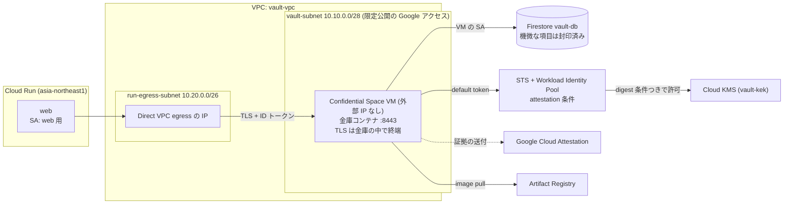
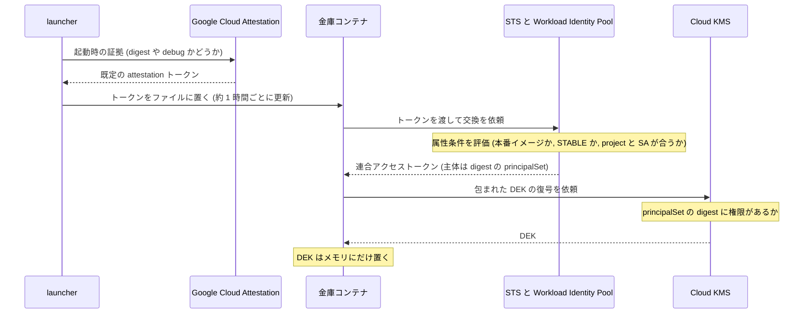
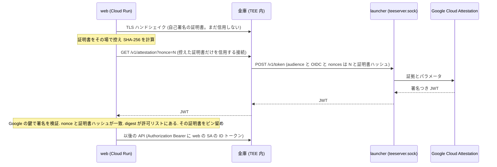

# TEE（Confidential Space）スパイク前の調査報告

- 作成日: 2026-10-02
- 対象: `design/anon-negotiation-agent/design.md` v10 の §9（確かめる 6 点）・§1.1・§1.2・§3・§10・AC-23、台帳 I-7・I-14
- 今回やったこと: 公式文書の読み込みと、リポジトリの読み取りだけ。コードは書いていない。GCP のコマンドは実行していない（`gcloud` を呼んでいない）。
- 読み方
  - 文末の `[S12]` は、末尾「出典」の番号。
  - 確かさの印: 【原文】公式ページの原文をブラウザで読んだ ／ 【要約】検索・要約ツールの出力だけで、原文は読んでいない ／ 【推測】確かめられていない ／ 【二次】公式以外の情報。
  - 要約ツールの出力に、公式文書に無い記述が混ざった例が 1 件あった（「公式が TLS の EKM 結び付けを説明している」。原文には無い。S8）。判断に効く主張は、原文で確かめ直して【原文】を付けた。
- 公式ページの最終更新は 2026-09-24〜09-30（S3・S4・S7・S8・S23 など）。この報告は 10/2 時点の文書に基づく。
- 調査で分かった環境の事実: この Mac には `docker` も `podman` もない（`uv` だけ。CPU は arm64）。イメージは手元ではなく Cloud Build で作る前提にした（§コマンドの手順 B）。

---

## 結論

6 点とも、公式の部品の組み合わせで組める見込み。ただし 3 番（web が本物の金庫と話していることの確認）は、公式に手順がなく自前の設計になる。ここが一番の山。費用は、AMD SEV の最小構成（n2d-standard-2）で 1 日 約 450 円、14 日で 約 6,300 円。Intel TDX（c3-standard-4）だと 1 日 約 1,000 円、14 日で 約 14,100 円（1 ドル 150 円の仮定）。

### 6 点の見込み

| # | 確かめること | 見込み | 理由 | いちばん注意すること |
|---|---|---|---|---|
| 1 | 金庫のイメージを Confidential Space で動かす | 通る | 公式のコマンド・メタデータ・ラベルが揃っている [S2][S3][S4]【原文】 | 本番イメージは SSH もログも既定で無い。先に debug イメージで通す。受信ポートは Dockerfile の `EXPOSE` と VPC の両方で開ける [S3][S6]【原文】 |
| 2 | 暗号鍵（Cloud KMS）を attestation 条件で渡す | 通る（鍵の解放まで）。Firestore の CMEK は使えない | 公式の手順どおり [S2]【原文】。CMEK は Firestore 自身が復号する仕組みで、条件が入らない [S21]【原文】 | debug イメージは STABLE 属性を持たず、本番の条件を通らない [S5]【原文】。digest が変わるたびに IAM を付け替える。Firestore への暗号化の組み込み（store.py の約 40 か所）は別作業 |
| 3 | web から金庫へ、金庫の中で終端する TLS で、本物か確かめてつなぐ | 危ない | 公式文書に TLS と attestation を結ぶ手順は無い [S8]【原文】。独自 audience と nonce は使える | 自前方式（TLS 証明書のハッシュを nonce に入れる）を Python で作る。EKM 方式は標準の `ssl` に API が無く採らない [S40][S41] |
| 4 | 金庫が呼び出し元の ID トークンを自分で検証する | 通る | google-auth の標準機能で足りる [S31][S32]【原文】 | Cloud Run が出す ID トークンに `email` が入るかは実機で確認。入らなければ `azp`（SA の一意 ID）で照合 |
| 5 | VM を外部 IP なしで VPC 内に置き、Cloud Run から VPC 経由でつなぐ | 通る（実機で詰まりやすい） | 公式の手順がある [S23][S24]【原文】[S27]【要約】 | Direct VPC egress の起動遅延（1 分以上）と接続切断。VM 側の ingress 許可は、サブネットの CIDR 指定だけ（タグは使えない）[S23]【原文】 |
| 6 | 画面に attestation の内容とコミットのリンクを出す／AC-23 | 通る（再現ビルドは対象外） | JWT の検証用エンドポイントを直接取得して確かめた [S9]【原文】 | digest とコミットの結び付けは、再現可能ビルドが無いうちは運営者の申告（対応表）になる。公式が再現ビルドで名前を挙げるのは Bazel だけ [S3]【原文】 |

- 10/4 までに 6 点とも通る確率は、五分五分（推測）。10/5〜6 の予備を使えば 7 割前後（推測）。
- 「分からない」が残るもの（実機でしか確かめられない）: Cloud Run の ID トークンの `email` 有無／Cloud Run のメタデータサーバが URL 以外の audience 文字列を受け付けるか／`tee-image-reference` に `@sha256:...` 形式が通るか／東京ゾーンの在庫とクォータ。

### 最も危ない点 3 つ

1. 3 番の自前方式。公式の手順が無く、web の検証部品と金庫の attestation の口と TLS の証明書を、すべて新しく作る。
2. 本番イメージの「見えなさ」と、外部 IP なしのネットワークの初見の組み合わせ。起動に失敗しても SSH もログも既定で出ない。限定公開の Google アクセスだけで Artifact Registry・STS・KMS・Firestore に出られるかは、実機でしか分からない。
3. 鍵を渡す条件の組み立てと、運営者の限界。条件に `hwmodel`・project・SA・`dbgstat` を入れないと、別のイメージ・別プロジェクト・機密でない VM に鍵が出る。さらに、運営者（プロジェクトのオーナー）は鍵の IAM を書き換えられる（管理操作は監査ログに残る [S18]）。これは Confidential Space の構造上の限界で、説明文に書く必要がある。

### 推奨構成（決め打ち）

| 項目 | 決めたこと | 理由 |
|---|---|---|
| リージョン・ゾーン | asia-northeast1 ／ asia-northeast1-b | Direct VPC egress は Cloud Run と同じリージョンのサブネットを使う [S23]。-b は SEV と TDX の両方が使える東京の唯一のゾーン [S13]【原文】 |
| 機密 VM | `n2d-standard-2` + AMD SEV + `MIGRATE` | 公式の例がこの構成 [S4]【原文】。東京の a・b・c すべてで使える [S13]。費用は TDX の約 45%。ホスト保守でライブマイグレーションが効く（N2D + SEV だけ）[S4] |
| 代替の機密 VM | `c3-standard-4` + Intel TDX + `TERMINATE` | 東京は -b のみ [S12][S13]。費用は 2.2 倍。ホスト保守では VM が止まって再起動する [S4]。2026 年に TDX ファームウェアの脆弱性告知が 2 件 [S44] |
| 機密技術の注意 | SEV-SNP は選べない | Confidential Space の選択肢は SEV と TDX だけ [S4]。SEV は SNP・TDX より保護が弱いと一般に言われる（出典未確認の推測） |
| イメージ | 金庫専用の `Dockerfile.vault`（金庫と negotiation_core だけ）。`ENTRYPOINT` 固定 | `tee-cmd` の上書きを許さないため。web・agents の変更で digest が動くのを避けるため（設計書 §1.1 の「3 サービス 1 イメージ」の例外になる） |
| launch policy | `log_redirect=always` だけ許可。ほかは既定（上書き不可） | 本番イメージでログを見るため。環境変数の上書き・コマンドの上書き・メモリ監視は許さない [S3] |
| 鍵 | Cloud KMS に鍵 1 本（KEK）。権限は Workload Identity Pool の principalSet（digest）にだけ。VM の SA には付けない | VM の SA に付けると、運営者が同じ SA で別の VM を作って復号できる |
| 保存 | Firestore `vault-db` に、本物の依頼者の機微な項目だけを項目単位で AES-256-GCM で封印 | CMEK では「検証済みだけ」にならない [S21]。クエリに使う項目は平文のまま |
| 経路 | web（Cloud Run）→ Direct VPC egress（`private-ranges-only`）→ 金庫の内部 IP:8443（TLS は金庫の中で終端）| 追加費用なし [S24]。VM に外部 IP は付けない |
| 呼び出し元の認証 | 金庫が web の SA の Google ID トークンを自分で検証 | TEE 版では Cloud Run の IAM が効かない（設計書 §1.1・§9） |
| web が金庫を確かめる方法 | 「検証してからピン留め」: 金庫の TLS 証明書のハッシュを attestation トークンの nonce に入れ、web が署名・claim・ハッシュを確かめて、その証明書だけを信用する | 公式の独自 audience・nonce の機能の応用（【推測】動作は実機で確認）|
| 画面とAC-23 | web が検証した結果を出す。第三者は `scripts/verify_attestation.py` で JWT を自分で検証する | 金庫は外部から直接届かないので、web の公開口か IAP トンネル経由になる |

### 台帳 I-14「検証の中で決めること」への回答案

- 2 番（何を暗号化するか）: 本物の依頼者の機微な項目だけ。`principals/{pid}` の policy・blocklist・removed_axes・attribute_bands、`negotiations/{nid}`（mode=live）の snapshots・pending_offer・last_check・pending_question・result、`events/{version}` の `views.*.payload`。索引や制御に使う項目（ID・status・期限・seq・mode・TTL・カウンタ）は平文。デモ・攻撃・テンプレートは公開フィクスチャなので暗号化しない。AAD は「文書のパス + 項目名」。詳細は、本書「6 点ごとのやり方」の 2-5。
- 3 番（web が本物の金庫と話していることの確かめ方）: 上の「検証してからピン留め」。詳細は 3。

### 作るもの／捨てるもの／危ないところ

- 作るもの: (a) 金庫の TEE 用の起動口（鍵の解放・証明書の生成・attestation の口・呼び出し元の検証）、(b) web 側の「検証してからピン留めする」接続部品、(c) 検証スクリプトと digest↔コミットの対応表。
- 捨てるもの: Firestore の CMEK（条件が入らず、申請も要る）、全文書の一括暗号化（クエリが書けなくなる）、EKM 方式（Python に標準の API が無い）、Serverless VPC Access コネクタ（費用がかかる）、`google-cloud-kms`・Tink・pyOpenSSL（依存の追加）、再現可能ビルド（2 日では対象外）、SEV-SNP（Confidential Space が非対応）。
- 危ないところ: 上の「最も危ない点 3 つ」と、末尾の「危ない点」。

### ユーザーの判断が要る点（既定の提案つき）

1. 機密 VM の種類: 既定は N2D + SEV（安い・公式例どおり・止まりにくい）。TDX は隔離が強いが 2 倍強の費用。
2. 合否のルール: 設計書 §9 は「6 点とも通れば実施」。提案は、1・2・4・5 を必須、3 と 6 は「縮退版でも可（画面と文書に弱い版だと明記）」。縮退の中身は 2 日の順番の節。
3. 公開の範囲: 既定はリポジトリ全体を公開（digest↔コミットが単純）。ただし `design/` と台帳が公開される。台帳 I-10 に GCP プロジェクト ID が書かれているので、公開前に伏せるか決める。金庫だけを別リポジトリに出す場合は、ビルドの流れを作り直す。
4. 予算アラート: いまは 3,000 円（台帳 I-10）。VM だけで 1 日 約 450 円（SEV）〜 約 1,000 円（TDX）かかる。10/3 に引き上げる。
5. 依存の明示: `cryptography` と `requests` は uv.lock にすでにあるが、直接 import するので pyproject への明示が要る（新しいライブラリではないが、ルール上の承認が要る）。
6. 手元に Docker が無い: イメージは Cloud Build で作る。Cloud Build の既定 SA に権限が無いと失敗する可能性がある [S34]。
7. VM の運用: デモ期間（審査が終わるまで）は常時。それ以外は夜間に止めて費用を抑える（止まっている間は vCPU・メモリは課金されない。ディスクは課金される [S43]）。

---

## 6 点ごとのやり方

### 全体の絵



Confidential Space は、ワークロード（コンテナ）・attestation サービス（Google Cloud Attestation か Intel Trust Authority）・保護されたリソース（KMS・Cloud Storage など）の 3 つでできている [S1]【要約】。このプロジェクトでは、Confidential Space の 3 つの役割（workload author・operator・データの持ち主）が、すべて同じ人（ユーザー）になる [S10]【原文】。公式は 3 者が別々の組織であることを想定している。そのため「運営者から隠す」は構造上、完全にはならない（点 2 の「運営者の限界」と末尾の「危ない点」）。

---

### 1. 金庫のイメージを Confidential Space で動かす

**見込み: 通る**

#### 1-1 イメージの作り方

- 置き場: Artifact Registry の Docker リポジトリ（`asia-northeast1`）[S2][S37]。
- 公式の流れ: Docker でイメージを作り、Artifact Registry に置く。VM（Confidential Space イメージ）が起動時に launcher で pull して動かす [S3]【原文】。
- ビルド: この Mac に docker が無いので Cloud Build を使う（`gcloud builds submit --region ... --tag ...` か `--config`。公式の手順 [S36]【要約】。Linux/amd64 で作られる）。Cloud Build は 1 請求アカウントあたり月 2,500 分まで無料 [S35]【原文】。新しいプロジェクトでは、ビルドの既定 SA が Compute Engine の既定 SA になることがあり、権限が足りないと失敗する [S34]【原文】。失敗したら、その SA に `roles/cloudbuild.builds.builder` を付ける（【推測】一般的な対処。公式文書にコマンドの記載は見つからなかった）。
- digest の取得: `gcloud artifacts docker images describe <イメージ> --format='value(image_summary.digest)'` [S38]【要約】。
- `Dockerfile.vault` の要点（案）:
  - ベース `python:3.12-slim` を digest で固定。`uv sync --frozen`（uv.lock のハッシュで依存が固定される）。
  - `COPY` は `src/vault`・`src/negotiation_core`・`config/params.toml` だけ。
  - `ENTRYPOINT ["python", "-m", "vault.tee.main"]` と `CMD []`（コマンド上書きを許さない）。
  - `EXPOSE 8443/tcp`。Confidential Space の VM は既定で受信を全部止めていて、`EXPOSE` したポートだけ開く（イメージ版 230600 以降）。`EXPOSE` を変えると digest が変わる [S3]【原文】。ランチャーは `iptables` で INPUT を許可する [S39]【原文（ソース）】。
  - `LABEL "tee.launch_policy.log_redirect"="always"`。
  - `USER` は指定しない（root）。ランチャーのソースに「non-root のときだけユーザーとネットワークの名前空間を使い、それ以外はホストのネットワークを使う（`ctr` の `--net-host` と同じ）」とある [S39]【原文（ソース）】。non-root 用のメタデータ `tee-nonroot-container` はソースにあるが公式文書に無いので使わない。

launch policy（作者が Dockerfile のラベルで決める。運営者の指定を上書きする）[S3]【原文】:

| ラベル | 既定 | この構成での設定 | 意味 |
|---|---|---|---|
| `tee.launch_policy.allow_cmd_override` | false | 設定しない（false） | `tee-cmd` でコマンドを変えられるか |
| `tee.launch_policy.allow_env_override` | 空 | 設定しない | `tee-env-*` で環境変数を足せるか。足せないので、設定はイメージに焼くかメタデータサーバの値から作る |
| `tee.launch_policy.allow_capabilities` / `allow_cgroups` | false | 設定しない | Linux capability・cgroup の追加 |
| `tee.launch_policy.allow_mount_destinations` | 空 | 設定しない | `tee-mount`。`/dev/shm` と既定の暗号化領域で足りる |
| `tee.launch_policy.log_redirect` | debugonly | `always` | 本番イメージでもログの転送を許す（ログには ID・秘密を出さない設計。設計書 §3.8） |
| `tee.launch_policy.monitoring_memory_allow` | debugonly | `never` | メモリ使用量の監視。使用量から秘密が漏れうるので禁止 |

#### 1-2 VM の作り方

- 機密コンピューティングの種類: `--confidential-compute-type=SEV` か `TDX`（SEV-SNP は選択肢に無い）[S4]【原文】。
- マシンタイプ: SEV は `n2d-standard-2`（公式の例）、`--maintenance-policy=MIGRATE`（N2D + SEV のときだけ。ほかは `TERMINATE`）[S4]【原文】。TDX は `c3-standard-*`（最小は c3-standard-4）、`TERMINATE`。
- イメージ: `--image-project=confidential-space-images`。`--image-family=confidential-space`（本番）か `confidential-space-debug`（debug）[S4][S5]【原文】。最新は 260800（2026-09-15）[S11]【原文】。
- 本番と debug の違い [S5][S6]【原文】:
  - 本番: SSH なし。workload が終わると VM は止まる（戻り値 0・1）。`tee-restart-policy` が使える（本番だけ）。
  - debug: SSH あり。workload が終わっても VM は残る（戻り値 4）。`support_attributes` が付かない。
- メタデータ（区切りは `^~^`）[S4]【原文】:
  - `tee-image-reference`（必須）: `asia-northeast1-docker.pkg.dev/<PROJECT_ID>/vault/vault:spike`。本番は `...@sha256:<digest>` を使う案（【推測】`@sha256` 形式が通るかは実機で確認。通らなければタグ参照）。
  - `tee-container-log-redirect`: debug は `true`（シリアルと Cloud Logging の両方）、本番は `cloud_logging`。
  - `tee-restart-policy`: 本番は `OnFailure`（落ちたら再起動。ログの戻り値 3）。
  - `tee-env-*` は使わない（launch policy で許していない）。
- VM の SA に必要な権限 [S4]【原文】: `roles/confidentialcomputing.workloadUser`（attestation トークンの発行）、`roles/artifactregistry.reader`（イメージの取得）、`roles/logging.logWriter`（ログの転送）。それに Firestore（`roles/datastore.user` を `vault-db` だけに限る IAM 条件つき。条件の書式は [S22]【原文】）。KMS の権限は付けない。
- そのほか: `--shielded-secure-boot --scopes=cloud-platform --no-address --tags=vault-tee --boot-disk-size=20GB`。ディスクの整合性タグがメモリの約 1% を使い、swap は無い [S3]【原文】。8 GB のメモリで足りる。

#### 1-3 ログの出し方

- debug イメージ: シリアル出力（`gcloud compute instances get-serial-port-output`）と Cloud Logging。SSH でコンテナの中に入るには `sudo ctr task exec -t --exec-id shell tee-container bash` [S6]【原文】。手元の `~/.ssh` に鍵を作りたくなければ、コンソールのブラウザ SSH を使う。
- 本番イメージ: `tee-container-log-redirect=cloud_logging` ＋ 作者側ラベル `log_redirect=always` ＋ `logging.logWriter`。ログ名は `confidential-space-launcher`、リソースタイプは VM Instance [S6]【原文】。戻り値は 0（正常終了。VM 停止）・1（異常。VM 停止）・3（再起動ポリシーで再起動）・4（debug で待機）。
- 本番イメージでは、ログの転送を許さないと何も見えない（非公式サンプルも「stdout は debug だけ」と書いている [S40]【二次】）。
- ログに秘密を出さない: 金庫は LLM を使わず、ログは設計書 §3.8 に従う。`mask_ids_in_logs()` は TEE の起動口でも呼ぶ。TEE で増える秘密も出さない: STS 交換用の既定トークン（ファイルの中身）、KMS が返した DEK、連合アクセストークン。出してよいのは claims の値（`image_digest` など）と、独自 audience で取った attestation トークン（公開情報）だけ。

#### 1-4 合否・代替

- 合格: 本番イメージの VM が起動し、Cloud Logging に launcher のログが出て、コンテナが動く。`/v1/attestation` のトークンに `swname=CONFIDENTIAL_SPACE`・`dbgstat=disabled-since-boot`・`hwmodel=GCP_AMD_SEV`（TDX なら `GCP_INTEL_TDX`）・`image_digest` がビルドした digest と一致する。VM の停止→開始、クラッシュ後の再起動（`OnFailure`）も確認する。
- 不合格の目安: 本番イメージで 2 時間デバッグしても起動しない。
- 代替: debug イメージで原因を切り分ける。公式の nginx 例（[S2]）で土台の問題かを分ける。それでも駄目なら Cloud Run 版。

---

### 2. 保存データの鍵を、検証済みのワークロードにだけ渡す

**見込み: 通る（鍵の解放まで）。Firestore への組み込みは別作業。**

#### 2-1 仕組み（公式）



- 既定のトークンは、audience が `https://sts.googleapis.com` で、launcher が約 1 時間ごとに取り直してファイル `/run/container_launcher/attestation_verifier_claims_token` に書く [S7][S8]【原文】。更新は寿命の 0.8±0.1 の時点 [S39]【原文（ソース）】。
- 公式のワークロード（Go）は、このファイルを `external_account` の認証情報の `credential_source.file` に指定して STS で交換し、KMS を呼ぶ [S2]【原文】。

#### 2-2 プールとプロバイダの作り方（公式のコマンドが元）[S2]【原文】

- プール: `gcloud iam workload-identity-pools create vault-tee-pool --location=global`
- プロバイダ: `gcloud iam workload-identity-pools providers create-oidc attestation-verifier --location=global --workload-identity-pool=vault-tee-pool --issuer-uri="https://confidentialcomputing.googleapis.com/" --allowed-audiences="https://sts.googleapis.com" --attribute-mapping=... --attribute-condition=...`
- 属性の対応（公式のとおり）: `google.subject = "gcpcs::" + image_digest + "::" + project_number + "::" + instance_id`、`attribute.image_digest = assertion.submods.container.image_digest`。
- 条件（公式は 2 段階）:
  - テスト用（debug を通す）: `assertion.swname == 'CONFIDENTIAL_SPACE'`
  - 本番用（公式）: 上に `&& 'STABLE' in assertion.submods.confidential_space.support_attributes`
  - debug イメージには support_attributes が付かない（空）ので、本番条件では落ちる [S5]【原文】。そのため、debug で試す間はテスト用、本番に切り替えるときに本番用へ `update-oidc` する。
- この構成での本番条件（案。公式の本番条件に、後述の 4 つを足す）:

```
assertion.swname == 'CONFIDENTIAL_SPACE'
&& 'STABLE' in assertion.submods.confidential_space.support_attributes
&& assertion.dbgstat == 'disabled-since-boot'
&& assertion.hwmodel in ['GCP_AMD_SEV', 'GCP_INTEL_TDX']
&& assertion.submods.gce.project_id == '<PROJECT_ID>'
&& '<VAULT_SA>' in assertion.google_service_accounts
```

  - `dbgstat`: debug イメージ（root で入れる）を除く [S7]【原文】。
  - `hwmodel`: トークンの `hwmodel` には `GCP_SHIELDED_VM`（機密でない VM）も取りうる [S7]【原文】。機密 VM であることを条件に入れる（【推測】Confidential Space のイメージが機密でない Shielded VM でも `swname=CONFIDENTIAL_SPACE` になりうるかは未確認。入れて損はない）。
  - `project_id` と `google_service_accounts`: この digest のイメージは公開される。別人が自分のプロジェクトで同じ digest を動かしても、このプールからは鍵を受け取れないようにする [S4]【原文】（SA の書式）。

#### 2-3 鍵の権限の付け方

- 鍵: `gcloud kms keys create vault-kek --location=asia-northeast1 --keyring=vault-tee --purpose=encryption`（公式の例は `global`。どちらでも動く見込み＝推測）。
- 権限: `principalSet://iam.googleapis.com/projects/<PROJECT_NUMBER>/locations/global/workloadIdentityPools/vault-tee-pool/attribute.image_digest/<DIGEST>` に `roles/cloudkms.cryptoKeyEncrypterDecrypter` [S2]【原文】。公式は decrypter だけだが、初回に DEK を包む（encrypt）のも金庫なので両方要る。
- digest が変わるたびに、新しい digest の principalSet を足し、古いものを外す。外し忘れると古いイメージにも鍵が出る。
- VM の SA には KMS の権限を付けない。
- 運営者の限界: プロジェクトのオーナーは、鍵の IAM（`SetIamPolicy`）を書き換えて、自分や別のイメージに復号権を付けられる。`SetIamPolicy` は Admin Activity 監査ログに必ず残る。暗号操作（Decrypt など）の記録は Data Access ログで、既定では無効 [S18]【要約】。設計書 §9 の「鍵は、そのコードを動かすワークロードにしか渡らない」は、「IAM を変えない限り」という前提つきで書く。

#### 2-4 ワークロードの中から KMS を呼ぶ（Python。擬似コード・未検証）

`google-auth` の `identity_pool` が使える（ローカルの google-auth 2.58.1 のソースで、`from_info` と `credential_source.file` を確認 [S32]【原文（ソース）】）。KMS は REST で呼ぶ（`google-cloud-kms` は新しい依存になるので使わない）[S20]【要約】。

```python
import base64
import google.auth.transport.requests as gar
from google.auth import identity_pool

creds = identity_pool.Credentials.from_info(
    {
        "type": "external_account",
        "audience": f"//iam.googleapis.com/projects/{project_number}/locations/global"
                    "/workloadIdentityPools/vault-tee-pool/providers/attestation-verifier",
        "subject_token_type": "urn:ietf:params:oauth:token-type:jwt",
        "token_url": "https://sts.googleapis.com/v1/token",
        "credential_source": {"file": "/run/container_launcher/attestation_verifier_claims_token"},
    },
    scopes=["https://www.googleapis.com/auth/cloud-platform"],
)
session = gar.AuthorizedSession(creds)
r = session.post(f"https://cloudkms.googleapis.com/v1/{key_name}:decrypt",
                 json={"ciphertext": base64.b64encode(wrapped_dek).decode()}, timeout=10)
r.raise_for_status()
dek = base64.b64decode(r.json()["plaintext"])
```

（`key_name` は `projects/<PROJECT_ID>/locations/asia-northeast1/keyRings/vault-tee/cryptoKeys/vault-kek`。プロジェクト ID・番号は、Compute Engine のメタデータサーバ（`project/project-id`・`project/numeric-project-id`）から実行時に取る案。公開リポジトリに ID を書かずに済む。【推測】Confidential Space のコンテナから届く前提（ランチャーのソースで root のコンテナは host ネットワーク [S39]。Firestore の既定の認証も同じ経路を使う）。運営者が書き換えられるのはインスタンスのカスタム属性で [S10]、プロジェクト ID・番号は書き換えられない、と見ている（【推測】）。）

#### 2-5 Firestore との組み合わせ（エンベロープ暗号化）

公式の考え方 [S19]【要約】: データはローカルで作った DEK で暗号化し、DEK は Cloud KMS の KEK で包んで、包んだものをデータの隣に置く。推奨は AES-256-GCM。

- DEK は、金庫が初回の起動時に VM の中で作る（手元で作ると、運営者が平文の DEK を見てしまう）。KMS の `encrypt` で包み、`vault-db` の `_tee/dek` に保存する。以降の起動では、包みを解いてメモリにだけ置く。KMS を呼ぶのは起動時の 1 回だけ（イメージが失効しても、起動済みの金庫は動き続ける）。
- 注意: debug イメージで動かしている間は、運営者が SSH で root として入れる [S5]。その間に作った・復号した DEK は「運営者が見られた鍵」として扱い、試験の文書しか暗号化しない。本物の依頼者のデータを入れる前に、`_tee/dek` を消して、本番イメージで DEK を作り直す（手順 D の後）。
- 封印は AES-256-GCM（`cryptography` の `AESGCM`。すでに uv.lock にある）。AAD は「文書のパス + 項目名」にして、運営者が暗号文を別の文書に差し替えても復号できないようにする。保存形式は Firestore の bytes 型。
- 何を封印するか（案）:

| 場所 | 封印する項目 | 平文のまま | 理由 |
|---|---|---|---|
| `principals/{pid}`（本物の依頼者） | policy・blocklist・removed_axes・attribute_bands | side・deleting・累計カウンタ・予算の窓 | 丸め済みポリシーそのもの |
| `negotiations/{nid}`（mode=live） | snapshots・pending_offer・last_check・pending_question・result | participants（ID）・status・paused・mode・deadline・expires_at・version・seq・counters・TTL | クエリ（`participants.*.principal_id`・`status in [...]`）が使う |
| `negotiations/{nid}/events/{version}`（live） | `views.*.payload` | `views.*.seq`・TTL | `views.<side>.seq > n` のクエリが使う |
| テンプレート・デモ・攻撃の交渉 | なし | すべて | 公開フィクスチャ（値はリポジトリにある） |

- 触るコード: `store.py` の `model_to_firestore` が 18 か所・`model_from_firestore` が 22 か所・`to_dict()` が 26 か所 [S47]。書き込みと読み込みの入口を 1 つの封印レイヤにまとめると、約 40 か所の変更で済む（規模の見積もりは「コードの変更」）。
- 限界: 金庫の読み出し口（web が呼べる API）は、封印を解いた値を返す。運営者のコード（web）が API を通せば読める点は、TEE でも変わらない（設計書 §9「TEE でも言えないこと」）。封印が守るのは、運営者が Firestore を直接読む・エクスポートする・バックアップから読む場合。古い版への巻き戻しや、文書の削除は防げない。

#### 2-6 Firestore の CMEK では「検証済みのワークロードだけ」にならない理由

1. CMEK で鍵を使うのは Firestore サービス自身（Firestore のサービスエージェント）で、アプリではない。公式も「リクエストごとに鍵を渡す必要はない。読み・書き・クエリは、Google の既定の暗号化と同じように動く」と書く [S21]【原文】。
2. 読み書きの認可は従来どおり Firestore の IAM。IAM を持つ主体（運営者・別の VM・gcloud）には平文で返る。attestation の条件が入り込む場所が無い。
3. 使うには、機能のアクセス申請（フォーム）が要り、データベースの作成時にだけ指定できる。既存のデータベースは変換できない [S21]【原文】。
4. CMEK ができること: 鍵を無効にして全データを読めなくする、鍵の利用を監査ログに残す、鍵の場所を限る。今回の目的とは違う。
5. 結論: 「検証済みのイメージだけが復号できる」は、アプリ側の暗号化 + Cloud KMS を Workload Identity Pool の条件で絞る方式でだけ成り立つ。

#### 2-7 つまずいたときの切り分け（【推測】一般的な挙動）

| 症状 | どこで | 疑うこと |
|---|---|---|
| STS が「属性条件で拒否」 | STS | 条件が false。debug は support_attributes が空で、本番条件の STABLE で落ちる。トークンの claims（`hwmodel`・`project_id`・`google_service_accounts`）を見る |
| STS が「audience が合わない」 | STS | プロバイダの `--allowed-audiences` と、トークンの `aud`（`https://sts.googleapis.com`）[S7] |
| KMS が 403 | KMS | principalSet の digest がトークンの `image_digest` と違う。IAM の反映待ち（数分） |
| KMS が 404 | KMS | 鍵のパス（location・keyring・key） |
| トークンのファイルが無い | ワークロード | launcher のログを見る。本番イメージで `log_redirect` が許されているか |

#### 2-8 合否・代替

- 合格: (a) 本番イメージの VM の金庫が、DEK を unwrap でき、封印した試験文書を Firestore に書いて読み戻せる。(b) 負の試験 3 つ: debug イメージの VM → STS で拒否／digest の違うイメージ（試験用に 1 行変えて作る）→ KMS が 403／手元（オーナー権限）から `gcloud kms decrypt` → 403（オーナーに復号権は無い。【推測】基本ロールに復号権が含まれないという一般的な理解）。(c) 手元で Firestore の文書を読むと暗号文になっている。
- 不合格の目安: 本番イメージで STS の交換が 3 時間通らない。負の試験で鍵が漏れる（これは即、中止）。
- 代替: テスト用の条件（swname のみ）で debug の VM だけで確かめ、本番条件は 10/5〜6 に回す。それでも鍵の解放が成立しなければ、TEE は設計書だけにする（spec の縮退順）。

---

### 3. web から金庫へ、ワークロード内で終端する TLS でつなぐ

**見込み: 危ない（自前設計）**

#### 3-1 公式にあるもの・ないもの

- ある【原文】[S8]:
  - 独自の audience（最大 512 バイト。`https://sts.google.com` は不可）と nonce（最大 6 個。要求側は各 10〜74 バイト。トークンの `eat_nonce` の仕様は 8〜88 バイト [S7]）を付けた attestation トークンを、launcher から取れる。
  - 取り方: ワークロードが Unix ソケット `/run/container_launcher/teeserver.sock` に、`POST http://localhost/v1/token`、本文 `{"audience": "...", "token_type": "OIDC" | "PKI", "nonces": ["...", ...]}`。返りはトークン（JWT）。
  - nonce は「証明書利用者が決める 1 回限りの値。要求した nonce と、返ったトークンの nonce が同じことを確かめ、違えば拒否する」。
  - Google Cloud Attestation への要求は、1 プロジェクト・1 リージョンあたり毎秒 5 件まで。
- ない【原文】: TLS の鍵や証明書とトークンを結び付ける手順（ページ本文を検索して、「TLS」「EKM」「channel binding」の語が無いことを確認した）。
- 非公式の参考【二次】: Google 社員の個人サンプルに、TLS の EKM（RFC 5705）を nonce に入れて結び付ける方式がある。「Google はサポートしない」と明記 [S40]。Python の標準 `ssl` には EKM を取り出す API が無い（CPython の課題が未解決）。pyOpenSSL には `export_keying_material` がある（新しい依存になる）[S41]【検索要約】。→ 採らない。

#### 3-2 推奨する方式: 検証してからピン留め



- 金庫は起動のたびに、メモリ上で P-256 の鍵と自己署名の証明書を作る（`cryptography`。鍵のファイルは `/dev/shm` か暗号化された書き込み領域 [S3][S10]。uvicorn の `ssl_keyfile`・`ssl_certfile` はファイルのパスを取る）。証明書には `serverAuth` の拡張鍵用途を付ける（【推測】付け忘れると、クライアントの検証が「用途が違う」で通らないことがある）。証明書の SHA-256（16 進 64 文字。10〜74 バイトの範囲に収まる）を控える。
- web は、(1) 証明書を検証なしで取り、ハッシュを計算（標準の `ssl.get_server_certificate`）、(2) その 1 枚だけを信用する `SSLContext`（`check_hostname=False`、`load_verify_locations(cadata=...)`）で `/v1/attestation?nonce=<新しい乱数>` を呼ぶ、(3) 返った JWT を検証、(4) 通ったらその `SSLContext` を以後の接続に使う（`httpx.AsyncClient` の transport として束ねる。`VaultClient` は変えない）。
- 中間者への強さ: 途中の者が自分の証明書を出すと、トークンの nonce にある証明書ハッシュと合わず、拒否される。本物の金庫のトークンを中継しても、中継者は本物の証明書の秘密鍵を持たないので TLS を張れない。古いトークンの再利用は、新しい nonce で防ぐ。
- 金庫の再起動で証明書が変わる。web は接続エラーのたびに、再検証して付け替える（頻度に上限を付ける。Google の 5 QPS 制限 [S8]）。
- nonce は公式の説明では「証明書利用者が決める 1 回限りの値」。証明書ハッシュを入れるのはワークロード側の都合で、公式の想定した使い方ではない（【推測】launcher は nonce を中継するだけなので、動作に問題はないはず。スパイクで確認）。

#### 3-3 web が確かめる項目（トークンの検証ポリシー）

| claim | 条件 | 出典 |
|---|---|---|
| 署名 | Google の鍵で検証できる（x509 エンドポイントか JWKS） | [S9] |
| `iss` | `https://confidentialcomputing.googleapis.com` | [S7][S9] |
| `aud` | 金庫が使うと決めた固定の文字列と一致 | [S8] |
| `exp`・`iat` | 期限内 | [S32] |
| `eat_nonce` | 送った nonce と、証明書ハッシュの両方を含む | [S8] |
| `swname` | `CONFIDENTIAL_SPACE`（失効したイメージは `GCE` になる） | [S5][S7] |
| `dbgstat` | `disabled-since-boot` | [S7] |
| `hwmodel` | `GCP_AMD_SEV` か `GCP_INTEL_TDX`（設定で受ける） | [S7] |
| `support_attributes` | `STABLE` を含む | [S5][S7] |
| `image_digest` | 許可リスト（`deploy/vault-releases.json`）にある | [S7] |
| `cmd_override`・`env_override` | 無い | [S7] |
| `gce.project_id`・`zone`・`instance_name` | 想定どおり | [S7] |
| `google_service_accounts` | 金庫用 SA だけ | [S7] |
| `tdx.gcp_attester_tcb_status`（TDX のみ） | 記録する。厳しく見るかは別に決める（ファームウェアの更新中に最新でなくなりうる [S44]） | [S7][S44] |

署名の検証は `google.auth.jwt.decode(token, certs=<kid→PEM の辞書>, audience=...)` が使える（RS256・`iat`/`exp`/`aud`を確認。`iss` と nonce は自分で見る）。ローカルの google-auth 2.58.1 のソースで挙動を確認した [S32]【原文（ソース）】。x509 エンドポイントが、この `kid→PEM` の形で返ることを直接確認した [S9]【原文】。

#### 3-4 合否・代替

- 合格: (1) 正常系: 手元の検証スクリプト（IAP トンネル経由）と Cloud Run の probe の両方で、ピン留めして API が通る。(2) 異常系（単体試験で自動）: nonce が違う／証明書ハッシュが違う／署名を 1 バイト変える／debug のトークン／digest が許可リストに無い／期限切れ → すべて拒否。(3) 金庫の再起動の後に、web が再検証して復帰する。
- 不合格の目安: 金庫から launcher のトークンが取れない、または Cloud Run から VM の 8443 に届かない（点 5 と同時に切り分ける）。
- 代替（弱い順に）: (a) 証明書を設定で固定する（再起動ごとに手動で貼り替え。デモ中の可用性が悪い）。(b) 証明書を KMS で包んで保存し、再起動しても同じ証明書を使う（web は固定のピンを設定で持てる。実装が増える）。(c) pyOpenSSL で EKM（依存の追加の承認が要る）。(d) 結び付けなし（VPC 内 + ID トークンだけ）。(d) は「web が本物の金庫と話している」の確認ができないので、画面と文書で弱い版だと明記する。

---

### 4. 金庫が呼び出し元の ID トークンを自分で検証する

**見込み: 通る**

#### 4-1 公式の事実

- Cloud Run から別のサービスを呼ぶときは、メタデータサーバから audience つきの ID トークンを取る [S33]【要約】。audience は「サービスの URL またはカスタム audience」と書かれている（URL 以外の文字列を受け付けるかは実機で確認。受け付けなければ `https://vault.<任意>` の URL 形式にする）。
- サービスアカウントの ID トークンの claim: `iss=https://accounts.google.com`、`aud`（要求側が自由に決める）、`azp` と `sub`（SA の一意 ID）、`email`（SA のメール）、`email_verified`、`exp`、`iat` [S30][S31]【原文】。
- 検証は、Google の公開 OAuth2 証明書で署名を確かめ、`aud` と `exp` を確かめる [S31]【原文】。google-auth の既定の証明書 URL は `https://www.googleapis.com/oauth2/v1/certs`（`kid`→x509 の PEM）[S32]【原文（ソース）】。同じ鍵の JWK 形式が `.../oauth2/v3/certs`（【要約】[S31]）。

#### 4-2 実装の方針

- 使う関数: `google.oauth2.id_token.verify_token(token, request, audience=..., certs_url=...)`。署名・`exp`・`aud` を確かめる。`iss` が Google であること、`email` が web の SA と一致し `email_verified` が真であることは、自分で確かめる。ローカルのソースで、既定の証明書 URL が `oauth2/v1/certs`、`verify_oauth2_token` は `iss` が `accounts.google.com` か `https://accounts.google.com` であることも確かめる、と確認した [S32]【原文（ソース）】。
- 証明書のキャッシュ: 同じ docstring に「既定では検証のたびに証明書を取り直す。キャッシュで遅延と通信エラーを減らすとよい」とある [S32]。金庫は証明書を 1 時間キャッシュし、未知の `kid` のときだけ（1 分に 1 回まで）取り直す。取得に失敗しても、キャッシュが有効なうちは動く。
- 判定: トークンなし・形式不正・署名不正・期限切れ・audience 違い → 401。署名は正しいが許可された呼び出し元でない → 403。
- web 側: `web.service_auth.IdTokenAuth` は audience を呼び先の URL から作る [S47]。TEE 版では固定の audience（設定）を渡せるようにする（約 10 行）。

```python
from google.oauth2 import id_token
from google.auth.transport import requests as gar

claims = id_token.verify_token(token, gar.Request(), audience=VAULT_CALLER_AUDIENCE)
assert claims["iss"] in ("https://accounts.google.com", "accounts.google.com")
assert claims.get("email") == WEB_SA_EMAIL and claims.get("email_verified") is True
```

（擬似コード・未検証。実装ではキャッシュ付きの `google.auth.jwt.decode` にする。）

#### 4-3 合否

手元（IAP トンネル）から、コード無しで確かめられる。

- トークンなし → 401
- `gcloud auth print-identity-token`（自分のユーザーのトークン。audience が違う）→ 401
- `--impersonate-service-account=<web の SA> --audiences=<金庫の audience> --include-email` のトークン → 認可を通る（存在しない依頼者なので 404 が返る）
- `--impersonate-service-account=<金庫の SA>`（別の SA）→ 403
- Cloud Run の probe（web の SA）→ 認可を通る。ここで、Cloud Run のトークンの claim（`email`・`azp`）を出力して確かめる。

---

### 5. VM を外部 IP なしで VPC の内側に置き、Cloud Run の web から VPC 経由でつなぐ

**見込み: 通る（実機で詰まりやすい）**

#### 5-1 Direct VPC egress とコネクタの比較 [S24][S23]【原文】

| 項目 | Direct VPC egress（推奨） | Serverless VPC Access コネクタ |
|---|---|---|
| 追加費用 | なし（ネットワーク転送料のみ） | コネクタの VM 料金（既定は最小 2 台・e2-micro [S48]。東京 $0.010745715/h × 2 ≈ $0.0215/h ≈ 月 $15.7）[S15] |
| 性能 | 低遅延・高スループット | 低い |
| 受信側（VM）のファイアウォール | サブネットの CIDR で許可する。ネットワークタグ・サービスアイデンティティは ingress 規則で使えない | コネクタ単位 |
| 起動時の遅延 | 1 分以上の接続確立遅延がありうる。Cloud NAT を併用すると 30 秒以上の遅れ（コネクタ + NAT を勧める記述）| NAT との併用でも安定 |
| IP の消費 | 多い（/26 以上。16 個ずつ予約。稼働インスタンスの 2 倍を使う） | 少ない（専用の /28 のサブネットが別に要る [S48]） |
| 設定 | `--network --subnet --vpc-egress` | コネクタの作成 + `--vpc-connector` |
| その他 | ネットワーク保守で接続が切れうる（再接続できるクライアントで） | — |

この構成は web が 1 インスタンスだけなので、IP の消費は問題にならない。Direct VPC egress を第一候補にし、起動遅延が実用に耐えなければコネクタに替える。

#### 5-2 ネットワークの作り方

- VPC: カスタムモードの `vault-vpc`。
- サブネット 2 つ（どちらも限定公開の Google アクセスを有効）[S27]【要約】:
  - `vault-subnet` 10.10.0.0/28: 金庫の VM 用。
  - `run-egress-subnet` 10.20.0.0/26: Cloud Run の Direct VPC egress 用（/26 以上が必須 [S23]）。
- 金庫の VM: 固定の内部 IP `10.10.0.10`（内部 IP は無料 [S26]）。外部 IP なし（`--no-address`）。
- Cloud Run: `--network=vault-vpc --subnet=run-egress-subnet --vpc-egress=private-ranges-only`（既定値）。10.x の宛先だけが VPC を通り、Firestore・Vertex AI・Google API は従来の経路のまま [S29]【要約】。

#### 5-3 ファイアウォール

- ingress: `tcp:8443` を、ソース `10.20.0.0/26`（Cloud Run のサブネット）から、ターゲットタグ `vault-tee` へ許可する。
- Confidential Space の VM は、VM の中の `iptables` も既定で受信を全部止めていて、Dockerfile の `EXPOSE` したポートだけ開く [S3][S39]【原文】。VPC 側と VM の中の両方を開ける必要がある。
- 検証用に、IAP の範囲 `35.235.240.0/20` から `tcp:8443`（と debug のとき `tcp:22`）を許可する。`gcloud compute start-iap-tunnel` で、外部 IP の無い VM に手元から届く。VM に外部 IP は要らない [S28]【要約】。Confidential Space の VM ではゲストエージェントが無効 [S10]だが、IAP の TCP 転送はネットワークの経路なので届く見込み（【推測】。文書に、ゲストエージェントが必須という記載は見当たらなかった）。検証が終わったら、この規則は消す。
- egress: 既定（全許可）でよい。

#### 5-4 出口（Google API）

- 限定公開の Google アクセスを有効にしたサブネットの VM は、外部 IP が無くても Google API に届く。既定のドメイン（`*.googleapis.com`）は特別な DNS 設定が要らない。`*.pkg.dev`（Artifact Registry）と `gcr.io` も対象 [S27]【要約】。
- 金庫の VM が使う宛先: Artifact Registry（image の pull）、`confidentialcomputing.googleapis.com`（attestation）、`sts.googleapis.com`、`cloudkms.googleapis.com`、`firestore.googleapis.com`、`logging.googleapis.com`、`www.googleapis.com`（ID トークンの証明書）。どれも Google API。
- Cloud NAT は要らない見込み（公式の Confidential Space の文書に NAT を必須とする記述は無い [S2][S4]。非公式サンプルが NAT を使うのは、egress の IP を固定するため [S40]【二次】）。実機で出られなければ、VM 用に Cloud NAT を足す（外部 IP の料金は $0.005/h [S26]。NAT 本体の料金は未確認）。

#### 5-5 Cloud Run 側の注意 [S23]【原文】

- 起動時に 1 分以上、接続確立が遅れることがある。金庫を呼ぶ処理は再試行する。web の起動時に、HTTP の startup probe（金庫への接続を試す）を付ける。
- ネットワーク保守で接続が切れうる。`VaultClient` は通信エラーを `VaultUnavailableError` にして、レフェリーが待って再試行する作りなので、そのまま使える（`web/vault_client.py` [S47]）。
- 1 インスタンスの帯域は 1 Gbps まで。問題にならない。

#### 5-6 合否・代替

- 合格: (1) `gcloud compute instances describe` で外部 IP（`accessConfigs`）が空。(2) VM が Artifact Registry からイメージを取れ、STS・KMS・Firestore・Logging に出られる（金庫のログで確認）。(3) Cloud Run の Job（Direct VPC egress）から金庫に 200 が返る。(4) 手元から VM の内部 IP に直接は届かない（IAP のトンネルだけ）。
- 代替: Cloud NAT（VM 用）／Serverless VPC Access コネクタ／別ゾーン（a・c は SEV のみ）。

---

### 6. 画面に attestation の内容と GitHub のコミットへのリンクを出す／AC-23 の確かめ方

**見込み: 通る（再現ビルドは対象外）**

#### 6-1 JWT の署名の検証（点 3 と同じ部品）

直接取得して確かめた【原文】[S9]:

| 何 | URL |
|---|---|
| OpenID の設定 | `https://confidentialcomputing.googleapis.com/.well-known/openid-configuration`（`issuer=https://confidentialcomputing.googleapis.com`、署名は `RS256`） |
| JWKS（`jwks_uri`） | `https://www.googleapis.com/service_accounts/v1/metadata/jwk/signer@confidentialspace-sign.iam.gserviceaccount.com`（2026-10-02 時点で鍵 2 本。`kid` は `1be6ff7287d640316ddc929e1a8b21fbca7e54e7`・`bed6864e0f0fb3e94dab515a4711e3532584709e`） |
| 同じ鍵の x509 版（`kid`→PEM） | `https://www.googleapis.com/service_accounts/v1/metadata/x509/signer@confidentialspace-sign.iam.gserviceaccount.com` |
| PKI トークン用のルート証明書の場所 | `https://confidentialcomputing.googleapis.com/.well-known/attestation-pki-root`（`root_ca_uri` = `.../.well-known/confidential_space_root.crt`。SHA-1 指紋 `B9:51:20:74:2C:24:E3:AA:34:04:2E:1C:3B:A3:AA:D2:8B:21:23:21` [S8]） |

- 金庫には `token_type: "OIDC"` で要求する。理由: google-auth の `jwt.decode` で署名を確かめられる。PKI トークン（`x5c` の証明書チェーンをルートまで検証）は、Google への問い合わせが要らない利点があるが、チェーンの検証を `cryptography` で書く必要がある。2 日の枠では OIDC にする。
- 鍵は回転する。`kid` が未知のときだけ取り直す。

#### 6-2 画面に出すもの

web は、検証した結果を `GET /api/tee/attestation` で返し、画面が表示する（5 分ごとに更新。Google の 5 QPS 制限を守るため、画面の閲覧のたびには金庫を呼ばない）。

- 検証した時刻と「Google の鍵で署名を検証した」の表示。
- イメージの digest（全文をコピーできる）。
- ハードウェア（AMD SEV / Intel TDX）、本番イメージか（`dbgstat`）、Confidential Space のイメージ版（`swversion`）、ゾーンとインスタンス名。
- コミット: 対応表から引いた SHA と、`https://github.com/<owner>/<repo>/commit/<sha>` へのリンク。
- 「自分で確かめる」: 生の JWT（折りたたみ）と、`scripts/verify_attestation.py` の使い方。

#### 6-3 イメージ digest と git のコミットの結び付け（3 段階）

| 段階 | 方法 | 何が言えるか | 手間 | 時期 |
|---|---|---|---|---|
| L0 | リリースごとに `deploy/vault-releases.json` へ `{digest, commit, built_at}` を記録（ビルドの後に追記して、別のコミットにする）。画面とスクリプトはこの表を引く | 「運営者が、このコミットから作ったと記録した」。第三者がコミットから再ビルドしても、digest は一致しない（ビルドごとに変わる）| 小 | スパイク |
| L1 | GitHub Actions でビルドし、`actions/attest-build-provenance`（`subject-digest` に digest を渡す）で、digest・リポジトリ・コミット・ワークフローを結ぶ署名つきの証明を作る。第三者は `gh attestation verify` で確かめられる [S45]【検索要約】| 「このリポジトリのこのコミットのワークフローが、この digest を作った」と第三者が確かめられる | 中（GitHub から Artifact Registry への認証設定が要る）| 10/7 以降の任意 |
| L2 | 再現可能ビルド。`SOURCE_DATE_EPOCH` を固定し [S42]【要約】、ベースイメージ・uv を digest で固定、`uv sync --frozen`。公式が名前を挙げるのは Bazel [S3]【原文】。非公式サンプルは「Docker のビルドは決定的でなく digest が毎回変わる」と書く [S40]【二次】 | 第三者が同じ digest を再現できる | 大 | 任意（成功の見込みは五分五分。推測）|

- イメージの設定に `org.opencontainers.image.revision=<commit>` のラベルを入れる案もあるが、これは自己申告で、検証の足しにならない（digest が変わるだけ）。

#### 6-4 AC-23 の具体化（案）

設計書の AC-23 は `uv run python scripts/verify_attestation.py <vault-url>`。金庫は外部 IP が無く直接届かないので、`<vault-url>` を次の 2 通りにする。

- `--web https://<web の URL>`: web の `GET /api/tee/attestation?nonce=` に、スクリプトが乱数の nonce を渡す。web は金庫に転送し、JWT をそのまま返す。
- `--direct https://localhost:8443`: IAP トンネルの出口。開発者が手元で使う。

スクリプトの流れと合否:

1. 乱数の nonce（32 バイトを base64url）を作り、JWT を取る。
2. Google の x509 エンドポイントの鍵で署名を検証する。
3. 3-3 の表の項目を確かめる（`iss`・`aud`・`exp`・nonce・`swname`・`dbgstat`・`hwmodel`・`STABLE`・digest ほか）。
4. digest を `deploy/vault-releases.json` から引き、コミットの SHA と URL を表示する（`--check-commit` で GitHub のコミットの存在も確かめる）。
5. 全部通れば終了コード 0。1 つでも違えば 1。

自動の異常系（pytest）: 署名を 1 バイト変える／nonce 違い／digest が表に無い／`dbgstat=enabled`／期限切れ → すべて終了コード 1。

「ID トークンのない呼び出しは拒否される」は、IAP トンネル経由の `curl`（401）を、手動の確認項目（AC-19 と同じ扱い）として `tests/manual/` に書く。金庫の認可の判定そのものは pytest で確かめる。

#### 6-5 注意

- 画面とスクリプトでできるのは、「この digest の TEE が存在し、与えた nonce に応答した」ことの確認まで。「web が、その TEE にだけデータを送っている」ことの証明にはならない（web は運営側のコード。設計書 §1.2 の「運営者についての正直な限界」と同じ）。
- 公開前の確認: 台帳 I-10 に GCP プロジェクト ID が書かれている。リポジトリを公開するなら、公開前に台帳の扱いを決める。

---

## 費用

前提: 円換算は 1 ドル 150 円の仮定。東京（asia-northeast1）。オンデマンド。Cloud Run の既存の費用は含まない。

### 単価（出典つき）

| 項目 | 単価 | 出典 |
|---|---|---|
| n2d-standard-2（2 vCPU・8 GiB）東京 | $0.108396 / h | [S15]【原文。東京を選択して取得】 |
| Confidential VM の追加（AMD SEV）vCPU | $0.005479 / h | [S14]【原文】 |
| 同 メモリ | $0.0007342 / GiB・h | [S14] |
| c3-standard-4（4 vCPU・16 GiB）東京 | $0.258905 / h | [S15]【原文】。二次情報の $0.2589 と一致 [S46] |
| Confidential VM の追加（Intel TDX）vCPU | $0.0033982 / h | [S14]【原文】 |
| 同 メモリ | $0.0004555 / GiB・h | [S14] |
| ディスク pd-balanced | $0.000136986 / GiB・h（us-central1 の表） | [S16]【原文】。東京は未確認 |
| Cloud KMS の鍵バージョン（ソフトウェア鍵）| $0.000082192 / h（≈ $0.06 / 月） | [S17]【原文】 |
| Cloud KMS の暗号操作 | $0.03 / 10,000 回 | [S17] |
| Direct VPC egress | 追加費用なし（ネットワーク転送料のみ） | [S24][S25]【原文】 |
| VPC 内の転送 | 同一ゾーンは無料／同一リージョンの別ゾーンは $0.01 / GiB | [S26]【原文】 |
| 内部 IP | 無料 | [S26]【原文】 |
| Serverless VPC Access コネクタ（代替案）| e2-micro 東京 $0.010745715 / h × 最小 2 台 | [S15][S26][S24] |
| Cloud Build | 月 2,500 分まで無料（e2-standard-2）。超過は $0.006 / 分 | [S35]【原文】 |
| Cloud NAT の外部 IP（代替案）| $0.005 / h | [S26]【原文】。NAT 本体の料金は未確認 |

- Confidential VM の追加料金は、価格ページに地域別の行が無く、定額として書かれている [S14]。東京でも同額かは未確認（【推測】。VM 作成時のコンソールの見積もりで確かめる）。
- Confidential Space 固有の追加料金（attestation の利用料など）は、価格ページに見当たらなかった（書かれているのは機密 VM の追加料金だけ [S14]【原文】）。ただし「無い」と確かめたわけではない（【推測】）。
- 停止中の VM: ディスクとアドレスは課金される。メモリは RUNNING 等で課金される、と書かれている [S43]【要約】。停止（TERMINATED）の間 vCPU・メモリが課金されないというのは、この記述からの推論（【推測】）。

### 機密 VM の費用（VM 1 台）

計算: n2d-standard-2 は 0.108396 + (2 × 0.005479) + (8 × 0.0007342) = $0.1252276 / h。c3-standard-4 は 0.258905 + (4 × 0.0033982) + (16 × 0.0004555) = $0.2797858 / h。

| 構成 | 1 時間 | 1 日 | 14 日連続 | 454 時間（検証 48h + 開発 70h + 審査期間 14 日） | 624 時間（10/3〜10/28 の連続） |
|---|---|---|---|---|---|
| N2D + AMD SEV（推奨） | $0.125 ≈ ¥19 | $3.01 ≈ ¥451 | $42.08 ≈ ¥6,300 | $56.85 ≈ ¥8,500 | $78.14 ≈ ¥11,700 |
| C3 + Intel TDX | $0.280 ≈ ¥42 | $6.71 ≈ ¥1,007 | $94.01 ≈ ¥14,100 | $127.02 ≈ ¥19,100 | $174.59 ≈ ¥26,200 |

「454 時間」の内訳（仮定）: 検証の 2 日（10/3〜10/4）を最大 48 時間、開発の 7 日（10/5〜10/11）を 1 日 10 時間の 70 時間、審査期間の 14 日を連続の 336 時間。

### そのほか（VM 以外）

| 項目 | 見込み | 根拠 |
|---|---|---|
| 起動ディスク 20 GiB（pd-balanced） | 26 日で 約 $2.2 ≈ ¥330 | [S16] の us-central1 の単価の約 1.3 倍で計算（【推測】。東京の単価は未確認）|
| Cloud KMS | 26 日で 約 $0.05（鍵 1 本・数回の操作）| [S17] |
| VPC の接続（Direct VPC egress） | $0 | [S24] |
| （代替）Serverless VPC Access コネクタ | 14 日で $7.2 ≈ ¥1,080、26 日で $13.4 ≈ ¥2,000 | $0.0214914 / h（e2-micro 東京 × 2 台）|
| Artifact Registry | $0.2 未満（【推測】料金ページは未確認）| — |
| Cloud Build | 0（無料枠内） | [S35] |
| Cloud Logging | 0（月の無料枠内の見込み。【推測】）| — |
| IAP のトンネル | 0（【推測】料金ページは未確認）| — |

### 費用の見方

- 合計は、N2D + SEV で 検証〜審査終了（454 時間）に 約 ¥9,000、C3 + TDX で 約 ¥19,500（VM + ディスク + KMS）。ほとんどが VM。
- 台帳 I-10 の予算アラート 3,000 円は、SEV でも 7 日、TDX だと 3 日で VM だけで超える。10/3 までに引き上げる。
- 費用を抑える運用: 夜間の停止（`gcloud compute instances stop`）。審査期間は常時稼働。Spot VM は、金庫が止まるので避ける。
- Cloud Run の web・agents、Firestore、Vertex AI は、この見積もりに含めていない。

---

## コマンドの手順

ユーザーがターミナルで実行する。1 つのブロックに 1 コマンド。上から順に実行し、エラーが出たら、そのブロックと出力をそのまま貼る。`<PROJECT_ID>` は自分のプロジェクト ID に置き換える。

注意:
- B の手順で使うファイル（`Dockerfile.vault`・`cloudbuild.vault.yaml`・`.gcloudignore`）と、E の手順で使う `Dockerfile`・`scripts/tee_probe_client.py` は、コードの変更（次の節）で Claude が作る。10/3 の最初に出す。
- 課金が始まるのは C から（VM を作ってから）。A と B は課金なし（KMS の鍵 1 本が月 $0.06）。
- ゾーンは、まず SEV の `asia-northeast1-b`。TDX にする場合の差分は C の後ろの表を見る。

### 0. 変数

以降のすべての手順で使う。新しいターミナルを開いたら、もう一度実行する。

プロジェクト ID を設定する。

```
export PROJECT_ID=<PROJECT_ID>
```

リージョンを設定する。

```
export REGION=asia-northeast1
```

ゾーンを設定する。

```
export ZONE=asia-northeast1-b
```

プロジェクト番号を取得して変数に入れる（Workload Identity Pool の指定に使う）。

```
export PROJECT_NUMBER=$(gcloud projects describe "$PROJECT_ID" --format='value(projectNumber)')
```

web の Cloud Run が使うサービスアカウントのメールを設定する（すでに別の名前で作ってあれば、その値に置き換える）。

```
export WEB_SA="web-run@${PROJECT_ID}.iam.gserviceaccount.com"
```

金庫の VM が使うサービスアカウントのメールを設定する。

```
export VAULT_SA="vault-tee@${PROJECT_ID}.iam.gserviceaccount.com"
```

Artifact Registry のリポジトリのパスを設定する。

```
export REPO="${REGION}-docker.pkg.dev/${PROJECT_ID}/vault"
```

web が金庫を呼ぶときの ID トークンの audience（URL 形式の固定文字列）を設定する。

```
export VAULT_AUDIENCE="https://vault.anon-nego.internal"
```

### A. 準備（課金なし。今夜から実行できる）

gcloud の既定プロジェクトを設定する。

```
gcloud config set project "$PROJECT_ID"
```

必要な API をまとめて有効にする。

```
gcloud services enable compute.googleapis.com artifactregistry.googleapis.com cloudbuild.googleapis.com cloudkms.googleapis.com iam.googleapis.com iamcredentials.googleapis.com sts.googleapis.com confidentialcomputing.googleapis.com logging.googleapis.com firestore.googleapis.com iap.googleapis.com run.googleapis.com
```

CPU のクォータを確認する（`N2D_CPUS` が 2 以上、TDX にするなら `C3_CPUS` が 4 以上あること。結果を貼る）。

```
gcloud compute regions describe "$REGION" --flatten="quotas[]" --format="table(quotas.metric,quotas.limit,quotas.usage)" | grep -E 'METRIC|N2D_CPUS|C3_CPUS|^CPUS'
```

金庫の VM 用のサービスアカウントを作る。

```
gcloud iam service-accounts create vault-tee --display-name="vault TEE workload"
```

金庫の SA に、attestation トークンを発行する権限を付ける。

```
gcloud projects add-iam-policy-binding "$PROJECT_ID" --member="serviceAccount:${VAULT_SA}" --role=roles/confidentialcomputing.workloadUser
```

金庫の SA に、ログを書く権限を付ける。

```
gcloud projects add-iam-policy-binding "$PROJECT_ID" --member="serviceAccount:${VAULT_SA}" --role=roles/logging.logWriter
```

金庫の SA に、Firestore を `vault-db` だけで使える権限を付ける（IAM 条件つき）。

```
gcloud projects add-iam-policy-binding "$PROJECT_ID" --member="serviceAccount:${VAULT_SA}" --role=roles/datastore.user --condition="expression=resource.name==\"projects/${PROJECT_ID}/databases/vault-db\",title=vault-db-only"
```

web 用のサービスアカウントがまだ無ければ作る（すでにあれば飛ばす）。

```
gcloud iam service-accounts create web-run --display-name="web (Cloud Run)"
```

Artifact Registry に Docker リポジトリを作る。

```
gcloud artifacts repositories create vault --repository-format=docker --location="$REGION" --description="vault TEE and app images"
```

金庫の SA に、リポジトリの読み取り権限を付ける（VM がイメージを取れるようにする）。

```
gcloud artifacts repositories add-iam-policy-binding vault --location="$REGION" --member="serviceAccount:${VAULT_SA}" --role=roles/artifactregistry.reader
```

Firestore のデータベースの一覧を見る（`vault-db` があるか確認する）。

```
gcloud firestore databases list --format="value(name)"
```

`vault-db` が無ければ作る（あれば飛ばす）。

```
gcloud firestore databases create --database=vault-db --location="$REGION" --edition=standard --type=firestore-native
```

VPC ネットワークを作る。

```
gcloud compute networks create vault-vpc --subnet-mode=custom
```

金庫の VM 用のサブネットを作る（限定公開の Google アクセスを有効にする）。

```
gcloud compute networks subnets create vault-subnet --network=vault-vpc --region="$REGION" --range=10.10.0.0/28 --enable-private-ip-google-access
```

Cloud Run の Direct VPC egress 用のサブネットを作る（/26 以上が必要）。

```
gcloud compute networks subnets create run-egress-subnet --network=vault-vpc --region="$REGION" --range=10.20.0.0/26 --enable-private-ip-google-access
```

金庫の VM に付ける固定の内部 IP を予約する（内部 IP は無料）。

```
gcloud compute addresses create vault-ip --region="$REGION" --subnet=vault-subnet --addresses=10.10.0.10
```

Cloud Run のサブネットから金庫の 8443 だけを許可するファイアウォール規則を作る。

```
gcloud compute firewall-rules create allow-run-to-vault --network=vault-vpc --direction=INGRESS --action=ALLOW --rules=tcp:8443 --source-ranges=10.20.0.0/26 --target-tags=vault-tee
```

検証用に、IAP の範囲から金庫の 8443 と SSH を許可する規則を作る（検証が終わったら F で消す）。

```
gcloud compute firewall-rules create allow-iap-to-vault --network=vault-vpc --direction=INGRESS --action=ALLOW --rules=tcp:8443,tcp:22 --source-ranges=35.235.240.0/20 --target-tags=vault-tee
```

Cloud KMS のキーリングを作る。

```
gcloud kms keyrings create vault-tee --location="$REGION"
```

Cloud KMS の鍵（KEK）を作る。

```
gcloud kms keys create vault-kek --location="$REGION" --keyring=vault-tee --purpose=encryption
```

Workload Identity Pool を作る。

```
gcloud iam workload-identity-pools create vault-tee-pool --location=global --display-name="vault TEE"
```

Confidential Space 用の OIDC プロバイダを、テスト用の条件（debug を通す）で作る。

```
gcloud iam workload-identity-pools providers create-oidc attestation-verifier --location=global --workload-identity-pool=vault-tee-pool --issuer-uri="https://confidentialcomputing.googleapis.com/" --allowed-audiences="https://sts.googleapis.com" --attribute-mapping='google.subject="gcpcs::"+assertion.submods.container.image_digest+"::"+assertion.submods.gce.project_number+"::"+assertion.submods.gce.instance_id,attribute.image_digest=assertion.submods.container.image_digest' --attribute-condition="assertion.swname == 'CONFIDENTIAL_SPACE'"
```

自分のユーザーに、web の SA の ID トークンを作る権限を付ける（点 4 の手元の試験用）。

```
gcloud iam service-accounts add-iam-policy-binding "$WEB_SA" --member="user:$(gcloud config get-value account)" --role=roles/iam.serviceAccountOpenIdTokenCreator
```

自分のユーザーに、金庫の SA の ID トークンを作る権限を付ける（「別の SA は 403」の試験用）。

```
gcloud iam service-accounts add-iam-policy-binding "$VAULT_SA" --member="user:$(gcloud config get-value account)" --role=roles/iam.serviceAccountOpenIdTokenCreator
```

予算アラートの引き上げ: コンソールの「お支払い」→「予算とアラート」で、閾値を想定費用（上の「費用」）に合わせて引き上げる（コマンドは使わない）。

### B. イメージを作る（Cloud Build。無料枠内）

金庫のイメージを Cloud Build で作り、Artifact Registry に置く（`Dockerfile.vault` と `cloudbuild.vault.yaml` は Claude が作った後。リポジトリの直下で実行する）。

```
gcloud builds submit --region="$REGION" --config=cloudbuild.vault.yaml --substitutions=_IMAGE="${REPO}/vault:spike",_COMMIT="$(git rev-parse HEAD)" .
```

（権限のエラーで失敗したときだけ）ビルドが使う Compute Engine の既定 SA に、ビルドの権限を付ける（【推測】一般的な対処。公式文書にコマンドの記載は見つからなかった [S34]）。付けたら、上のビルドをやり直す。

```
gcloud projects add-iam-policy-binding "$PROJECT_ID" --member="serviceAccount:${PROJECT_NUMBER}-compute@developer.gserviceaccount.com" --role=roles/cloudbuild.builds.builder
```

ビルドしたイメージの digest を取得して変数に入れる。

```
export IMAGE_DIGEST=$(gcloud artifacts docker images describe "${REPO}/vault:spike" --format='value(image_summary.digest)')
```

digest を表示する（結果を貼る）。

```
echo "$IMAGE_DIGEST"
```

この digest のワークロードだけが鍵を使えるように、KMS の鍵に権限を付ける。

```
gcloud kms keys add-iam-policy-binding vault-kek --location="$REGION" --keyring=vault-tee --member="principalSet://iam.googleapis.com/projects/${PROJECT_NUMBER}/locations/global/workloadIdentityPools/vault-tee-pool/attribute.image_digest/${IMAGE_DIGEST}" --role=roles/cloudkms.cryptoKeyEncrypterDecrypter
```

イメージを作り直したら、B の 4 つ（ビルド・digest・表示・権限）をもう一度実行する。古い digest の権限は、後で外す（F）。

### C. debug イメージで金庫を動かす（ここから課金）

金庫の VM を debug イメージで作る（SEV。外部 IP なし。debug は SSH あり・ログは Cloud Logging とシリアルの両方）。

```
gcloud compute instances create vault-tee --zone="$ZONE" --machine-type=n2d-standard-2 --confidential-compute-type=SEV --maintenance-policy=MIGRATE --min-cpu-platform="AMD Milan" --shielded-secure-boot --image-project=confidential-space-images --image-family=confidential-space-debug --boot-disk-size=20GB --network=vault-vpc --subnet=vault-subnet --private-network-ip=10.10.0.10 --no-address --tags=vault-tee --service-account="$VAULT_SA" --scopes=cloud-platform --metadata="^~^tee-image-reference=${REPO}/vault:spike~tee-container-log-redirect=true"
```

VM のシリアル出力を見る（起動とコンテナの様子。結果を貼る）。

```
gcloud compute instances get-serial-port-output vault-tee --zone="$ZONE"
```

launcher のログを Cloud Logging から読む（結果を貼る）。

```
gcloud logging read "logName=\"projects/${PROJECT_ID}/logs/confidential-space-launcher\"" --freshness=1h --order=asc --limit=200 --format=json
```

別のターミナルを開き、IAP のトンネルを張る（手元の 8443 が VM の 8443 につながる。止めるまで前面で動き続ける）。

```
gcloud compute start-iap-tunnel vault-tee 8443 --local-host-port=localhost:8443 --zone="$ZONE"
```

トークンなしの呼び出しが 401 になることを確かめる（トンネルを張ったターミナルとは別で実行する）。

```
curl -sk -o /dev/null -w "%{http_code}\n" https://localhost:8443/v1/principals/0000000000000000/policy
```

自分のユーザーの ID トークン（audience が違う）が 401 になることを確かめる。

```
curl -sk -o /dev/null -w "%{http_code}\n" -H "Authorization: Bearer $(gcloud auth print-identity-token)" https://localhost:8443/v1/principals/0000000000000000/policy
```

web の SA のトークンが認可を通ることを確かめる（存在しない依頼者なので 404 が返れば合格）。

```
curl -sk -o /dev/null -w "%{http_code}\n" -H "Authorization: Bearer $(gcloud auth print-identity-token --impersonate-service-account="$WEB_SA" --audiences="$VAULT_AUDIENCE" --include-email)" https://localhost:8443/v1/principals/0000000000000000/policy
```

別の SA（金庫の SA）のトークンが 403 になることを確かめる。

```
curl -sk -o /dev/null -w "%{http_code}\n" -H "Authorization: Bearer $(gcloud auth print-identity-token --impersonate-service-account="$VAULT_SA" --audiences="$VAULT_AUDIENCE" --include-email)" https://localhost:8443/v1/principals/0000000000000000/policy
```

TDX にする場合の差分（C の VM 作成コマンドの、この部分だけを変える）:

| 項目 | SEV（推奨） | TDX |
|---|---|---|
| `--machine-type` | `n2d-standard-2` | `c3-standard-4` |
| `--confidential-compute-type` | `SEV` | `TDX` |
| `--maintenance-policy` | `MIGRATE` | `TERMINATE` |
| `--min-cpu-platform` | `"AMD Milan"` | 付けない |
| ゾーン | a・b・c | b だけ |
| トークンの `hwmodel` | `GCP_AMD_SEV` | `GCP_INTEL_TDX` |

### D. 本番の条件・本番イメージに切り替える

プロバイダの条件を、本番用（STABLE・dbgstat・hwmodel・プロジェクト・SA を要求）に更新する。

```
gcloud iam workload-identity-pools providers update-oidc attestation-verifier --location=global --workload-identity-pool=vault-tee-pool --attribute-condition="assertion.swname == 'CONFIDENTIAL_SPACE' && 'STABLE' in assertion.submods.confidential_space.support_attributes && assertion.dbgstat == 'disabled-since-boot' && assertion.hwmodel in ['GCP_AMD_SEV','GCP_INTEL_TDX'] && assertion.submods.gce.project_id == '${PROJECT_ID}' && '${VAULT_SA}' in assertion.google_service_accounts"
```

debug の VM を削除する（検証用の VM。破壊的な操作。名前を確かめてから実行する）。

```
gcloud compute instances delete vault-tee --zone="$ZONE"
```

金庫の VM を本番イメージで作り直す（digest でイメージを指定。ログは Cloud Logging だけ。落ちたら再起動）。

```
gcloud compute instances create vault-tee --zone="$ZONE" --machine-type=n2d-standard-2 --confidential-compute-type=SEV --maintenance-policy=MIGRATE --min-cpu-platform="AMD Milan" --shielded-secure-boot --image-project=confidential-space-images --image-family=confidential-space --boot-disk-size=20GB --network=vault-vpc --subnet=vault-subnet --private-network-ip=10.10.0.10 --no-address --tags=vault-tee --service-account="$VAULT_SA" --scopes=cloud-platform --metadata="^~^tee-image-reference=${REPO}/vault@${IMAGE_DIGEST}~tee-container-log-redirect=cloud_logging~tee-restart-policy=OnFailure"
```

本番イメージの launcher のログを読む（結果を貼る。`@sha256` の参照が通らなければ、`tee-image-reference` をタグ参照に戻す）。

```
gcloud logging read "logName=\"projects/${PROJECT_ID}/logs/confidential-space-launcher\"" --freshness=30m --order=asc --limit=200 --format=json
```

注意: debug の間に金庫が作った DEK（`vault-db` の `_tee/dek`）は、本物のデータを入れる前に消して、本番イメージで作り直す（2-5）。消す操作は、金庫のコード側で用意する（手順は、そのときに出す）。

### E. Cloud Run から VPC 経由でつなぐ（Direct VPC egress）

web・agents・probe を含むアプリのイメージを Cloud Build で作る（直下の `Dockerfile` は Claude が作る。無料枠内）。

```
gcloud builds submit --region="$REGION" --tag="${REPO}/app:spike" .
```

Direct VPC egress つきの Cloud Run Job（検証用のクライアント）を作る（web の SA で動く。`scripts/tee_probe_client.py` は Claude が作る）。

```
gcloud run jobs create tee-probe --region="$REGION" --image="${REPO}/app:spike" --service-account="$WEB_SA" --network=vault-vpc --subnet=run-egress-subnet --vpc-egress=private-ranges-only --command=python --args=scripts/tee_probe_client.py --set-env-vars="VAULT_BASE_URL=https://10.10.0.10:8443,VAULT_AUDIENCE=${VAULT_AUDIENCE}" --max-retries=0 --task-timeout=600
```

Job を実行して、終わるまで待つ（Direct VPC egress の起動遅延で、最初の接続に 1 分以上かかることがある）。

```
gcloud run jobs execute tee-probe --region="$REGION" --wait
```

Job のログを読む（結果を貼る。ここに、ID トークンの claim と、attestation の検証結果が出る）。

```
gcloud logging read 'resource.type="cloud_run_job" AND resource.labels.job_name="tee-probe"' --freshness=30m --order=asc --limit=200 --format="value(textPayload)"
```

VM に外部 IP が無いことを確かめる（出力が空なら合格）。

```
gcloud compute instances describe vault-tee --zone="$ZONE" --format="value(networkInterfaces[0].accessConfigs)"
```

web の Cloud Run サービスができた後に、Direct VPC egress をつなぐ（これは web をデプロイした後の手順。設定の値は、デプロイの段で確定する）。

```
gcloud run services update web --region="$REGION" --network=vault-vpc --subnet=run-egress-subnet --vpc-egress=private-ranges-only --update-env-vars="VAULT_BASE_URL=https://10.10.0.10:8443,VAULT_AUDIENCE=${VAULT_AUDIENCE}"
```

### F. 毎日の止め方と片付け

夜間に VM を止める（vCPU・メモリの課金が止まる）。

```
gcloud compute instances stop vault-tee --zone="$ZONE"
```

翌日に VM を開始する（金庫が再起動し、DEK の復号と証明書の再生成をやり直す。web は再検証して復帰する）。

```
gcloud compute instances start vault-tee --zone="$ZONE"
```

検証が終わったら、IAP のファイアウォール規則を消す（金庫に手元から届く経路を閉じる）。

```
gcloud compute firewall-rules delete allow-iap-to-vault
```

古い digest の KMS の権限を外す（`<OLD_DIGEST>` は外したい digest。`gcloud kms keys get-iam-policy vault-kek --location="$REGION" --keyring=vault-tee` で一覧を見てから実行する）。

```
gcloud kms keys remove-iam-policy-binding vault-kek --location="$REGION" --keyring=vault-tee --member="principalSet://iam.googleapis.com/projects/${PROJECT_NUMBER}/locations/global/workloadIdentityPools/vault-tee-pool/attribute.image_digest/<OLD_DIGEST>" --role=roles/cloudkms.cryptoKeyEncrypterDecrypter
```

撤退（Cloud Run 版に戻す）と決めたときに消すもの（コマンドは、そのときに出す）: VM `vault-tee`、Cloud Run Job `tee-probe`、ファイアウォール規則 2 つ、予約した内部 IP、サブネット 2 つ、VPC、Workload Identity Pool（プロバイダごと）、KMS の鍵バージョン（破棄の予約）、Artifact Registry のリポジトリ、金庫の SA。

---

## コードの変更

規模は「行数の見積もり」（【推測】。テスト込みの目安）。「スパイク」は、10/3〜4 の検証に要るもの。

### 変更の一覧

| 区分 | 対象 | 内容 | 規模 | スパイク |
|---|---|---|---|---|
| 金庫 | `src/vault/tee/launcher.py`（新規） | launcher のソケット（`httpx.HTTPTransport(uds=...)`）から、audience・nonce つきの attestation トークンを取る | 約 40 行 | 要 |
| 金庫 | `src/vault/tee/key_release.py`（新規） | `identity_pool` の認証情報、KMS の REST（encrypt・decrypt）、DEK の初回生成と保存・起動時の復号 | 約 110 行 | 要 |
| 金庫 | `src/vault/tee/sealing.py`（新規） | AES-256-GCM の封印・開封（AAD つき）。テスト用の何もしない実装 | 約 90 行 | 試験文書の往復だけ |
| 金庫 | `src/vault/tee/tls.py`（新規） | 自己署名の証明書と鍵の生成、`/dev/shm` への書き出し、証明書のハッシュ | 約 70 行 | 要 |
| 金庫 | `src/vault/tee/caller_auth.py`（新規） | Google の ID トークンの検証（証明書のキャッシュ・`iss`・`aud`・`email`）と FastAPI の依存 | 約 100 行 | 要 |
| 金庫 | `src/vault/tee/attestation_api.py`（新規） | `GET /v1/attestation?nonce=`（nonce の形式検査、launcher の呼び出し間隔の制限） | 約 40 行 | 要 |
| 金庫 | `src/vault/tee/main.py`（新規） | 起動の順序（鍵の解放 → Firestore → 証明書 → アプリ → TLS で uvicorn）、SIGTERM の処理、`mask_ids_in_logs()` | 約 100 行 | 要 |
| 金庫 | `src/vault/app.py` | `create_app(store, caller_verifier=None)` に、呼び出し元の検証と attestation の口を足す（Cloud Run 版は従来どおり） | 約 25 行 | 要 |
| 金庫 | `src/vault/store.py`・`serialization.py` | 書き込みと読み込みの入口に封印を挟む（`model_to_firestore` 18 か所・`model_from_firestore` 22 か所・`to_dict()` 26 か所 [S47]）| 約 150〜250 行の変更 | 範囲外（10/5 以降） |
| 金庫 | `src/vault/config.py`・`config/params.toml` | `[vault.tee]`（鍵の名前の規約・許可する呼び出し元・audience・ポート） | 約 40 行 | 要 |
| web・共有 | `src/negotiation_core/attestation.py`（新規。web とスクリプトが共有） | JWT の署名検証（google-auth の `jwt.decode`）と、claim のポリシー検査 | 約 140 行 | 要 |
| web | `src/web/attested_transport.py`（新規） | 「検証してからピン留め」の `httpx` transport。接続エラーで再検証して付け替える | 約 150 行 | 要 |
| web | `src/web/service_auth.py` | 固定の audience を渡せるようにする | 約 10 行 | 要 |
| web | `src/web/app.py` | `create_app_from_env` に TEE 版の分岐（環境変数）を足す | 約 40 行 | 要 |
| web | `src/web/api.py` と静的ページ | `GET /api/tee/attestation`（検証結果と JWT）、画面の表示 | 約 60 行 + 約 60 行 | 一部（JSON まで） |
| scripts | `scripts/verify_attestation.py`（新規） | AC-23 の検証 | 約 140 行 | 要 |
| scripts | `scripts/tee_probe_client.py`（新規） | Cloud Run Job で、ID トークンの claim と attestation の検証結果をログに出す。スパイクだけで使い、後で消す | 約 90 行 | 要 |
| scripts | `scripts/tee_release.sh`（新規） | ビルド → digest → 対応表の追記 → KMS の権限の付け替えの手順書 | 約 50 行 | 後 |
| Docker | `Dockerfile.vault`・`cloudbuild.vault.yaml`・`.gcloudignore`（新規） | 金庫専用のイメージ | 約 30 + 25 + 15 行 | 要 |
| Docker | `Dockerfile`（新規） | web・agents・probe 用のイメージ。デプロイの段でもどのみち必要 | 約 35 行 | 要（点 5 の試験） |
| 依存 | `pyproject.toml`・`uv.lock` | `cryptography`・`requests` を明示。金庫だけの依存グループ（任意） | 約 10 行 | 要（承認が要る） |
| データ | `deploy/vault-releases.json`（新規） | digest↔コミットの対応表 | 数行 | 要 |
| CI | `.github/workflows/vault-image.yml`（新規。任意） | L1（GitHub の証明つきビルド） | 約 60 行 | 後 |
| テスト | `tests/test_tee_*.py`・`tests/test_attested_transport.py`・`tests/test_verify_attestation.py` | 呼び出し元の検証・封印・証明書・attestation の検証・ピン留め・スクリプト（GCP に接続せず、手元で生成した鍵で署名した偽のトークンを使う）| 約 600〜800 行 | 要（一部）|

- 合計の見積もり: 約 2,300〜2,600 行（テスト込み。任意の CI を含む）。スパイクだけなら、テスト別で約 1,300 行、テスト込みで約 1,600 行（内訳: 金庫の `tee/*`・app・config 約 600、web と共有の検証部品 約 380、scripts 約 230、Docker 約 105、依存 約 10、テスト 約 300）。2 日の枠には重い量なので、下の並列化の提案を使う前提で組んである。
- 影響範囲: 既存コードの変更は、金庫の `app.py`（約 25 行）・`config.py`、web の `service_auth.py`（約 10 行）・`app.py`（約 40 行）が小さな変更。大きいのは `store.py` の封印だけで、スパイクの範囲外。Cloud Run 版（TEE 無し）は、環境変数と別の起動口で従来どおり動く状態を保つ（撤退先なので）。
- 並列化の提案（ユーザーの規約による提案。自動では起動しない）: 独立した 3 つに分けられる。(A) `vault/tee/*` と金庫の Docker、(B) `negotiation_core/attestation.py`・web の `attested_transport.py`・`scripts/verify_attestation.py`、(C) `Dockerfile`・probe・対応表と手順書。

### 着手前の 4 要素（案）

| 要素 | 内容 |
|---|---|
| Design intent | 金庫を TEE で動かし、保存データの鍵を検証済みのイメージだけに渡す。web が本物の金庫と話していることを、web 自身が確かめる。第三者が digest を確かめられる |
| Tradeoffs | 金庫専用イメージ（設計書 §1.1 の「同一イメージ」の例外）を取る代わりに、digest の揺れを避ける。EKM・CMEK・SEV-SNP・再現ビルドは捨てる。封印は live の項目だけにして、実装量とクエリの制約を抑える |
| Impact scope | 金庫の起動口と app（小）、store の封印（大・スパイク外）、web の接続部品（中）、デプロイ（VPC・VM・KMS・WIP）。Cloud Run 版は壊さない |
| Data quirks | 封印できない索引項目（ID・status・seq・期限）は平文のまま。Firestore の datetime・Enum は pydantic の `mode="json"` で直列化してから封印する。トランザクションの再試行では、封印をやり直しても結果が同じになること（nonce は毎回新しい）。`events` の TTL は各記録の項目に残る（設計書 §3.8）|

### 依存の明示（承認用の材料）

新しいライブラリは足さない。すでに uv.lock にあるものを、直接 import するので pyproject に明示する。

| パッケージ | 用途 | 代替案と不採用の理由 | ライセンス | uv.lock の版 | 最終コミット |
|---|---|---|---|---|---|
| `cryptography` | AES-256-GCM の封印、自己署名の証明書の生成（金庫）。google-auth の署名検証も内部で使う | 標準ライブラリには AES-GCM も X.509 の生成も無い。`pyOpenSSL`・Tink は新しい依存になる | Apache-2.0 または BSD-3-Clause（【推測】一般に知られた表記。未確認）| 50.0.1 | 未確認 |
| `requests` | google-auth の `AuthorizedSession`・`id_token` の取得に必要（google-auth が要求する transport）| `httpx` は google-auth の同期 API の transport にならない（【推測】）| Apache-2.0（【推測】同上）| 2.34.2 | 未確認 |

`google-cloud-kms`（新規の依存）は、KMS の REST が 2 つ（encrypt・decrypt）だけで足りるので使わない。

### 設計書に反映が要る点

- §9: 「2 日で 6 点とも」の合否を、本報告の基準に置き換える（縮退を認めるかはユーザーの判断）。「TEE で言えること」を「鍵は、この digest・本番イメージ・このプロジェクト・この SA にだけ渡る。ただし運営者は IAM を変えられる（監査ログに残る）」に直す。
- §1.1: 金庫の TEE 版だけ専用イメージになる。TEE 版の認証は、アプリ内の ID トークン検証。
- §3.3: `GET /v1/attestation?nonce=` の仕様（nonce の形式、返す JSON）。
- §10: GCP の構成に VPC・サブネット 2 つ・Compute Engine（機密 VM）・Artifact Registry・KMS・Workload Identity Pool・IAP を足す。依存に `cryptography`・`requests` の明示。
- AC-23: `<vault-url>` を「web の公開口か、IAP の出口」と定義し直す。「ID トークンのない呼び出しは拒否」は、pytest と手動の確認に分ける。
- 台帳 I-14: 「検証の中で決めること」の 2 番・3 番を、本報告の案で確定する。

---

## 2 日の順番と合否の基準

### 順番

| いつ | 何を | 点 | 担当 | 時間の枠 |
|---|---|---|---|---|
| 10/2 夜（任意） | A の準備（API・SA・VPC・KMS・WIP・予算アラート）。クォータの結果を貼る | 5・2 の土台 | ユーザー | 30〜45 分 |
| 10/3 午前 | スパイク用の最小実装（金庫の `tee/*`・`Dockerfile.vault`・`cloudbuild.vault.yaml`。トークンの claims を出力、KMS の unwrap、封印した試験文書の往復、TLS・`/v1/attestation`・呼び出し元の検証）| 1・2・3・4 | Claude | 3〜4 時間（並列化した場合）|
| 10/3 昼 | B（ビルド・digest・KMS の権限）→ C（debug の VM）→ launcher のログと claims の確認 | 1 | ユーザー + Claude | 1.5 時間 |
| 10/3 午後 | テスト条件で KMS の解放 → D（本番の条件・本番イメージ）→ 負の試験 3 つ | 1・2 | ユーザー + Claude | 3 時間 |
| 10/3 夕 | IAP トンネルで、ID トークンの 4 試験（点 4）。手元からの attestation 検証（点 3 の一部）| 4・3 | ユーザー + Claude | 2 時間 |
| 10/3 夜 | VM を停止（F） | — | ユーザー | 5 分 |
| 10/4 午前 | web 側の検証部品と transport（単体試験 → 実機）| 3 | Claude + ユーザー | 2〜3 時間 |
| 10/4 昼 | E: Cloud Run Job で Direct VPC egress の end-to-end | 5・3・4 | ユーザー + Claude | 2 時間 |
| 10/4 午後 | `/api/tee/attestation` と画面、`verify_attestation.py`、対応表、AC-23 | 6 | Claude + ユーザー | 2 時間 |
| 10/4 夕 | 判定会: 6 点の表、費用の実績、U-11 の判断 | 全部 | 全員 | 1 時間 |
| 10/5〜6 | 予備（詰まった点のやり直し。DV-15 の見直しが先に要るならそちらを優先） | — | — | — |

打ち切りの目安: 各点の時間の枠を 1.5 時間超えたら、その点の代替に切り替えて、判定会で扱う。

### 点ごとの合否の基準

| # | 合格（すべて満たす） | 縮退（判断が要る） | 不合格 |
|---|---|---|---|
| 1 | 本番イメージの VM が起動し、Cloud Logging に launcher のログが出る。トークンに `swname=CONFIDENTIAL_SPACE`・`dbgstat=disabled-since-boot`・`hwmodel` が期待どおり・`image_digest` がビルドと一致。停止→開始と `OnFailure` の再起動が動く | — | 本番イメージで 2 時間デバッグしても起動しない |
| 2 | 本番条件の VM の金庫が DEK を復号でき、封印した試験文書を Firestore に書いて読み戻せる。負の試験 3 つ（debug の VM・digest 違い・手元のオーナー）が拒否される。手元から文書を読むと暗号文 | 本番の条件が間に合わず、テスト条件（`swname` のみ）で鍵の解放が成立。本番条件は 10/5〜6 | 負の試験で鍵が漏れる。3 時間で STS の交換が通らない |
| 3 | 正常系（手元の検証スクリプトと Cloud Run の probe）でピン留めして通る。異常系 6 つ（nonce 違い・ハッシュ違い・署名破損・debug・digest 不許可・期限切れ）が自動試験で拒否。金庫の再起動の後に再検証して復帰 | 証明書の固定（設定）で TLS はつなぐが、attestation との結び付けはスクリプトだけ。画面と文書に弱い版だと明記 | トークンが取れない／VM に届かない |
| 4 | 401 が 2 通り（トークンなし・audience 違い）、403 が 1 通り（別の SA）、web の SA は通る（手元の IAP 経由と、Cloud Run の probe の両方）。Cloud Run のトークンの claim（`email`・`azp`）を確認。形式不正・署名不正・期限切れの 401 は pytest で確かめる | `email` が無く `azp` で照合 | 署名の検証ができない |
| 5 | VM に外部 IP なし。image の pull と STS・KMS・Firestore・Logging が通る。Cloud Run Job から金庫に 200。手元から直接は届かない | Cloud NAT かコネクタを足して通る（費用の増を許容する場合）| どの代替でも届かない |
| 6 | 画面と `verify_attestation.py` が、署名・claim・digest・コミットを確かめる。異常系（署名破損・nonce 違い・digest が表に無い・debug・期限切れ）で終了コード 1。IAP 経由で ID トークンなしが 401 | コミットのリンクが手動の対応表だけ（L0）。再現ビルドと L1 は 10/7 以降 | JWT の署名を検証できない |

6 点すべての合格が、設計書 §9 の「TEE を実施する」の条件。縮退を使う場合は、画面と説明文にその旨を書く（ユーザーの判断。上の「ユーザーの判断が要る点」の 2）。

### 証跡

各点の試験結果（トークンの claims・ログ・終了コード）は、`tmp/tee_spike/` に保存する（`tmp/` は `.gitignore` 済み）。判定会の後に、要点を台帳へ書く。トークンの中身は公開情報だが、ID トークンの値そのものは貼らない（claim だけ）。

---

## 危ない点

確率の評価（高・中・低）は【推測】。

| # | 危ない点 | 起きやすさ | 影響 | 見つけ方 | 代替 |
|---|---|---|---|---|---|
| R1 | 3 番の自前方式（nonce にハッシュを入れる）が実機で動かない、または実装が膨らむ | 中 | 点 3 の不合格 | 10/3 夕に手元（IAP）で単体で試す | 証明書の固定 → KMS で包んだ証明書の再利用 → pyOpenSSL の EKM → 結び付けなし（弱い版）|
| R2 | 本番イメージが起動せず、SSH もログも出ない | 高 | 1〜2 日の遅れ | 必ず debug で先に通す。本番はログ転送（`log_redirect=always`）を許す | debug のまま原因を切り分け。公式の nginx 例で土台を確認 [S2] |
| R3 | 限定公開の Google アクセスだけでは image の pull や API に出られない | 中 | 点 5 の遅れ | C の launcher ログ | VM 用の Cloud NAT（外部 IP $0.005/h + NAT の料金。未確認）[S26] |
| R4 | Direct VPC egress の起動遅延（1 分以上）と接続切断 | 中 | web の起動の不安定。デモ中の瞬断 | E の最初の接続時間を測る | startup probe と再試行。コネクタ（+ $0.0215/h）[S23][S24] |
| R5 | 東京ゾーンの在庫・クォータ不足 | 中 | VM が作れない | A のクォータ確認。作成時のエラー | 別ゾーン（SEV は a・b・c）、別の機密技術、別リージョン |
| R6 | 鍵の条件の組み立て（debug は STABLE を満たさない・digest の付け替え・IAM の反映待ち・条件の書き間違い） | 中 | 点 2 の遅れ | 2-7 の切り分け表 | テスト用の条件で先に鍵の解放を確かめる |
| R7 | 運営者＝鍵の所有者＝プロジェクトのオーナー。IAM を書き換えれば、鍵を別のイメージに渡せる | 構造上、必ずある | 「運営者から隠せる」の主張の強さ | — | 説明文に書く。IAM の書き換えは Admin Activity ログに残る [S18]。KMS の Data Access ログを有効にすれば、復号した主体を残せる（任意）|
| R8 | digest↔コミットの結び付けが、運営者の申告（対応表）のまま | 必ずある（再現ビルドが無い間）| 「公開コードで動いている」の検証力 | — | L1（GitHub の証明つきビルド）または L2（再現ビルド）を 10/7 以降の任意課題に |
| R9 | `store.py` の封印の統合が大きい（約 40 か所） | 中 | 10/5 以降の工数 | スパイクでは試験文書の往復だけにする | 範囲を live の項目だけに絞る。間に合わなければ、「鍵の解放」までで TEE を出し、封印は後 |
| R10 | 費用が予算アラート 3,000 円を超える | 必ずある | 通知（上限ではない）| — | 10/3 に引き上げる。夜間は VM を停止 |
| R11 | Intel TDX は 2026 年にファームウェアの脆弱性告知が 2 件（2026-02、2026-08）。AMD SEV は SNP・TDX より保護が弱い（一般論）| — | 主張の強さ | [S44] | 推奨は SEV だが、保護の強さを重視するなら TDX（費用 2.2 倍）|
| R12 | Google Cloud Attestation の 5 QPS 制限 [S8] | 低 | トークンが取れない | — | 金庫が呼び出しを制限し、web が検証結果をキャッシュ |
| R13 | 審査期間中に Confidential Space のイメージが失効、または STABLE が外れる（まれ）[S5]。web は `swname` が `GCE` になると金庫を拒否する（安全側に倒れる）| 低〜中 | デモの停止 | web の検証ログ | 新しい image で VM を作り直す手順を用意。長期運用は、状態を持たない作りが前提（金庫は Firestore に状態を置く）|
| R14 | VM の再起動で TLS 証明書が変わる（SEV では保守で止まりにくいが、TDX は保守で再起動）| 確実に起きる | web の再検証が必須 | 単体試験 | 設計に織り込み済み（3-2）。複数回の再起動の試験を入れる |
| R15 | Cloud Build の既定 SA の権限が無い [S34] | 中 | ビルド失敗 | B の最初 | `roles/cloudbuild.builds.builder` を付ける（【推測】）／Cloud Shell で docker build |
| R16 | `tee-image-reference` に `@sha256:` が通らない | 低 | 起動エラー | D のログ | タグ参照にして、digest は KMS 側で縛る |
| R17 | Cloud Run のメタデータサーバが URL 以外の audience を受けない／ID トークンに `email` が入らない | 低〜中 | 点 4 の調整 | E の probe のログ | URL 形式の audience／`azp` で照合 |
| R18 | non-root にするとソケットの権限で `teeserver.sock` に届かない | 低 | — | — | root のまま（既定）。変えない |
| R19 | 公開に伴う情報（台帳の GCP プロジェクト ID、`design/` の公開）| 必ずある | 公開範囲 | 公開前の確認 | 台帳の ID を伏せる／金庫だけ別リポジトリ |
| R20 | 6 点すべて必須のルールが厳しい | — | 実施の可否 | — | 縮退の許可（ユーザーの判断）|
| R21 | スパイクの実装量が約 1,300 行（テスト別）あり、2 日の枠が詰まっている | 中〜高 | 10/4 の判定会に間に合わない | 10/3 昼の時点で、金庫の最小実装が動いているか | 並列化（3 つに分ける）。点 6 の画面は JSON の返却までにして、画面は 10/7 以降 |
| R22 | debug イメージで動かした間に作った・復号した DEK は、運営者（SSH で root）が見られる状態だった | 構造上、必ずある | 本物のデータを守れない | — | 本物の依頼者のデータを入れる前に、`_tee/dek` を消し、本番イメージで DEK を作り直す |
| R23 | 組織のポリシーが、WIP のプロバイダの作成（`constraints/iam.workloadIdentityPoolProviders` は発行元の URI を許可リストで縛れる [S49]）や、Cloud Run の VPC egress の設定（`run.allowedVPCEgress` [S23]）を拒否する。プロジェクトが組織の配下にあるときだけ | 低〜中（【推測】組織の設定は未確認）| A の途中で止まる | A のプロバイダ作成のエラーメッセージ（制約の名前が出る）| 組織の管理者権限で、許可リストに `https://confidentialcomputing.googleapis.com/` を足す（ユーザーの操作）。エラーのメッセージをそのまま貼る |

---

## 出典

【原文】=公式ページの原文をブラウザで読んだ ／【要約】=要約ツールの出力だけ ／【二次】=公式以外。「最終更新」はページ末尾の表記。

| 番号 | URL | 内容 | 確認方法 |
|---|---|---|---|
| S1 | https://docs.cloud.google.com/confidential-computing/confidential-space/docs/confidential-space-overview | Confidential Space の概要 | 【要約】 |
| S2 | https://docs.cloud.google.com/confidential-computing/confidential-space/docs/create-your-first-confidential-space-environment | 最初の環境（KMS・Workload Identity Pool・プロバイダ・権限・VM のコマンド、Go のワークロード）| 【原文】 |
| S3 | https://docs.cloud.google.com/confidential-computing/confidential-space/docs/create-customize-workloads | ワークロードの作成（launch policy のラベル、`EXPOSE`、署名つきイメージ、再現ビルド、tmpfs）。最終更新 2026-09-28 | 【原文】 |
| S4 | https://docs.cloud.google.com/confidential-computing/confidential-space/docs/deploy-workloads | デプロイ（`tee-*` メタデータ、機密技術・マシンタイプ・`MIGRATE`、必要なロール）。最終更新 2026-09-28 | 【原文】 |
| S5 | https://docs.cloud.google.com/confidential-computing/confidential-space/docs/confidential-space-images | イメージ（本番と debug、support_attributes、イメージの更新）。最終更新 2026-09-28 | 【原文】 |
| S6 | https://docs.cloud.google.com/confidential-computing/confidential-space/docs/monitor-debug | ログ・戻り値・debug のシェル。最終更新 2026-09-28 | 【原文】 |
| S7 | https://docs.cloud.google.com/confidential-computing/confidential-space/docs/reference/token-claims | トークンの claim の一覧。最終更新 2026-09-28 | 【原文】 |
| S8 | https://docs.cloud.google.com/confidential-computing/confidential-space/docs/connect-external-resources | 独自 audience・nonce・`teeserver.sock`・OIDC と PKI の違い・5 QPS 制限。最終更新 2026-09-29。TLS・EKM の記述が無いことを原文で確認 | 【原文】 |
| S9 | https://confidentialcomputing.googleapis.com/.well-known/openid-configuration ／ https://www.googleapis.com/service_accounts/v1/metadata/jwk/signer@confidentialspace-sign.iam.gserviceaccount.com ／ https://www.googleapis.com/service_accounts/v1/metadata/x509/signer@confidentialspace-sign.iam.gserviceaccount.com ／ https://confidentialcomputing.googleapis.com/.well-known/attestation-pki-root ／（説明）https://docs.cloud.google.com/confidential-computing/confidential-space/docs/reference/token-validation-endpoint-fields | 検証用のエンドポイント（2026-10-02 に直接取得）。説明ページは要約 | 【原文】（エンドポイント）／【要約】（説明ページ）|
| S10 | https://docs.cloud.google.com/docs/security/confidential-space | セキュリティの概要（3 つの役割、暗号化された書き込み領域、tmpfs、swap 無効、イメージは公開前提）| 【原文】 |
| S11 | https://docs.cloud.google.com/confidential-computing/confidential-space/docs/release-notes | リリースノート（最新イメージ 260800、TDX の GA）。最終更新 2026-09-28 | 【原文】 |
| S12 | https://docs.cloud.google.com/confidential-computing/confidential-vm/docs/supported-configurations | 機密 VM の対応構成（TDX のゾーン一覧に `asia-northeast1-b`）。最終更新 2026-09-28 | 【原文】 |
| S13 | https://docs.cloud.google.com/compute/docs/regions-zones | 東京の a・b・c の対応（N2D・C3・AMD SEV・Intel TDX）| 【原文】 |
| S14 | https://cloud.google.com/confidential-computing/confidential-vm/pricing | 機密 VM の追加料金（日本語版で取得）| 【原文】 |
| S15 | https://cloud.google.com/products/compute/pricing/general-purpose | 汎用マシンの料金（地域選択で東京を指定して取得）| 【原文】 |
| S16 | https://cloud.google.com/compute/disks-image-pricing | ディスクの料金（us-central1 の表）| 【原文】 |
| S17 | https://cloud.google.com/kms/pricing | Cloud KMS の料金（2025-03-17 発効）| 【原文】 |
| S18 | https://docs.cloud.google.com/kms/docs/audit-logging | KMS の監査ログ（Admin Activity は常時、Data Access は既定で無効）| 【要約】 |
| S19 | https://docs.cloud.google.com/kms/docs/envelope-encryption | エンベロープ暗号化 | 【要約】 |
| S20 | https://docs.cloud.google.com/kms/docs/reference/rest/v1/projects.locations.keyRings.cryptoKeys/decrypt | KMS の `decrypt` の REST | 【要約】 |
| S21 | https://docs.cloud.google.com/firestore/native/docs/use-cmek | Firestore の CMEK（申請が要る・作成時のみ・サービスエージェントが鍵を使う）。最終更新 2026-09-28 | 【原文】 |
| S22 | https://docs.cloud.google.com/firestore/native/docs/manage-databases | データベースの作成（`--edition=standard --type=firestore-native`）と、データベース単位の IAM 条件 | 【原文】 |
| S23 | https://docs.cloud.google.com/run/docs/configuring/vpc-direct-vpc | Direct VPC egress の制限・サブネット・ファイアウォール。最終更新 2026-09-30 | 【原文】 |
| S24 | https://docs.cloud.google.com/run/docs/configuring/connecting-vpc | Direct VPC egress とコネクタの比較。最終更新 2026-09-30 | 【原文】 |
| S25 | https://cloud.google.com/run/pricing | Cloud Run の料金（VPC への転送は VPC の料金、コネクタは別にコンピュートが課金）| 【原文】（該当の段落）|
| S26 | https://cloud.google.com/vpc/network-pricing | VPC の転送料・内部 IP・Cloud NAT の IP・コネクタの課金の仕組み | 【原文】（該当の段落）|
| S27 | https://docs.cloud.google.com/vpc/docs/configure-private-google-access | 限定公開の Google アクセス | 【要約】 |
| S28 | https://docs.cloud.google.com/iap/docs/using-tcp-forwarding | IAP の TCP 転送（`35.235.240.0/20`・`start-iap-tunnel`）| 【要約】 |
| S29 | https://docs.cloud.google.com/sdk/gcloud/reference/run/services/update ／ https://docs.cloud.google.com/sdk/gcloud/reference/run/jobs/create | `--network`・`--subnet`・`--vpc-egress`・`--network-tags` ほか | 【要約】 |
| S30 | https://docs.cloud.google.com/docs/authentication/token-types | トークンの種類（SA の ID トークンの claim）| 【原文】 |
| S31 | https://docs.cloud.google.com/compute/docs/instances/verifying-instance-identity | VM の ID トークンの検証（Google の公開証明書・Python の例）| 【原文】（claim の部分）／【要約】（コード）|
| S32 | https://googleapis.dev/python/google-auth/latest/reference/google.oauth2.id_token.html ／ ローカルの `.venv` の google-auth 2.58.1 のソース（`oauth2/id_token.py`・`auth/jwt.py`・`auth/identity_pool.py`。読み取りのみ）| `verify_token`・`verify_oauth2_token`・`jwt.decode`・`identity_pool.Credentials.from_info` | 【原文】（ソース）／【要約】（リファレンス）|
| S33 | https://docs.cloud.google.com/run/docs/authenticating/service-to-service | Cloud Run のメタデータサーバからの ID トークン | 【要約】 |
| S34 | https://docs.cloud.google.com/build/docs/cloud-build-service-account ／ https://docs.cloud.google.com/build/docs/cloud-build-service-account-updates | Cloud Build の既定 SA。最終更新 2026-09-24（前者）| 【原文】（前者）／【要約】（後者）|
| S35 | https://cloud.google.com/build/pricing | Cloud Build の料金（月 2,500 分無料）| 【原文】 |
| S36 | https://docs.cloud.google.com/build/docs/build-push-docker-image | Cloud Build で Docker イメージを作る | 【要約】 |
| S37 | https://docs.cloud.google.com/artifact-registry/docs/docker/pushing-and-pulling | Artifact Registry の push・pull | 【要約】 |
| S38 | https://docs.cloud.google.com/kubernetes-engine/docs/concepts/about-container-images | `--format 'value(image_summary.digest)'` による digest の取得 | 【要約】（検索結果）|
| S39 | https://github.com/google/go-tpm-tools/blob/main/launcher/container_runner.go ／ https://github.com/google/go-tpm-tools/blob/main/launcher/container_spec.go ／ https://github.com/google/go-tpm-tools/blob/main/launcher/spec/launch_spec.go | ランチャーのソース（`iptables` によるポートの開放・root のコンテナは host ネットワーク・トークンの更新は寿命の 0.8±0.1・メタデータのキー一覧）。2026-10-02 に raw のソースを読んだ | 【原文】（ソース）|
| S40 | https://github.com/salrashid123/confidential_space | 個人のサンプル。Google はサポートしないと明記。EKM・ログ・再現ビルド・NAT | 【二次】 |
| S41 | https://github.com/pyca/pyopenssl/pull/725 ／ https://bugs.python.org/issue43765 | pyOpenSSL の `export_keying_material`、CPython の標準 `ssl` に無いこと | 【要約】（検索結果）|
| S42 | https://docs.docker.com/build/ci/github-actions/reproducible-builds/ | `SOURCE_DATE_EPOCH` による再現ビルド | 【要約】 |
| S43 | https://docs.cloud.google.com/compute/docs/instances/instance-life-cycle | インスタンスの状態と課金 | 【要約】 |
| S44 | https://docs.cloud.google.com/confidential-computing/confidential-vm/docs/release-notes ／ https://docs.cloud.google.com/confidential-computing/confidential-vm/docs/security-bulletins | 機密 VM のリリースノート（TDX の告知 GCP-2026-008・GCP-2026-053）| 【原文】（リリースノート）／【要約】（告知の内容）|
| S45 | https://github.com/actions/attest-build-provenance | GitHub の成果物の証明（ビルドの来歴）| 【要約】（検索結果）|
| S46 | https://sparecores.com/server/gcp/c3-standard-4 | c3-standard-4 の価格の照合（東京 $0.2589/h）| 【二次】 |
| S47 | `design/anon-negotiation-agent/design.md`（v10）、`ledger.md`（I-7・I-9・I-10・I-14）、`src/vault/app.py`・`store.py`・`firestore_client.py`・`config.py`、`src/web/app.py`・`service_auth.py`・`vault_client.py`、`pyproject.toml`、`uv.lock` | このプロジェクトの内部資料（読み取りのみ）| 内部 |
| S48 | https://docs.cloud.google.com/vpc/docs/configure-serverless-vpc-access | Serverless VPC Access コネクタの既定（最小 2・最大 10 台、e2-micro、専用の /28 サブネット、作成コマンド）| 【要約】 |
| S49 | https://cloud.google.com/iam/docs/manage-workload-identity-pools-providers | Workload Identity Pool・プロバイダの管理。組織ポリシー `constraints/iam.workloadIdentityPoolProviders`（既定は全部許可。発行元の URI を許可リストにできる）| 【要約】（検索結果）|
