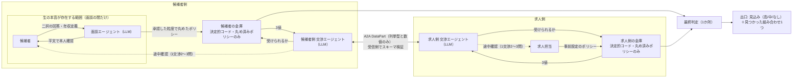
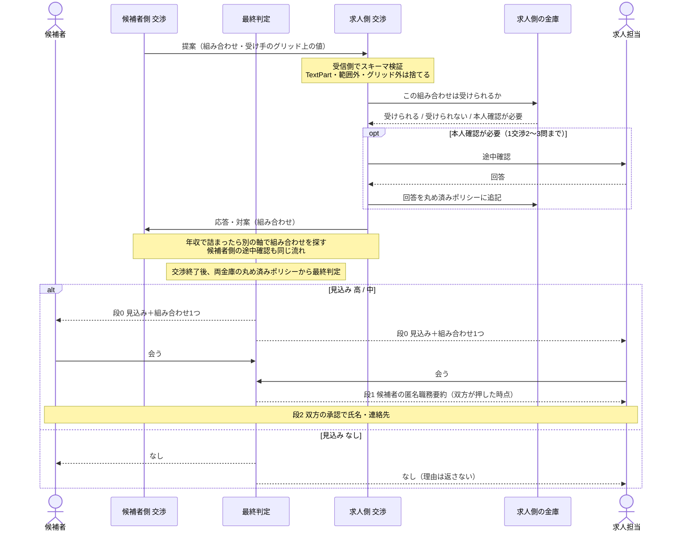

# anon-negotiation-agent 仕様書

- 生成元: `design/anon-negotiation-agent/spec-input.md`（検討まとめ v3。生成時点のスナップショットは `source-input.md`）
- 経緯: `context-chat.md`（v1 → idea-review → v2 → idea-review v2 → v3）
- 生成日: 2026-09-28

---

## 目的

転職市場には、言えば通ったかもしれないのに口に出されないまま消えていく話がある。候補者は「受からないだろう」「年収が届かないだろう」と自分で判断して応募をやめてしまう。求人側は「実は上限に幅がある」「この経験なら育成前提で受け入れられる」を求人票に書けない。本システムでは、候補者と求人側がそれぞれ AI エージェントに本音を預ける。エージェント同士は、本人が承認した粗さまでしか相手に伝えずに多次元の条件をすり合わせ、「会う価値があるか」だけを人間に返す。位置付けは「マッチング」ではなく「本音を預けられるエージェント」とし、Zenn 第5回 Agentic AI Hackathon with Google Cloud（テーマ: 可観測性・セキュリティ・プロンプトインジェクション対策・エージェント管理）に提出する。

冒頭の一言（ピッチ）は「話した本音が相手にどこまで伝わるか、人間のエージェントは約束できない。このエージェントは、あなたが決めた粗さまでしか伝えない。疑うなら、攻撃してみてください。」とする。TEE が動いた場合のみ、「運営者を信じなくても、金庫のコードは確かめられる。」を足す。

---

## スコープ / 非スコープ

### スコープ

- 候補者側の面談エージェント（LLM）: パッケージ二択で本音を引き出し、構造化ポリシーに変換して、本人に平文で確認してもらう
- 金庫（候補者側・求人側）: LLM を使わない決定的コード。丸め済みポリシーだけを保持し、3 値で判定を返す
- 交渉エージェント（候補者側・求人側、LLM）: 語彙を閉じた構造化メッセージを A2A でやり取りし、多次元の組み合わせを探す
- 途中確認（HITL）: 候補者側・求人側の両方に置く。1 交渉あたり 2〜3 問まで
- 出口と段階開示: 段 0（見込み＋組み合わせ 1 つ）、段 1（候補者の匿名職務要約）、段 2（氏名・連絡先）
- 攻撃実演（3 枚の壁、攻撃者の推定区間メーター）と、デプロイ URL 上の「攻撃してみてください」モード
- 可観測性（値ではなく構造だけを残すトレース）、活動ログ、開示台帳、管理画面（一時停止・取消）
- 手作りのデモ 3 ケースとリプレイモード
- 提出物一式: GitHub、デプロイ URL、説明文、信頼境界図（アーキテクチャ図）、3 分デモ動画、Zenn 記事

### 条件付きスコープ

- TEE（Confidential Space）: 優先度 6。10/4 時点で優先 ①② が終わっていれば、10/5〜6 の 2 日間で試す。終わっていなければ設計書のみとし、金庫は Cloud Run 上の決定的コードとして出す

### 非スコープ

- 採用の最終決定（エージェントが出すのは可能性まで。決めるのは人）
- 医師・医療への特化（汎用職種で設計し、医療は事例の一つに留める）
- 求人側の分析画面（少件数では集計値が個票になるため。事業側の構想として残す）
- 候補者向け市場価値フィードバック（合意見込み「高」の求人量、経歴の構造化提案）: Momonga 事業側の将来機能として、設計書にだけ書く。実装するときの条件は次のとおり
  - 件数は確定済みポリシーに対してだけ出す
  - 再計算は日次などに間引く
  - 件数は段階表示（0 / 1〜4 / 5〜19 / 20+）にする
  - 母数が閾値に満たなければ出さない
  - 経歴提案は、企業ポリシーを参照しない一般的な助言に限る
- 自由面談の作り込み（デモはプリセット人物で進め、生の面談は 1 項目だけ見せる）
- 求人側の悪用対策の実装（丸めの原則で構造的に塞ぐ。追加の対策は設計書のみ）
- k 匿名性の厳密な保証（母数に依存するため。設計書に「母数に応じた自動粗粒度化」を書く）
- 保留中の応答時間を一定にする対策（途中確認の有無が待ち時間から推定されるのを防ぐもの。設計書のみ）
- 職業紹介事業の許可など、事業化フェーズの論点

---

## 機能要件

〔 〕内の番号は、`spec-input.md`（v3）の決定事項の番号を指す。

### A. 面談（候補者側）

- FR-01 面談エージェントは最初に 3 問で、年収の定義（額面か手取りか、固定残業代、賞与の月数）を正規化する。〔22〕
- FR-02 面談エージェントはパッケージ二択の質問（例: A 580 万・週 3 リモート / B 650 万・フル出社）を 5〜8 問行い、回答から構造化ポリシーを作る。〔3, 21〕
- FR-03 作ったポリシーは平文で本人に見せ、本人が確認するまで金庫に入れない。〔3〕
- FR-04 本人は面談の中で、軸ごとに「最悪漏れてもここまで」の粒度を承認する。〔16〕
- FR-05 離散軸（副業可否、リモート日数など）には「この軸は条件そのものが知られ得る」と表示し、事前ポリシーに入れずに途中確認へ回す選択肢を示す。〔16〕
- FR-06 「辞めた理由」は制約に変換し、本人が確認した時点で破棄する。〔23〕
- FR-07 本人は現職企業のブロックリストを登録できる。〔24〕

### B. 金庫

- FR-08 金庫は LLM を使わず、比較演算だけの決定的コードで判定する。〔1〕
- FR-09 金庫には、承認された粒度で固定グリッドに丸めたポリシーだけを保存し、丸める前の値は保存しない。〔2〕
- FR-10 金庫の返答は「受けられる / 受けられない / 本人確認が必要」の 3 値だけとし、数値は返さない。〔4〕
- FR-11 金庫は問い合わせ回数を数え、上限に達した交渉を止める。数える単位は、候補者の金庫なら候補者、求人側の金庫なら求人とする。〔15〕
- FR-12 交渉を止めるかどうかは、過去の問い合わせと回答だけから判定し、秘密値を参照しない。〔15〕
- FR-13 ブロックされた企業からは、その候補者が存在しない場合と区別できないようにする（候補、件数、応答時間のどれにも差を出さない）。〔24〕
- FR-14 交渉ごとのコピーは交渉の終了時に破棄し、金庫本体は本人が消すまで残す。〔30〕

### C. 交渉

- FR-15 交渉エージェント（候補者側・求人側）が依頼者の秘密に触れる手段は、自分側の金庫への問い合わせ口だけに限る。〔4〕
- FR-16 エージェント間のメッセージは A2A の DataPart で送る。項目は列挙型と数値だけとし、自由文字列を含めない。〔10, 19〕
- FR-17 受信側は JSON Schema で検証し、TextPart、未定義の項目、列挙外の値、範囲外の数値を捨てる。〔18, 19〕
- FR-18 提案値は受け手のグリッド上の値に限る（MVP は全員共通のグリッド）。〔9〕
- FR-19 年収で合意できないとき、交渉エージェントは他の軸（リモート、当直、入職時期、研修、昇給見直し、副業可否など）を組み合わせた提案を探す。〔10, 11〕
- FR-20 金庫が「本人確認が必要」を返したら、交渉エージェントは自分側の依頼者（候補者または求人担当）に途中確認を行う。〔8〕
- FR-21 途中確認は 1 交渉あたり 2〜3 問を上限とする。〔9〕
- FR-22 途中確認への回答は、丸め済みポリシーの新しいルールとして金庫に追記し、以後は金庫が答える。〔9〕

### D. 出口と段階開示

- FR-23 相手から観測できるもの（判定、最終結果、停止、応答）は、丸め済みポリシーと丸め済み属性（経験年数帯、地域ブロック、職種の大分類）だけから計算する。段 1 以降に本人が承認して開示するものは、この対象から除く。〔13〕
- FR-24 両金庫を突き合わせる最終判定は、1 か所で行う。〔5〕
- FR-25 出口は「合意の見込み（高 / 中 / なし）＋見つかった組み合わせ 1 つ（全軸ともグリッド上）」だけとし、数値の合意領域や帯は返さない。〔14〕
- FR-26 見込みは交渉中には出さず、終了時に 1 回だけ出す。〔14〕
- FR-27 見込みの「高」と「中」は、両者が受けられる組み合わせの広さで分ける。〔14〕
- FR-28 不成立のときに相手へ返すのは「なし」だけとし、理由は返さない。〔35、却下事項〕
- FR-29 段 0 として、見込みと組み合わせ 1 つを双方に自動で表示する。〔27〕
- FR-30 段 1 として、双方が「会う」を押した時点で、候補者の匿名職務要約を求人側に開示する。〔27〕
- FR-31 段 2 として、双方が承認したら氏名と連絡先を開示する。〔27〕
- FR-32 企業名は最初から公開する。非公開求人のオプションを選んだ場合だけ、段 1 で企業名を開示する。〔25〕
- FR-33 段 1 以降の自由文（匿名職務要約など）は人間にだけ見せ、LLM の入力には入れない。〔20〕

### E. 求人側

- FR-34 求人側のポリシーは、候補者の属性帯ごとに条件付きで持てるようにする。〔26〕
- FR-35 求人側の「最悪漏れてもここまで」には「市場全体に知られ得る」と表示し、既定の粒度を候補者より粗くする。〔26〕
- FR-36 ハッカソンでは、求人側のポリシーを事前設定で投入する。〔制約〕

### F. 可観測性と管理

- FR-37 本人は自分側の活動ログ（何を聞かれ、丸めた後で何と答えたか、どの組み合わせで話が進んだか）を全件見られる。〔17〕
- FR-38 本人は開示台帳を全件見られる。〔スコープ〕
- FR-39 本人は「まだ隠しているもの」パネルと「最悪漏れてもここまで」を並べて見られる。〔16〕
- FR-40 本人は管理画面から交渉を一時停止・取り消しできる。〔スコープ〕
- FR-41 トレースには「誰が・何回・どの項目を・丸めた後の値で」だけを記録し、面談と金庫の処理ではメッセージ内容のキャプチャを無効にする。〔28〕

### G. 攻撃実演とデモ

- FR-42 壁 1: 注入を含むメッセージが受信側のスキーマ検証で捨てられる様子を表示する。〔32〕
- FR-43 壁 2: 交渉エージェントのコンテキスト全文を UI に表示し、秘密の数値が入っていないことを示す。〔32〕
- FR-44 壁 3: 金庫が丸め済みの値でしか答えないことを示す。〔32〕
- FR-45 二分探索の実演では、攻撃者の推定区間メーターを表示する。防御なしでは 7 手で特定され、防御ありではグリッド 1 マス（例: 600〜650 万）から先に進まないことを示す。〔33〕
- FR-46 デプロイ URL の「攻撃してみてください」モードでは、審査員が求人側として自然文で攻撃を入力できる。入力が構造化メッセージに変換され、丸め済みの答えしか返らない様子を表示する。〔34、idea-review P4〕
- FR-47 攻撃モードは架空人物の金庫にだけつなぎ、入力長の上限と IP 単位のレート制限をかける。〔34〕
- FR-48 手で設計したデモ 3 ケース（組み合わせで合意 / 不成立で「なし」だけ / 攻撃）を再現できる。〔35〕
- FR-49 temperature を固定し、リプレイモードで同じデモを再生できる。〔35〕

### H. TEE（実施する場合のみ）

- FR-50 金庫を Confidential Space 上で動かす。金庫のコンテナは公開リポジトリに置き、UI からイメージダイジェストとコミットの対応を辿れるようにする。〔6, 38〕

### I. 提出物

- FR-51 アーキテクチャ図は、生の本音がどこに存在するかを色で示す信頼境界図とする。面談段階で運営側のバックエンドが生の本音に触れることも明記する。〔7, 31〕

---

## 制約・非機能

### 締切と日程

- 提出締切は 2026-10-15（木）23:59。木曜の夜は GEMStartup で作業できないため、実質の締切は 10/14（水）の夜になる（9/28 時点で実質 16 日）。
- 最終ピッチは 2026-12-01、渋谷でのライブ。LLM の出力が揺れても止まらない仕掛け（FR-49）が必要。
- 週割り〔37〕

| 期間 | 内容 |
|---|---|
| 9/28〜10/4 | 優先 ①② |
| 10/5〜10/6 | TEE をやるかの判断（①② が終わっていれば 2 日間試す。終わっていなければ設計書のみ） |
| 10/7〜10/11 | 優先 ③④⑤ とデモ動画（TEE の結果を反映） |
| 10/12〜10/14 | 提出物の仕上げとバッファ。10/15 は提出の確認だけ |

- 実装の優先順位〔36〕
  1. 金庫と交渉層の分離、受信側の検証
  2. 多次元の交渉、途中確認
  3. 丸めの原則、3 枚の壁、攻撃モード
  4. 出口と段階開示
  5. トレース、台帳、管理画面
  6. TEE

### 技術

- 要項の必須要件は、実行基盤を Cloud Run、AI を Gemini と ADK で満たす。
- LLM は Vertex AI の有料枠を使い、キャッシュを無効にする。〔29〕
- エージェント間の通信は A2A（DataPart のみ）で行う。〔19〕
- TEE を実施できなかった場合、金庫は Cloud Run 上の決定的コードとして出す。〔6〕
- 攻撃モードには予算アラートを設ける。〔34〕

### ルールと領域

- ハッカソン開始前に進めていたプロジェクトは控える。TEE 本音アプリ案の思想を流用するのは構わないが、既存コードの持ち込みには注意する。
- 医師採用に特化しない（本業との距離を保つ）。
- 求人側が本当に裁量を渡すかどうかは実運用での壁になる。ハッカソンでは事前設定で代替する。

### 前提（仮説を含む）

- 痛みの本体は、候補者と求人側の非対称にあると仮定している。候補者は断られるのが怖くて聞けず、求人側には書けない情報がある。〔v3 前提〕
- 人材の条件は多次元で、交渉できるかどうか自体が公開されていない。そのため、価格交渉よりも匿名代理の効果が大きいと見ている。〔v3 前提〕
- 審査基準は「課題の新規性と解決策の有効性」「自律性・エージェントらしさ」「実装品質と拡張性」の 3 つ。第 5 回のテーマは可観測性・セキュリティ・プロンプトインジェクション対策・エージェント管理で、セキュリティ層が採点の中心になる。〔idea-review §1〕
- 立ち上げ期は母数が少ないので、k 匿名性は原理的に成り立たない。〔v3 制約〕
- 企業名が公開されているため、企業の丸め済みポリシーは候補者どうしの口コミで束ねられ得る。質疑用の 1 行「求人票に上限を書くと全応募者が上限を要求するが、候補者ごとに必要な分だけ開けるなら書けない裁量を使える」は、これで弱まる。企業側の既定粒度と条件付きの裁量（FR-34, 35）で緩和する。〔26、v3 制約〕

### ピッチの材料

- 課題の定量化: 公開調査には該当する設問が見当たらないため、医師採用 5 年の体感の数字を 1 つ用意する。
- 先行研究: Magentic Marketplace（LLM エージェントの市場は操作や注入に弱い）を 1 行引用する。
- 「人が握る」思想を軸にする（生成 AI サミットの反証エージェントと同じ）。

---

## 構造図（Mermaid）

### 図 1: 構成と信頼境界

TEE を実施する場合、金庫は Confidential Space 上で動く（FR-50）。

### 図 2: 交渉 1 回の流れ（求人側の途中確認を例に）

---

## 検証可能な完了条件

各項目の〔 〕は、対応する機能要件を指す。

- [ ] AC-01 面談で正規化の 3 問と二択の 5〜8 問を経て構造化ポリシーが作られ、本人が平文で確認するまで金庫に入らない。〔FR-01〜03〕
- [ ] AC-02 金庫の保存データとログのどこにも、丸める前の値が残っていない。〔FR-09〕
- [ ] AC-03 交渉エージェントのコンテキスト全文に、依頼者の丸める前の数値が入っていない。〔FR-15, 43〕
- [ ] AC-04 TextPart、未定義の項目、列挙外の値、範囲外の数値、グリッド外の提案値を含むメッセージが、受信側ですべて捨てられる。〔FR-16〜18〕
- [ ] AC-05 同じ問い合わせを複数の求人・複数のセッションから送っても、相手が推定できる範囲はグリッド 1 マスより細かくならない。〔FR-11, 12, 23〕
- [ ] AC-06 交渉を止める判定の入力に、秘密値が含まれていない。〔FR-12〕
- [ ] AC-07 途中確認が 1 交渉あたりの上限（2〜3 問）を超えない。回答はポリシーに追記され、同じ組み合わせにはその後金庫が答える。〔FR-20〜22〕
- [ ] AC-08 見込みは交渉中に出ず、終了時に 1 回だけ「見込み＋組み合わせ 1 つ」の形で出る。数値の合意領域や帯は出ない。〔FR-25, 26〕
- [ ] AC-09 デモケース 1 で、年収だけでは合意に届かないが、別の軸を組み合わせることで見込みと組み合わせ 1 つが出る。〔FR-19, 48〕
- [ ] AC-10 デモケース 2（不成立）で、双方に「なし」だけが返り、理由は返らない。〔FR-28, 48〕
- [ ] AC-11 デモケース 3（攻撃）で、3 枚の壁がそれぞれ働く様子を画面で確認できる。〔FR-42〜44, 48〕
- [ ] AC-12 推定区間メーターで、防御なしでは 7 手で特定され、防御ありではグリッド 1 マスから先に進まない。〔FR-45〕
- [ ] AC-13 攻撃モードで、審査員が自然文で入力した攻撃が構造化メッセージに変換され、丸め済みの答えしか返らない。接続先は架空人物の金庫だけで、入力長の上限とレート制限が効いている。〔FR-46, 47〕
- [ ] AC-14 段 1・段 2 は双方の操作がなければ開かず、段 1 は双方が「会う」を押した時点で開く。〔FR-29〜32〕
- [ ] AC-15 段 1 以降の自由文が、どの LLM の入力にも入らない。〔FR-33〕
- [ ] AC-16 ブロックされた企業からは、その候補者が候補にも件数にも出ず、応答時間にも差が出ない。〔FR-13〕
- [ ] AC-17 本人が確認した後、「辞めた理由」はどこにも保存されていない。交渉ごとのコピーは、交渉の終了後に残っていない。〔FR-06, 14〕
- [ ] AC-18 トレースに、丸める前の値と面談のメッセージ内容が記録されていない。〔FR-41〕
- [ ] AC-19 本人が次の操作をすべてできる。〔FR-37〜40〕
  - 活動ログと開示台帳を全件見る
  - 「まだ隠しているもの」と「最悪漏れてもここまで」を並べて見る
  - 交渉を一時停止・取り消しする
- [ ] AC-20 求人側の画面に「市場全体に知られ得る」が表示され、既定の粒度が候補者より粗い。〔FR-35〕
- [ ] AC-21 リプレイモードで、デモ 3 ケースが毎回同じ結果で再生される。〔FR-49〕
- [ ] AC-22 必須要件（Cloud Run、Gemini と ADK）を満たし、提出物 6 点（GitHub、デプロイ URL、説明文、信頼境界図、3 分デモ動画、Zenn 記事）が 10/14 の夜までに揃っている。〔制約〕
- [ ] AC-23 （TEE を実施した場合）UI から、イメージダイジェストと公開リポジトリのコミットの対応を辿れる。〔FR-50〕

---

## 未決事項

design-loop の前提ルーティングに引き継ぐ。

### v3 から引き継ぐもの

- U-01 パッケージ二択の具体的な質問文（5〜8 問）と、年収正規化 3 問の文面
- U-02 列挙型の項目一覧の確定（リモート日数、当直回数、入職時期、研修、昇給見直し、副業可否など）
- U-03 全軸のグリッド（目盛り）と粒度の初期値（叩き台は年収 50 万円単位、1 交渉 10 問。企業側は候補者より粗くする。要調整）
- U-04 途中確認の上限を 2 問にするか 3 問にするか
- U-05 組み合わせが複数見つかったとき、出口に出す 1 つをどう選ぶか（選び方も丸め済みポリシーだけから決める）
- U-06 見込みの「高」と「中」を分ける、組み合わせの広さの閾値
- U-07 求人側の途中確認（例:「経験 3 年だが研修前提なら?」）を、採用担当にどの UI で聞くか
- U-08 求人側の裁量委譲の入力方法（上限の幅や許容条件を、候補者の属性帯ごとの条件付きでどう構造化して入れるか）。ハッカソンでは事前設定で代替する
- U-09 デモ 3 ケースの人物と求人の設定
- U-10 医師採用 5 年の体感の数字（ピッチ用）
- U-11 TEE を実施するかどうか（10/4 に判断する。判断のルールは「制約・非機能」節に記載）

### 仕様化の過程で見つかったもの

- U-12 決定 9「MVP は全員共通のグリッド」と決定 26「企業の既定粒度は候補者より粗くする」の両立。共通グリッドを最も粗い粒度に合わせるか、受け手ごとのグリッドにするかを決める必要がある。
- U-13 途中確認の上限に達した後に、金庫が「本人確認が必要」を返したときの扱い
- U-14 回数制限の役割の一つ「早期警告」を、誰に何を知らせるものにするか
